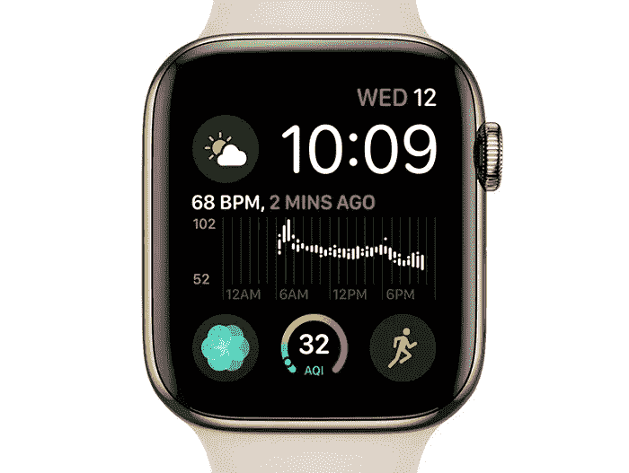

# 苹果将很快积极瞄准一个最不寻常的行业

> 原文：<https://medium.datadriveninvestor.com/apple-will-be-actively-targeting-a-most-unusual-industry-very-soon-47a4069e156d?source=collection_archive---------24----------------------->

## 它肯定会让你汗流浃背。

事实上，众所周知，鉴于 iPhone 销量下滑以及来自其他科技巨头的激烈竞争，苹果正在酝酿一场风暴。我们在看着你，亚马逊和谷歌。见鬼，即使是微软也在尽职调查，并采取适当的措施在当今的行业中保持相关性。但是苹果呢？谈谈*意想不到的* …

# 他们要应对的行业将是健康和保健

听说过 Fitbit 吗？方便的小手表。但与其说它是一只手表，不如说它是你健康的监测器，我们看到技术创新到处涌现，目的是确保你像瓦肯人一样长寿和繁荣。我知道这是有道理的，即 *Apple Watch* 试图在[智能技术](https://vigyaa.com/@pierre/beware-as-the-city-you-live-in-might-get-smarter-than-you-c7d8fe7b/)的帮助下做完全相同的事情，除了充当具有所有必要功能的腕带 iPhone 之外，还可以监控活动和心率。

健康管理本质上很重要。再简单不过了。毫无疑问，苹果有办法和创造力让它运转起来。事实上，最新版本的 Apple Watch 可以轻松解读 EKG。如果你不小心摔倒受伤了，Apple Watch 还可以提供一个立即呼叫紧急服务的选项。

为了更进一步，苹果已经与 Aetna 合作，提供免费或打折的苹果手表，以及针对老年人的私人医疗保险计划。毕竟，跌倒并知道自己爬不起来将受益于古老的*生命召唤*，老年人健康和福祉的专家电信的前身——但老年人可能从一个小小的**苹果手表**中受益更多*！*

# 这一切都是为了在利基市场提供产品——你认为苹果在这方面有所作为吗？

因为有一件事是肯定的:看起来值得信赖的 iPhone 不会持续太久，至少作为一项创新。它将不再是普通的智能手机。请随意说出你自己的想法，现在就**创建你自己的 VIGYAA 账户**！请务必也去 [**看看《数据驱动投资者》,了解更多关于技术的见解！**](http://datadriveninvestor.com)