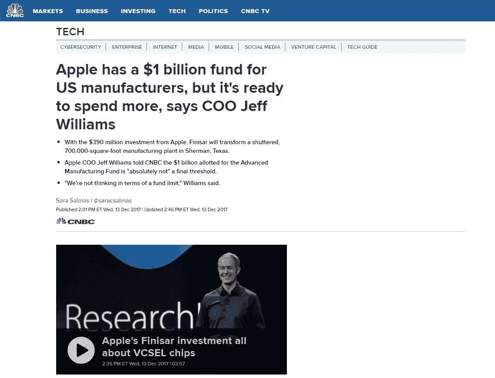
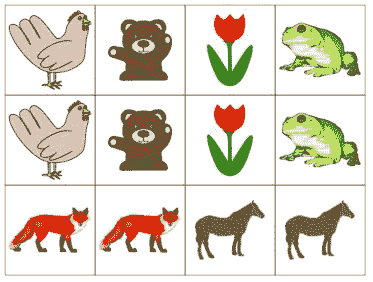
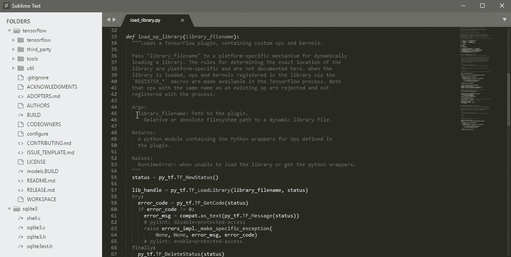

# 苹果 50 亿美元的制造基金来建造苹果工厂？

> 原文：<https://medium.datadriveninvestor.com/apples-5b-manufacturing-fund-to-build-apples-ifactory-6cabdb5ed027?source=collection_archive---------23----------------------->

2018 年 1 月 17 日，有人让我们注意到，苹果将其投资基金从 10 亿美元增加到 50 亿美元。

最初，你指定大量资金的想法可能是宣传的一个很好的理由，然而，根据所有关于苹果、制造或供应商的历史新闻，使用 [LSTM](https://en.wikipedia.org/wiki/Long_short-term_memory) 的简短切线，没有任何重要证据表明有任何理由对此持怀疑态度。在那次快速实验后，我们认为它可能会被用来帮助创新或刺激当前的供应商。

Exhibit 1.1

内包竞争可以帮助电子产品制造商更多地投资于自己的业务，真正实现差异化，承担适当的风险，探索新的道路。所以我们两个都不确定，所以我们只是想知道我们的激情是什么。我们热爱流程、自动化并帮助人们和企业变得更好！所以，让我们制定一个计划，并提交给杰夫威廉姆斯。

我们的计划是什么，我们如何提供帮助…

# 首次发现:

我们想找出商业模式中的差距、异常和奇怪之处，也许更好地理解为什么杰夫或蒂姆决定公布这一点的动机。在这一点上，我们必须关闭我们的情绪，不要在未来的过程中插入偏见。

> *任何有逻辑的人都会怎么做？尝试了解如何参与该基金，并提出一个发人深省的概念，这可能有利于苹果、美国、就业、制造业，当然还有我们。*

表面突出的是第一个真题。所以我们来玩一个简单的儿童游戏。什么不符合？

[https://www.montessorimom.com/memory-matching-game/](https://www.montessorimom.com/memory-matching-game/)

从所有苹果新闻、股票数据、美国文件来看，我们没有发现任何异常或异常情况，这将为我们指明任何方向。我们感受到的事实就是现实。

> 苹果公司创造了出色的产品，这些产品被认为是连续价值链的一部分。

# 看似而且可能是提前几年有条不紊地计划好的。苦思冥想每种主要帐篷杆产品或服务的最佳搭配。

# **没有线索，得到内幕**

因此，如果苹果是可靠的，我们需要一个内部人士。你知道我指的是谁，一个喝完 Philz“Jacobs wonder bar”咖啡后开始抱怨一些官僚主义的人，这些官僚主义会让我们找出弱点，从而使我们的概念推介更加引人注目。

但是这需要社会化，这意味着离开我们崇高的编辑的限制，去冒险进入世界，从最慢的界面(人类语言)获取数据，倾听和..我想你明白了。

不，我们将坚持计划，利用数据科学、商业敏锐度和经验来发现。

so you do not get bored we added this useless image

# 什么不匹配

让我们看看商业 DNA，作为一个示意图。苹果创造的消费产品和服务有助于提高生产力、与人沟通、娱乐自己、感觉更好(音乐)和整体享受。为了做到这一点，他们发明了一种大多数投资者不会做的方式，他们比任何其他同等规模的公司重复得更多，他们比任何类似的公司营销得更好，他们甚至智胜和操纵最老练的成熟竞争对手。

那么缺少什么呢？

苹果 iPhone，苹果 iPad，苹果 A 系列芯片，苹果服务，苹果商店..苹果制造。什么，苹果装配线？

蒂姆·库克可能会像我们一样思考流程中的每一秒钟，以及公司如何通过小调整变得更好，成为自己的完美版本。以他在 JIT 方面的背景，甚至可能只是在顺序方面，他一定真的希望他能自己制造或者不制造？如果没有，他/他们必须认真审查生产帐篷杆产品的供应商提供的产量。也许我们有所发现。

Maybe you can see the contrast.

那我们就把这个逻辑玩出来。“如果没有人变得更好，而我们想要更好，也许我们应该自己做”或“我们需要团结起来，让我们提高自己的能力，创造一种真正持续改进的卓越苹果工厂文化”。

在这两种情况下，这都是一个信号。制造/分销网络/半导体供应链需要改进一针强心剂，一点点推动。

考虑一下特斯拉。埃隆马斯克(Elon Musk)和特斯拉(Tesla)对“变得更好”的投资是专家和反对者的一年，他们在一旁观看，用群体思维和群体精神病来附和。但如果他们停下来，理解一下 Model 3 系列目标的宏伟和复杂。解决这个问题需要投资一家公司。但是特斯拉为什么要这么做呢？汽车城有几十年的优越经验，但在经济上没有革命或演变，这曾经是亨利·福特给世界的礼物。所以让我们假设苹果需要一个苹果工厂。

这就是了。这是我们喜欢解决的问题，也是他们需要帮助解决的问题，所以让我们向杰夫·威廉姆斯介绍一下神经学说的概念。

# 概念形成

我们，神经梦想着有一天供应链和它交织在一起的程序和过程会达成协议并说。让我们团结起来，共同努力来节省平均 15 %- 20%的运输成本，我们一直在供应链上下游的实体之间传递这些成本。

这 15%只是小费。想象一下，在他们真正有柠檬水卖之前，有三个柠檬水摊位。首先，它被种植、采摘、切割/压榨、批量销售，然后最终准备好面对消费者的产品“果汁”,所有这些人处理柠檬的工资是%。有些增加了价值，有些只是传递了价值。

以我们的苹果为例，它的**原料矿产(采矿)**、**半导体**、**无晶圆厂(制造商)**芯片被做好，送到**经销商**那里，经销商再以随机加价的方式转售芯片，最后卖给**电子制造商**来制造我们作为**消费者**都想要的奇妙产品。

# **让我们来解决这个问题。**

这是配料清单。

1.  我们需要投资，x *$* 来使用我们称之为神经代理人的基于人工智能的制造技能，创建一个苹果供应链的小型模拟，并再现/模拟制造地点。*(我们当然不会在这里列出所有的特性/变量)*
2.  我们需要大约四个人， *ppl#* 范围更广的人，他们不怕做许多角色，这将是一个完整的供应工作流程的一部分。*(体验巅峰的人“感受”生产。能听到取放机的声音并知道它没有对准。看到物料清单并知道它是复杂产品的高级主管)*
3.  我们需要一些 NPI(新产品)， *prj1* ，我们可以保证小批量生产，以便从模拟阶段过渡到试点阶段。(我们在硅谷有数百家硬件创业公司。给一些风险投资公司打电话，提供帮助以换取 A/B 测试)
4.  位置 *loc#* 将其全部放置并以盈亏平衡的方式运营。*(不需要发货、收货，我们对装配线的愿景是真正的 MFG 4.0，需要如此小的平方英尺，并且与人工的 btu 偏差尽可能小。我们喜欢大众、ABB、FESTO 和西门子正在做的事情)*

这将使苹果有能力在微观层面上的半控制环境中证明我们的论点，就像特斯拉可能做到的那样“自动化”。随着常见问题的减少，从而实现了 JIT/JIS 的基础，为我们在汽车行业看到的更大的箱体制造，高混合-高容量的复杂性。

# 杰夫·威廉姆斯

嗨，杰夫

我希望这封信能带给你好消息。

我们没有见过面，但是我们一直在想你和你的产品。我住在离你办公室步行 5 分钟的地方。

1.  你(苹果)已经尽你所能控制你制造的东西的所有方面。让我们在苹果工厂帮你。
2.  当您发布 A 系列处理器时，我们知道您渴望帮助您的消费者获得更多，而不会受到许可限制的束缚。让我们帮助您模拟完美的 EMS，这反过来将有助于以良好的竞争力推动行业创新。
3.  根据详细的评估和财务预算/计划，我们认为我们可以在收支平衡的情况下进行模拟，这样我们就可以利用投资来进一步加快你们供应渠道的创新。
4.  我们希望您能遵循我们详细的项目计划和高效的沟通计划。如果你为我们安排一次飞行掩护，让我们专注于我们同意的事情，我们将按时完成我们可衡量的目标。
5.  条件:任何添加的合作伙伴必须满足最严格的业务技术能力测试-技术敏锐度。没有对立的政治和游戏。只是背靠背地工作，完全信任商定的任务。