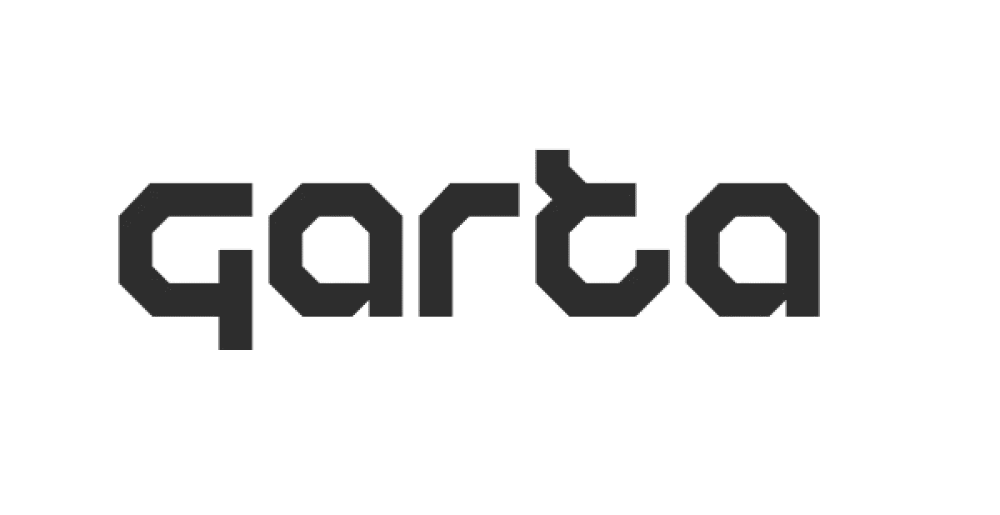

# 苹果的 AR 眼镜 T288 项目缩小到:Garta

> 原文：<https://medium.datadriveninvestor.com/apples-ar-glasses-t288-project-narrowed-down-to-garta-1525ce6d0f62?source=collection_archive---------2----------------------->

随着 iOS 13 发布在即，苹果在他们的新 iOS 版本中揭示了更令人兴奋的东西。

Garta 似乎是苹果将比你想象的更快让我们购买和享受的缩小的增强现实眼镜的代号。

 [## 人工智能和虚拟现实的融合-你能期待什么|数据驱动的投资者

### 在技术领域，融合是合乎逻辑的一步。就在几十年前，你可能需要一个专门的…

www.datadriveninvestor.com](https://www.datadriveninvestor.com/2018/08/30/the-convergence-of-ai-rv-what-you-can-expect/) 

[iOS 13](https://www.macrumors.com/roundup/ios-13/) 似乎已经打包了一个名为 STARTester 的隐藏应用，它似乎是作为一个增强现实耳机模拟器进行测试，在一个名为 StarBoard 的环境代码中运行。

其他被引用的隐藏在 [iOS 13](https://www.macrumors.com/roundup/ios-13/) 中的 SDK 组件像 ARStarBoardViewController 和 ARStarBoardSceneManager 似乎证实了一件事:

苹果有一个运行增强现实的闭环生态系统，包括一种正在测试的新的可穿戴设备。

尽管 iOS 13 只是无声地暗示增强现实眼镜真的很近了，但我敢打赌，2020 年底将是一个大日子，我们的圣诞钱将被交给苹果公司，用于购买一副增强现实眼镜。

这就对了，现在你有证据证明苹果的增强现实项目不仅没有死，而且比以往任何时候都更接近你的手中。

更多关于增强现实的故事和报道，请访问 bitsof[ar]。并订阅我们的帖子。