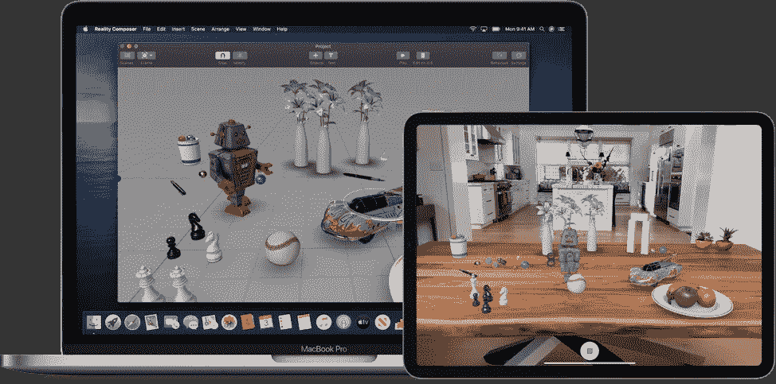

# 苹果的增强现实前景

> 原文：<https://medium.datadriveninvestor.com/apples-augmented-reality-outlook-1260ef3173ff?source=collection_archive---------2----------------------->

苹果 9 月 10 日的特别活动再次引发了人们的猜测，即该公司将推出一款[增强现实耳机](https://www.inc.com/jason-aten/the-most-incredible-gadget-apple-plans-to-introduce-this-fall-is-something-you-never-saw-coming-heres-why-its-brilliant.html?cid=sf01003)，这将(最终)为增强现实带来一个重大突破。这个谣言一直在流传，包括 Inc.com和罗伯特·斯考伯 2017 大胆(但不准确)[预测](https://withoutbullshit.com/blog/robert-scoble-wrong-iphone-x-hes-mensch)。当然，正如我们现在所知，苹果没有推出 AR 耳机。然而，像 Engadget([IOs 13&AR article](https://www.engadget.com/2019/09/10/ios-13-apple-ar/))这样的行业观察家仍然对这一天的到来抱有希望。但是为什么一直希望苹果加入这场竞赛呢？当我们思考苹果品牌是什么以及它意味着什么时，有三个主要原因凸显出来:

**苹果让我们相信**

当苹果下定决心追逐一个市场时，很明显他们做到了，并且通过将可用性问题排除在外而做得非常好——无论是考虑桌面游戏还是下一代产品。当我们思考 ar 时，蒂姆·库克(Tim Cook)尤其继续为 AR 唱赞歌。他这样做已经有一段时间了。例如，[在 2017 年的收益电话会议](https://www.macrumors.com/2017/11/02/apple-q4-2017-earnings-call-transcript/)上，蒂姆·库克表示，增强现实是主流，并且“苹果是唯一一家能够实现这一点的公司，因为它需要硬件和软件的集成，并且它需要同时为许多人提供操作系统更新。”

 [## 人工智能和虚拟现实的融合-你能期待什么|数据驱动的投资者

### 在技术领域，融合是合乎逻辑的一步。就在几十年前，你可能需要一个专门的…

www.datadriveninvestor.com](https://www.datadriveninvestor.com/2018/08/30/the-convergence-of-ai-rv-what-you-can-expect/) 

除了盈利电话会议，库克还多次公开阐述了 AR 的愿景，并将苹果定位为 AR 的领导者。最近，[在 HBO 特别节目](https://next.reality.news/news/tim-cook-takes-hbo-promote-future-augmented-reality-addresses-apple-ar-glasses-question-0190202/)中，他说，“几年后，我们将无法想象没有(AR)的生活。这是一个意义深远的平台。”

Image Source: HBO / Axiom

**苹果推出内容和开发者工具**

苹果已经稳步投资于 AR，包括开发 [ARKit](https://developer.apple.com/arkit/) ，苹果用于 iOS 移动设备的 AR 开发平台，以及 Reality Composer 和 RealityKit。ARKit 是开发者用来创建将在你的 iPhone 上工作的 AR 应用的工具包。[数百万只支持 ARKit 的安装导致了](https://techcrunch.com/2018/03/28/arkit-only-apps-top-13-million-installs-nearly-half-are-games/)，其中大部分目前是游戏，但总的来说是朝着正确的方向迈出的一步，让消费者对这些体验产生兴趣。

Image Source: Apple

苹果本质上是一家硬件公司

麦金塔电脑。笔记本电脑。iPhone。苹果手表。一次又一次，苹果通过硬件做出了最大、最大胆的举动。最近，在批评者嘲笑苹果进入拥挤的可穿戴设备市场后，Apple Watch 出乎意料地成为一款畅销的健康和保健设备。因此，有理由相信苹果最终将推出一款支持 AR 的设备，可能包括一款耳机。更不用说，当谈到消费电子产品的工业和人体工程学设计时，苹果公司处于领先地位！

**苹果何去何从？**

在 Moonshot，我们推测苹果可能正在[开发一套 AR 产品](https://www.moonshotio.com/2017/06/05/where-is-apple-going-with-augmented-reality/)，人们可能会假设它将与 AR 耳机一起发布。虽然许多观察人士继续猜测 AR 耳机成为现实只是时间问题(包括 the Verge，其中[直截了当地指出](https://www.theverge.com/2019/9/10/20860023/apple-ar-headset-starboard-garta-luck-franc-holokit)“苹果一直在悄悄地试图打造一款增强现实耳机，这不是什么秘密”)，但我们也应该了解它将产生的影响。

从一个角度来看，再看看苹果是如何依靠 Apple Watch 进入医疗保健领域的。苹果手表不仅仅是富人的玩具。这是一个监测你健康的装置。因此，苹果正在进军消费者和企业领域(包括健康保险公司和医疗保健提供商)。考虑到这一点，苹果可能不会简单地推出一款 AR 耳机，并期望全世界无缘无故地购买它们。相反，我们会期待苹果推出一款产品来解决现实世界的问题，比如更有效地了解你周围的环境。真正的问题不是苹果何时会推出 AR 耳机——而是出于什么目的？

最终，如果/当苹果创造了一款 AR 耳机，它将支撑 AR 市场，并为 AR 耳机的外观、感觉和交互方式创造新的标准。