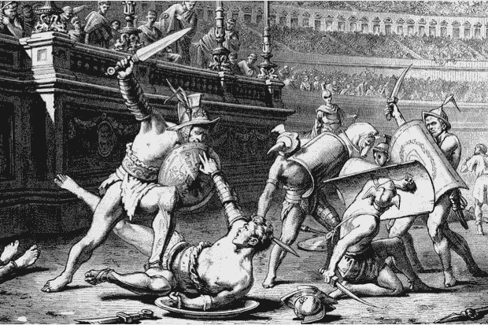

# 尽管苹果的影响力有目共睹，但高通有更好的法律地位

> 原文：<https://medium.datadriveninvestor.com/apples-influence-show-notwithstanding-qualcomm-has-the-better-legal-position-828dd6894b7?source=collection_archive---------3----------------------->

With battles on multiple fronts, this war is Apple’s to lose

成为世界上最富有的公司的一个原因是，苹果公司有很多钱可以用来对付它的对手。然而，它得到了很多免费的支持，这是富人的奇怪特权之一。早在唐纳德·特朗普之前，苹果就掌握了狗哨。在推特让这变得更容易之前，我个人曾经被这些可怕的奴才撕碎过裤子和一点肉。当苹果公司保持沉默时，这些意识形态战士从四面八方向你扑来，质疑你的血统、你的职业地位、你的性格。

苹果和高通之间旷日持久的战争也是如此，这场战争目前在全球不下 75 个地方进行。阅读一些关于这一争端的报道，人们可能会认为苹果公司几乎已经结束了这场争端。例如，在这个最近的故事中，作者让高通扮演恳求苹果和解的恳求者，大概是因为这个案子太无力了。[在这里](https://9to5mac.com/2018/09/07/apple-qualcomm-parent-pretrial-motions/)是一个描述高通的律师在加州南区的审前听证会的讨论中是不幸的，甚至是无能的。[这部](https://www.reuters.com/article/us-apple-qualcomm-itc/qualcomm-apple-kick-off-second-trial-seeking-iphone-import-ban-idUSKCN1LX258)更加平衡，但仍将叙事描绘成一场激战。这里的实际上是在吹嘘高通的情况越来越糟糕。弗洛里安·穆勒(Florian Mueller)可能是所有苹果巨魔的鼻祖，他发布了一连串反高通的帖子，比如这个标题令人痛苦的[帖子，“治安法官谴责高通最初选择不提起的 iPhone 专利侵权指控。”](http://www.fosspatents.com/2018/09/magistrate-judge-rebukes-qualcomm-for.html)

然而，所有这些噪音并没有准确描述实地的情况。因此，退一步来看，人们可以看到苹果——而不是高通——可能是寻求和解的一方的大致轮廓。首先，所有这些诉讼的根本争议在于，苹果认为高通对其知识产权的使用权要价过高。高通收取各种版税，从 2.275%到净批发价的 5%不等(最高批发价为 400 美元)。这意味着一部 iPhone 的最高版税理论上可能是 20 美元。在这一切发生之前的安排中，苹果的合同制造商实际上是根据向苹果的转移价格而不是转售价格向高通支付专利费。即使是更贵的 iPhones，这个价格也低于 400 美元的上限。因此，根据各种消息来源，从苹果公司通过制造商流向高通的版税收入不到 20 美元，大约在 20%到 20%之间。

现在，当苹果公司每部 iPhone 的平均利润为 150 美元时，为什么苹果公司还在抱怨这个数字呢？只有苹果公司的高级管理层知道，一部新的低端 iPhone Xr(799 w/128 GB)和一部类似的 iPod(299 w/128 GB)之间的差价是 500 美元，这可以说是高通通信专利的价值。基本上，公司喜欢压榨供应商。太多永远不够。诸如此类的事情。

对法律环境的宏观分析显示，尽管苹果一开始是原告，指控高通如何利用垄断力量进行不公平定价的各种哲学问题，但这家库比蒂诺巨头现在是全球 40 多起专利侵权诉讼的被告。与判定专利是否被侵犯相比，法官如何判断专利定价的公平性要抽象和困难得多。没错，专利的有效性可能会受到质疑，而苹果的主要策略之一就是这么做。但是一旦被授予，专利在默认情况下是有效的，其未经许可的使用是一种侵犯。

高通已经在多个司法管辖区起诉了苹果的多项专利。由于高通正在申请禁令救济——阅读:苹果不能将侵权产品运送到该司法管辖区——任何侵权的发现都可能对苹果的业务产生实质性影响。所有这些未决案件的司法管辖区是美国、德国和中国——苹果的一些最大市场。

根据现有协议，苹果公司不付款已经让高通遭受了最大的痛苦。尽管这种痛苦以数十亿美元计，但苹果无法对高通造成进一步的伤害。它已经尽其所能使用高通的知识产权，并且没有为此支付任何费用。与此同时，高通通过芯片销售和来自其他制造商的许可收入弥补了损失的收入，特别是占主导地位的中国和韩国厂商，如三星、华为、Oppo、Vivo、小米、LG 等公司。年复一年，即使没有苹果，高通也在增长。

但是即使是一个对高通有利的发现也会伤害苹果。

苹果在争论哲学，而高通在争论具体细节。小硬件项目可能没有宏伟的远景那么性感，但法律就是建立在它们之上的。

凭借其庞大的战争资金，苹果可能押注于它能拖垮高通。毕竟，律师可不便宜。但苹果可能打错了算盘。高通自己也有充足的战争资金，并且已经解决了其他的商业纠纷——特别是与三星，世界上最大的智能手机供应商——并且在一些司法管辖区(例如和台湾)和解。它的下一代 5G 技术许可[在中国被广泛接受](https://www.qualcomm.com/news/releases/2018/01/24/qualcomm-and-leading-chinese-manufacturers-announce-5g-pioneer-initiative)，中国既是世界上最大的智能手机市场，也是世界上大部分手机的生产地。事实是，两家公司都有足够的钱来资助诉讼，只要他们喜欢。但清算并不遥远，许多诉讼已经有了审判日期，一些正在进行中，大多数诉讼的初步裁决将在未来 12 个月内做出。所以，这不是谁先眨眼的问题。

苹果的前进道路充满了风险，高通的只会越走越好。是的，两家公司都想解决他们之间的争端。但是，随着发现过程出现许多有趣的八卦，每一项裁决都代表着数百万部 iPhones 无法发货的可能性，苹果更有可能哭哭啼啼，迟早会来到谈判桌前。