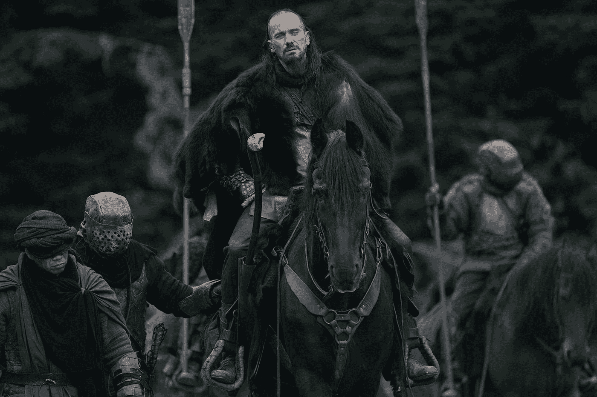
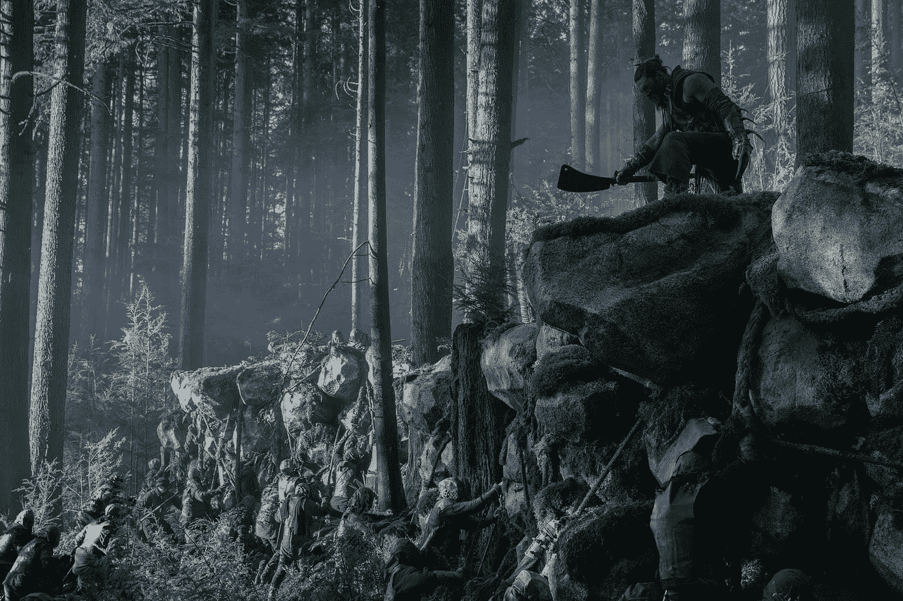
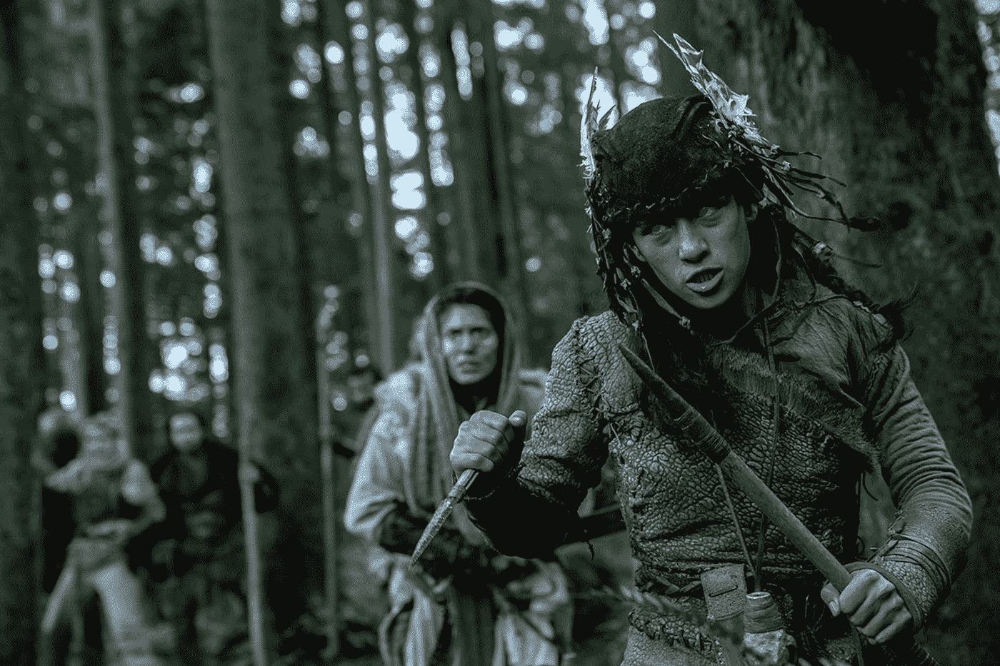
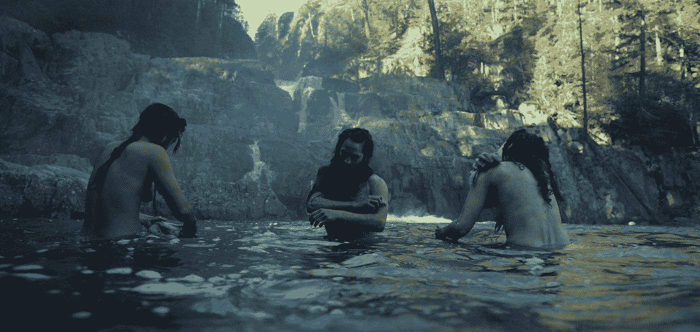
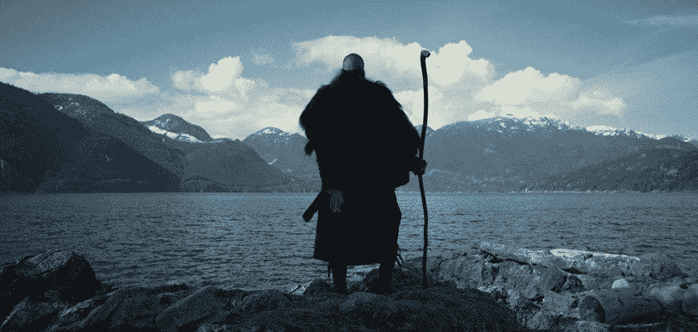
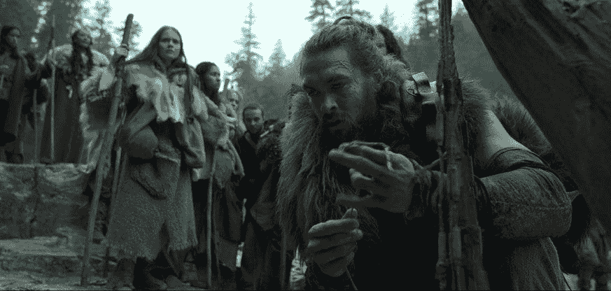
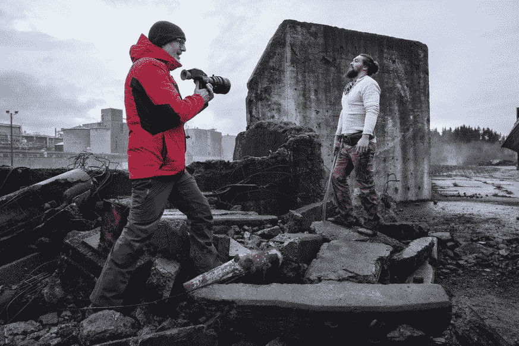

# 苹果的电视剧《看见》比《权力的游戏》好看

> 原文：<https://medium.datadriveninvestor.com/apples-tv-series-see-is-better-than-game-of-thrones-b582076b8b33?source=collection_archive---------2----------------------->

## 权力的游戏已经死了。“见”是下一个得了。

*screenshot: apple*

忘掉你听到的关于杰森·莫玛(《海王》)的电影的一切。这里指的是《看见》(the realm of the blind)，一部所谓的 [*苹果原创，*](https://apple-tv-plus-press.apple.com/en-US/originals/see/) 即一部电影制作，已经由 iPhone 制造商委托并资助其新的流媒体服务。

《See》通过 11 月 1 日推出的 **Apple TV Plus、**独家发售，并作为试用订阅免费提供。

它是《权力的游戏》、《疯狂的麦克斯》和《指环王》的混合体一部精心制作的只在北美荒野上演(至少在开始时)的作品。

我们在这里谈论的是冠军联赛。一集应该花费大约 1500 万美元。因为这是苹果进入流媒体业务的少数几部自己的作品之一，许多评论家的目光都投向了它。有些人认为其他的一切都是奉承，顺便说一句，在第一集之后我不能理解。

 [## 幸福的算法？数据驱动的投资者

### 从一开始，我们就认为技术正在使我们的生活变得更好、更快、更容易和更实用。社交媒体…

www.datadriveninvestor.com](https://www.datadriveninvestor.com/2019/03/08/an-algorithm-for-happiness/) 

但是足够的建议，我们来了六点为什么新系列值得你的时间。

## 小心剧透！

*《看见》的情节在帖子里只是一笔带过——想要享受完全不受预告信息阻碍的系列的人，就此停止阅读吧。*

Baba Voss has heroic courage and bitter past. ***Screenshot: apple***

# 1.行动

## 想象一下，你在为生存而战。而你是瞎子…

The pupils are clouded. For this, the sense of smell and hearing have developed stronger. **Picture: apple**

《看见》正在播放 600 年后的未来。

一开始，我们所知道的是，在 21 世纪，一种致命的病毒爆发了，毁灭了人类，使剩余的人口(200 万)失明。

视力现在只是一个神话，那些甚至谈论它的人都被作为异教徒受到迫害并被处以火刑。

> "曾经视觉的危险力量几乎毁灭了这个世界."疯狂的皇后说
> 
> “我祖母的祖母甚至有书。但是猎巫人把它们扔进了火里。”部落治疗师帕里斯说

该系列只有三集，但相信九个聪明的万事通已经判断出“爆发”后发生了什么，并质疑没有视力的人可以发展这么多，建立一个新的文明。

到目前为止，我们对下一个“进化阶段”发生的时期知之甚少。我们知道，尽管重新陷入黑暗时代，但某些技术成就仍然保留了下来。

如果你是一个只根据自己的经验来衡量每个细节的粉丝，那么你最好不要去“看”有一点是肯定的:科幻剧中的幻想需要大量的想象力和创造力。任何一个痴迷于在汤里寻找头发的人一定会找到它。

*   盲人穿有饰品装饰的连衣裙？“不现实！”
*   演员们的脸和身体不完全是又脏又乱？“不现实！”
*   战斗前，盲人战士在脸上涂涂抹抹？“不现实！”

让我们明确一点:没有人能说如果人类失明会发生什么。没人！希望我们永远也不会知道。

与其唠叨，不如坐下来享受童话故事的强烈叙事。

Yep, blind people can even wash. 😉

## 2.性、暴力和对宗教的批评

《看见》肯定不适合小众，但根据官方评级，适合 16 岁以上的流观众。

*   盲人战士的战争、战略、战术和武器都非常注重细节，绝对令人着迷。以及交流、导航和无视觉运动。
*   巴巴沃斯最喜欢的武器是一把超大的斧头。但他也擅长用武士刀和短刀进行近战。
*   它从身体的各个部位注入大量的血液。
*   迷信和宗教信仰也会让他们发胖。

在这一点上我不想透露更多。只有这一点:对我来说，第三集中的一场打斗场景是有史以来最棒、最不寻常的“打斗”之一。盲人巴巴沃斯带着几个对手在一个相对狭小的空间里。神经衰弱什么都不用！

## 3.纯粹的荒野😍

这部电影是在加拿大西部拍摄的，包括温哥华岛。我们了解到:电影制作人不一定要去新西兰才能看到壮观的景色和令人惊叹的原始荒野。不列颠哥伦比亚省提供了一个令人难以置信的背景，一些相机的设置让人想起佛罗多·巴金斯和他的旅行

Source — Apple

## 4.大电影院

我在 Macbook Pro 上看了前三集，我相信我会在大屏幕上欣赏它们。[比尔·麦克雷里](https://music.apple.com/us/artist/bear-mccreary/204012062)的配乐和许多黑暗神秘的音效造就了他们特殊的家庭影院奇观。

在《看吧》中，没有无所畏惧的米老鼠超级英雄，只有恐惧、鲜血和泪水。和超越自我的人。

## 5.永远不会太暗

尽管经常有威胁和阴郁的气氛，但它永远不会太暗。这和《权力的游戏》有一个很小但很重要的区别，在这场至关重要的对抗夜王的战斗中，甚至连那只手都没有出现。

## 6.皮革代替乳胶

Source — Apple

在《权力的游戏》中，杰森·莫玛扮演野蛮的战士卓戈·卡奥和多斯拉克骑士的王子。尤其令人难忘的是与后来的龙女王丹妮莉丝·坦格利安(艾米莉亚·克拉克饰)的床戏。

在《看吧》中，这位 1979 年 8 月 1 日出生于夏威夷火奴鲁鲁的 1.93 英尺高的美国人，再次扮演了一个强大的战士和勇敢的领导者，但最重要的是，一个热爱家庭的男人。而且他得到的屏幕时间比 GoT 多很多，这是值得的！肌肉发达的帅哥可以展示他的演技。

在一次采访中，Momoa 别名 Baba Voss 说，他宁愿在寒冷潮湿的天气外出，穿着毛皮和皮革，而不是穿着超级英雄乳胶服在绿色屏幕前跳进电影工作室。

谓语:强，值得一看！

## 7.一个文明的衰落——一个(不幸的)热门话题

一个全球性的疫情，席卷了地球上的大部分人口:不仅微软创始人比尔·盖茨认为这是一个现实的场景。在气候灾难迫在眉睫的情况下，人们不必看得那么远。人类正在摆脱？

Francis Lawrence (l.) And Jason Momoa during the filming in ruins. Picture: Apple

我个人的结论是:《看吧》是一个关于善与恶的经典故事，叙述有力，节奏舒缓。紧张切割效果噱头被放弃，但有加拿大西部美丽的野生自然和扣人心弦，非常不寻常的战斗场面。

仅仅三集之后，一种巨大的吸引力正在形成。作为一名观众，人们也迫切地想知道更多关于人类如何设法应对这样一场全球规模的灾难。

> 导演说:
> 
> “我们进入赛季越久，我们就越了解过去——我们现在——失去的知识。有趣的问题是:人类会再次犯同样的错误吗？这是这个系列提出的最大问题之一。”