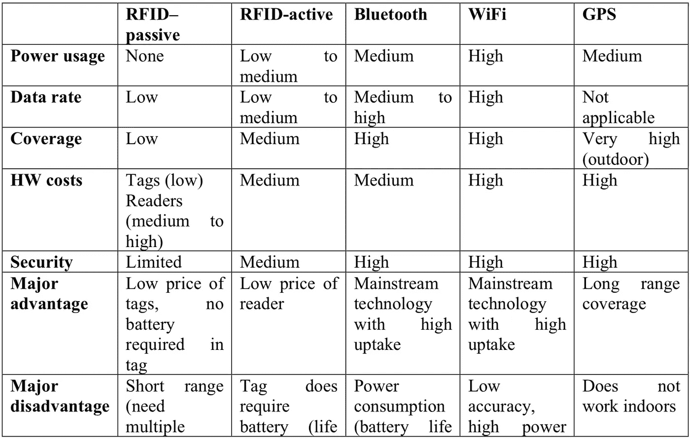
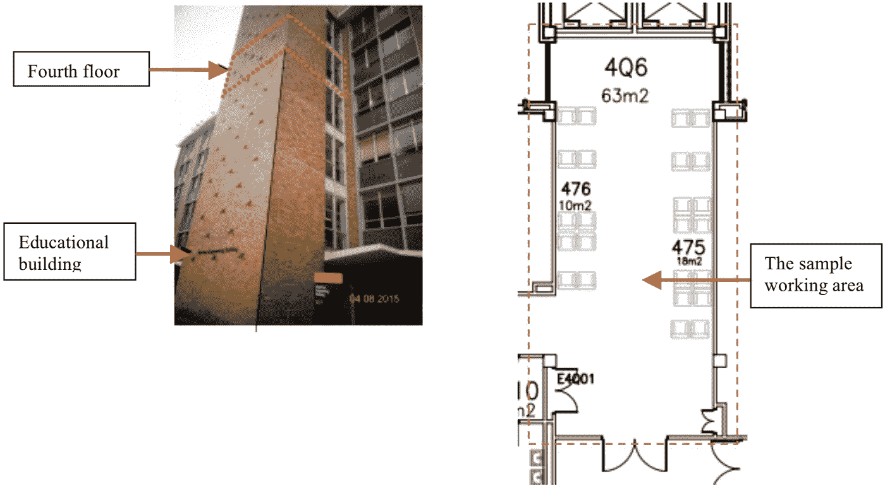
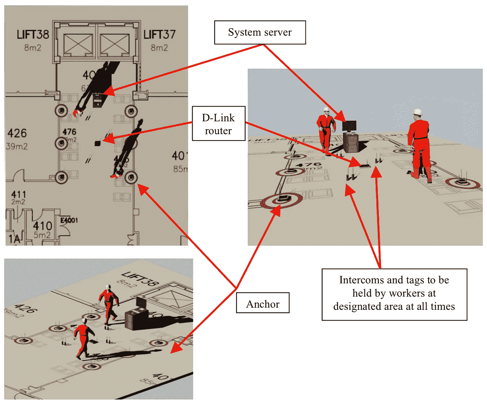
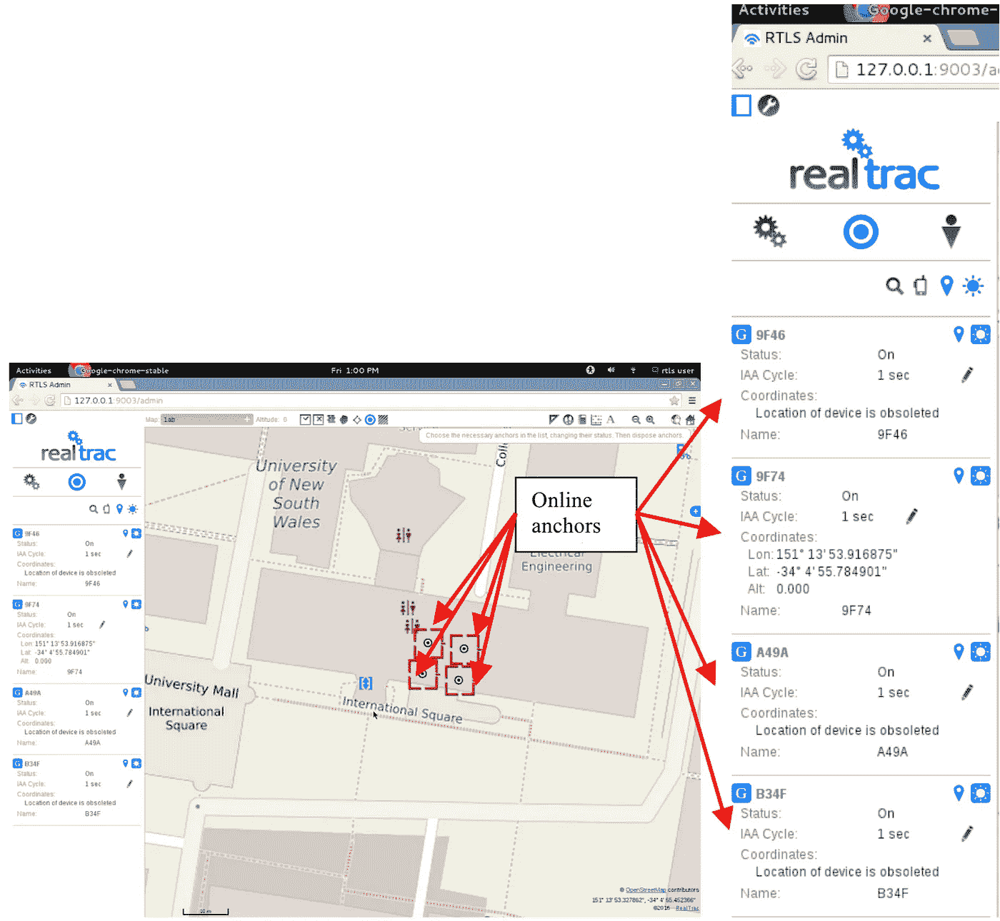
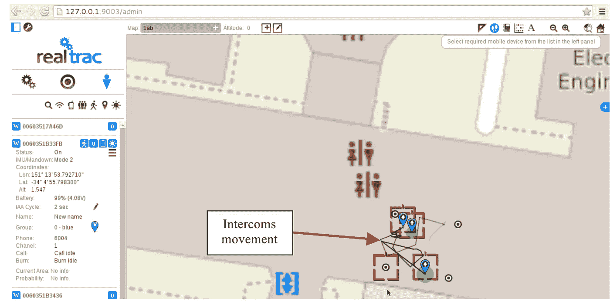
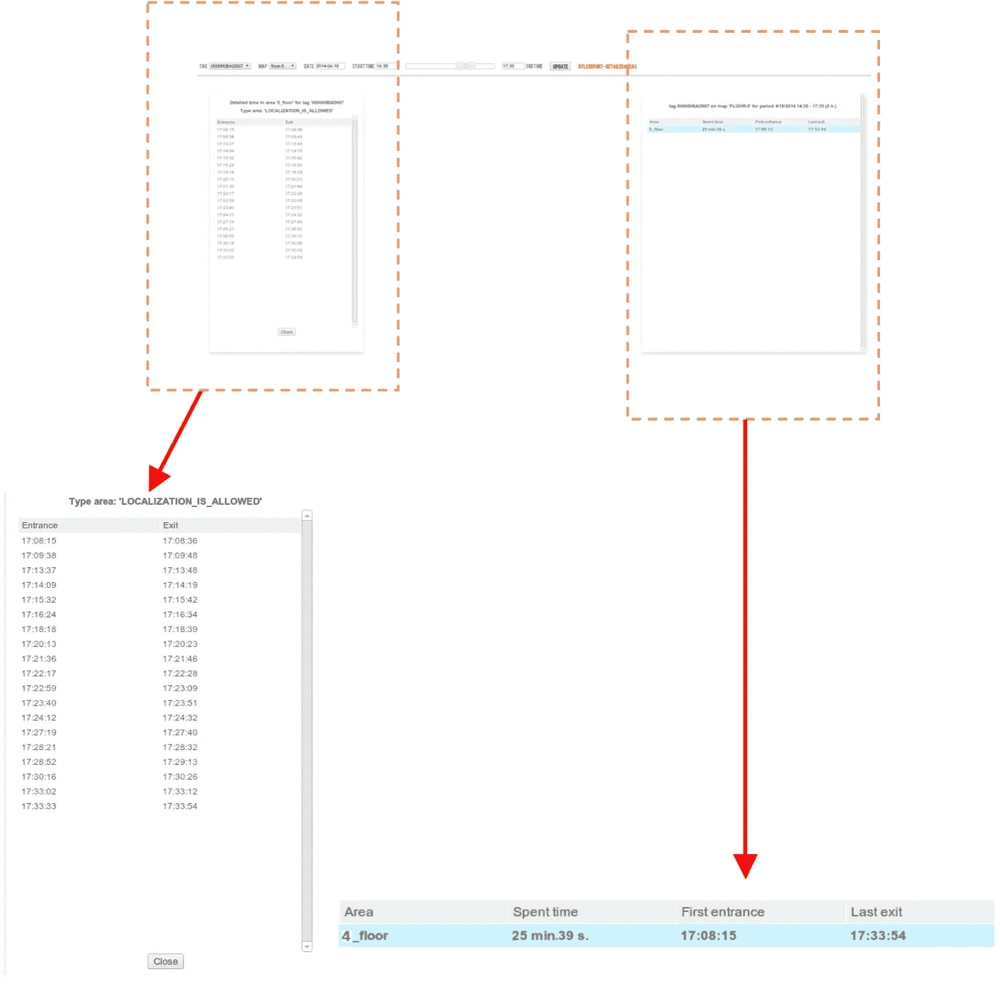

# 实时定位系统的应用(RTLS)。

> 原文：<https://medium.datadriveninvestor.com/application-of-real-time-locating-systems-rtls-1bb4cd93430f?source=collection_archive---------3----------------------->

## 通过人工智能监控劳动和生产力

Photo by [Franki Chamaki](https://unsplash.com/@franki?utm_source=medium&utm_medium=referral) on [Unsplash](https://unsplash.com?utm_source=medium&utm_medium=referral)

## 什么是 RTLS？

RTLS 可以实时确定媒体的位置，监测和分析指定位置的移动，并进行语音和数据通信。通过监测和测量指定地区的劳动力流动，它在提高建筑生产率方面有很大潜力。到目前为止，建筑行业使用的主要数据相当不准确，因为结果主要是在一天结束时，甚至在整个过程完成后进行测量。到那时，需要采取的必要行动就太晚了。此外，识别原因的过程有时是耗时且昂贵的，这是项目经理无法承担的。RTLS 是一个可靠有效的实时数据采集系统，在大多数可视化、优化和协调相关的应用中提供频繁的更新。

本文介绍了使用 RealTrac 实时定位系统实现 RTLS 框架的过程。据信，使用 RTLS 的框架的结果具有收集准确数据和进一步提高生产力并纳入 BIM 的巨大潜力。这项正在进行的研究的初步结果表明，可以测量、绘制和绘制一种远程监控建筑工人绩效和生产率的方法。

## 机制。

实时定位系统(RTLS)是增长最快的技术市场之一，预计到 2020 年增长将达到 70 亿美元，以前主要用于医疗保健，目前正在建筑、零售、石油和天然气等行业兴起(Constructech Magazine，2015)。

RTLS 用于实时跟踪和识别物体的位置，使用附着或嵌入被跟踪物体的“节点”或“标签”，以及接收和处理来自这些标签的无线信号以确定它们的位置的“读取器”，其中系统可以执行位置信息的被动或主动(自动)收集，一个密切相关的术语是“智能定位系统(IPS)”，它在给定的物理空间中连续实时确定物体的位置(Clarinox Technologies Pty Ltd，2009)。然而，需要对现有系统进行改进，以达到竣工文件目的所需的准确性和可靠性。

在医疗保健行业，基于射频识别(以下称为 RFID)的 RTLS RTLS 已被应用于跟踪医疗设备、给患者用药、监控患者和识别假药，而在建筑行业，RTLS 主要用于安全管理和材料物流，如 Lee(2014 年)所述。

RTLS 在建筑领域有许多应用，不仅仅是跟踪人员、产品和设备。如上所述，RTLS 最重要的应用之一是实时获取物体或介质的位置数据。然而，很少提到 RTLS 作为监测和衡量工人(主要是现场劳动力)生产率的工具的应用。在建筑行业中通常的做法是，如果一天的生产率与计划的时间表不一致，很可能会选择增加劳动力数量或增加工作时间，因为这是最佳和最常见的做法。这很常见，但可能不是最佳选择。增加其中一项或两项都会对整个项目的目标利润产生巨大影响。

本文介绍了使用 RealTrac 实时定位系统实现 RTLS 框架的过程。据信，使用 RTLS 的框架的结果具有收集准确数据和进一步提高生产力并纳入 BIM 的巨大潜力。RTLS 可以成为监测和评估指定地区工人生产力的工具，产生和分析数据和信息，并对其进行测量、绘制和绘图。

## **RTLS 概述。**

**2.1 数据采集方式** RTLS 利用无线技术建立标签和阅读器之间的通信。通常使用 WiFi、GPS、红外线、蓝牙以及有源和无源 RFID 系统。表 1 总结了这些技术的差异、它们的突出特征以及决定它们对不同应用的适用性的性能。没有一种无线技术解决方案可以满足每一种特定的功能。

**Table 1: RTLS algorithm comparison (Clarinox Technologies Pty Ltd, 2009) Utilises satellites.**

**Table 1: RTLS algorithm comparison (Clarinox Technologies Pty Ltd, 2009) Utilises satellites.**

**2.2 定位系统的评估和实施。** 

在本实验中，使用 Linux 操作系统的 RTLS 系统使用 web 客户端应用程序来配置系统和浏览地图上的对象位置，并检索设备信息和附加数据。

**2.3 集体数据和用途。**

> 定制使用该系统的房间平面图。
> ·上传建筑平面图。
> ·绘制房间平面图和谷歌地图。
> 在地图上定位锚点。
> 设置锚的高度和地图。
> 创建和编辑图形、墙壁、空间及其属性。
> 显示系统设备状态:网络连接、电池电量、MAC 地址、位置坐标和海拔高度。
> 在地图上显示对讲机和标签的移动。
> 显示一段时间内对讲机和标签在地图上的移动历史。
> 显示系统事件。

**方法与应用。** 本文试图开发一种模型，在现场创造一种可能的现实生活情境。生成和分析数据和信息的整个过程包括扫描、绘图、创建和处理。在数据收集步骤中，选择了新南威尔士大学肯辛顿校区的一栋教学楼来建立实时定位系统。进行了实地工作，以评估和核实通过实时跟踪系统获得的准确性。

The sample building and the floor plan of the working area.

***实验包括使用*** 收集数据和信息

总共 3 个带标签的对讲机，少一个充电适配器；
6 个锚/转发器；
采用 Linux 操作系统的 RTLS 服务器；
·D-Link 路由器；
带操作软件和手册的 USB 2.0 闪存盘

> 锚的覆盖范围是室内 5 米，室外 3 米。为了获得系统的正确和精确的工作，通过在距离地面不超过 1 米(高于人的身高)的地方沿着区域的周界相对于墙壁、锚和网关布置接入点，并且所有接入点被放置在一个位置(垂直位置，以便以太网和电源连接器更靠近地面)。

**结果。**

**3D visualisation of the arrangement of the RTLS RealTrac System.**

**3D Visualisation of a RTLS Set-up.**

**3D Visualisation of RTLS Performance Layout.**

**Data collection from web-client RealTrac on Linux.**

**Each intercoms and tags are connected to the to the system “work with events”. The system will record any events of entering and leaving the area.**

**Detailed report on the history of presence in areas.**

**本地化。**

系统记录的移动、存在和时间可以解释为劳动的生产时间，因为劳动在指定的参数范围内。如果系统记录了“事件:区域休假”,则被认为是劳动的非生产时间，因为劳动超出了界限。

可以考虑的生产力的主要测量与时间有关，即:在指定地点花费的时间与在指定区域之外花费的时间或在指定区域花费的实际工作时间。

记录的数据和信息的准确性非常高，IAA 周期值等于 300 毫秒。

总而言之，结果表明 RTLS 可以超越跟踪人、产品和设备。初步调查结果表明，它可以作为一种工具，以衡量生产力的指定地区的建筑工地。除此之外，通过收集和分析足够的数据库，可以绘制和绘制数据，这些数据将来可以集成到 BIM 中。

**总之(实验发现)。**

这项研究旨在实施一个创新的框架，衡量劳动生产率使用 RTLS。

使用模块化 RTLS 系统来检查指定工作区的开发框架。在本研究中，RTLS 系统安装在目标建筑的室内，以产生更好的结果，因为接入点的室内覆盖范围高于室外。IAA 值被设置为尽可能低的 300 毫秒，以提高数据准确性。

这样做的含义将影响电池的寿命周期，在充电之前，电池寿命周期将从数周显著减少到仅几天。

这项研究显示了一些重要的潜在利益，为更广泛的应用，特别是在建筑业，收集的数据和信息可以产生一个银行的历史，可以进一步分析，然后可以计算和地图。它可以根据类别、特征、环境和输出进行设计，这些因素与其他因素相关，如时间、成本、质量、生产率、健康和安全，这些因素都可以纳入 BIM。

**参考文献和参考书目。**

> Clarinox 技术有限公司(2009 年 11 月)。*实时定位系统*。检索自[http://www . clari NOx . com:](http://www.clarinox.com:)[http://www.clarinox.com/docs/whitepapers/RealTime_main.pdf](http://www.clarinox.com/docs/whitepapers/RealTime_main.pdf)
> 
> 建筑技术杂志。(2015 年 4 月 23 日)。建筑中定位系统的发展。伊利诺伊州卡罗尔溪。
> 
> Lee，I. (2014 年)。 *RFID 技术整合提升企业绩效。* (I .李，编。)IGI 环球。
> 
> RealTracTM。(未注明)。*网络应用 RealTrac 2.17。*奇塔威湾:3DX P/L

最初发布于[数据驱动投资者](https://www.datadriveninvestor.com/2019/02/01/application-of-real-time-locating-systems-rtls/)。

## 来自 DDI 的相关故事:

 [## 用 7 个步骤解释深度学习

### 和猫一起

medium.com](https://medium.com/datadriveninvestor/deep-learning-explained-in-7-steps-9ae09471721a)  [## 数据科学和软件工程哪个更有前途？

### 大约一个月前，当我坐在咖啡馆里为一个客户开发网站时，我发现了这个女人…

medium.com](https://medium.com/datadriveninvestor/which-is-more-promising-data-science-or-software-engineering-7e425e9ec4f4)