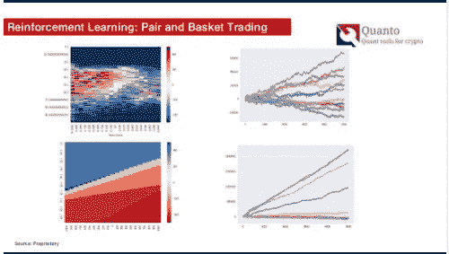

# 人工智能在金融领域的应用:

> 原文：<https://medium.datadriveninvestor.com/applications-of-ai-for-finance-a2e4a3eb8029?source=collection_archive---------9----------------------->

2019 年 7 月 24 日星期三，我给本科生和伦敦国王学院做了一次演讲:

(如果下面的嵌入不起作用[单击此处](https://www.slideshare.net/GerardoLemus3/lecture-kings-college))

我希望我的演讲能吸引一些学生理解人工智能(或者如我所解释的，狭义人工智能)在一些金融应用中的现状。

 [## 值得购买的 4 大人工智能股票及其原因|数据驱动型投资者

### 人工智能(AI)在 2019 年继续进入大众意识。通过应用程序…

www.datadriveninvestor.com](https://www.datadriveninvestor.com/2019/03/06/top-4-artificial-intelligence-stocks-to-buy-and-why/) 

特别是，我希望他们:

*   了解数据如何存储在多表 SQL 数据中(这需要大量的“数据管理”)
*   现实生活中的应用需要美元指标(错误识别一个坏交易的代价是什么？冻结一个好客户的账户怎么样？“精确度”和“召回率”不衡量这一点)
*   法规对模型选择的影响(选择人类可以理解的简单模型或面向客户的人员不能理解的超高效模型，但欧洲法律要求解释！)
*   狭义人工智能的限制:制度变迁，数据关联。
*   狭义人工智能无法解释“如果”( what if)问题(这需要一种新技术:微积分)

大部分原始材料来自我以前发表的故事；请特别参阅:

*   [人工智能:突破宣传](https://medium.com/datadriveninvestor/ai-in-finance-cutting-through-the-hype-with-case-studies-f361518b00d4)(解释了大多数监督和非监督学习的例子，**和**链接到用于生成所有图形的底层 python 代码)
*   [穴居人对 DeepQ 交易者](https://medium.com/datadriveninvestor/neanderthals-versus-deepq-robotraders-with-real-life-prices-round-1-28ab9100a505)(解释强化学习的例子)

如有疑问，请随时联系我。