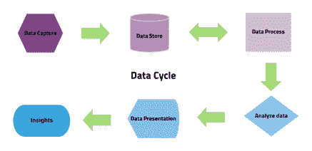

# 数据科学在市场营销中的应用

> 原文：<https://medium.datadriveninvestor.com/applications-of-data-science-in-marketing-3f132a47c863?source=collection_archive---------7----------------------->

每个人都在谈论数据科学以及它如何改变世界，但什么是数据科学？我们将告诉你所有你需要知道的关于数据科学和在市场营销中的应用。

**什么是数据科学？**

首先，重要的是让读者理解数据科学的概念。 *Will Van der Aalst (2016)* 表示，“为此，我们将数据科学定义为一个跨学科领域，旨在将数据转化为实际价值”，这允许预测特定市场的行为及其经历的所有不同阶段。在这些方面，数据科学能够识别过程的结果、导致该结果的影响、该结果将遵循的未来反应以及该过程将出现的最佳情况。

考虑到上述情况，数据科学必须经历 5 个阶段的循环，这包括从源中正确的**数据捕获**，数据的**存储**，以便将其纳入高效的**流程**，以便我们能够**分析**和**报告**它。所有这些，所以我们可以做出有效和强有力的结论。

按照图中所示的流程，首先，您需要通过录入和提取来收集数据。其次，按照定义数据需求的数据架构来存储它。然后，通过数据挖掘和建模对其进行处理，这一阶段可能发生在存储阶段之前或之后，具体取决于数据。在处理完数据后，下一步是利用统计学原理对数据进行分析，进行预测分析、回归分析、文本挖掘和定性分析。最后，数据呈现提供见解、生成报告以及做出决策或建议。

通过完成数据科学循环，您应该能够回答以下问题:发生了什么？为什么会这样？会发生什么？能发生的最好的事情是什么？。

**细分:聚类以做出基于数据的决策**

在市场营销中，为了制定进入具有特定特征的市场的策略，我们需要细分潜在客户并了解他们的需求。通过使用不同的聚类技术，数据科学可以帮助我们开发预测和描述方法，从而为我们提供细分市场的杠杆信息。例如，ward 方法是一种分层方法，在这种方法中，通过使用树状图(类似树的图)和 K-means 算法(根据距质心的距离形成组),可以获得分层结构中的聚类组。我们可以通过使用 r 来应用这些聚类方法。

或者，我们可以使用不同于人口统计学特征的属性(如年龄、体重、性别)，通过使用上述不同的聚类方法得出关于研究人群的结论。随着不断的数字转换和理解消费者给出的无限数据的方法，有必要学习如何应用基于使用新型数据的方法来探索不同的细分市场。

按照前面的想法，基于数学模型，我们可以使用神经网络的技术。这些模型的主要目的是了解用户如何对由研究群体的属性定义的细分市场具有更大的亲和力，将信息从神经网络中的一个节点传递到另一个节点。重要的是，在研究过程中识别可能的混淆变量，以确保结论是无偏倚的，并且只针对研究中的属性(与细分市场直接相关)做出。

**社交媒体数据分析:在线研究人类互动**

正如我们已经知道的，数字数据源自许多来源，而社交媒体的特点是从用户共享的内容中收集基于人类交互的信息。有了数据科学，我们可以收集数据并分析这种类型的信息，了解用户的行为，并旨在构建满足人们需求的营销策略。一些营销策略可以使用广告计划、A/B 测试和内容营销。

社交媒体有助于了解在购买产品时影响客户决策的事实，这有助于分析师确定用户需要哪些信息来进行转换。这方面的一个例子是，使用 A/B 测试来建立一个广告策略，这是对你的业务目标最有效和最有利可图的广告。

**参考文献**

1.  *威尔·范德阿尔斯特(2016)。流程挖掘*
2.  德里克·s·布恩和米歇尔·罗姆(2002)。使用人工神经网络和成员聚类标准评估市场细分解决方案的适当性。