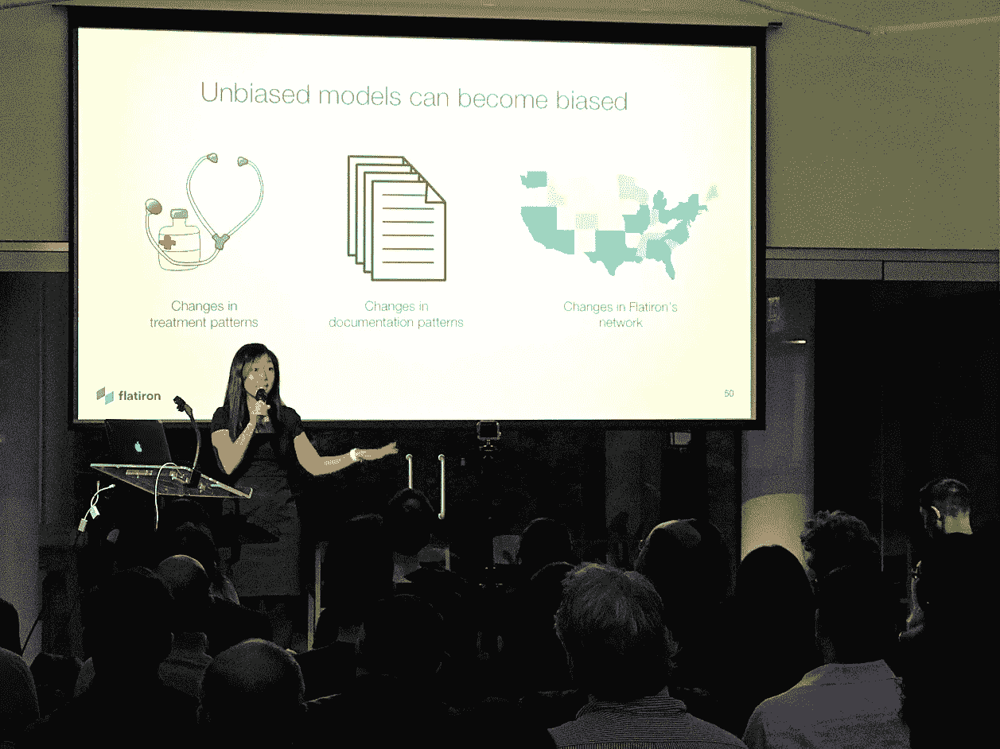
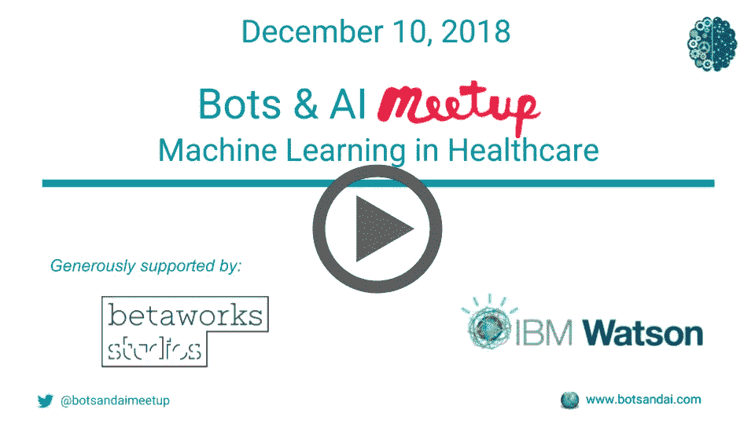
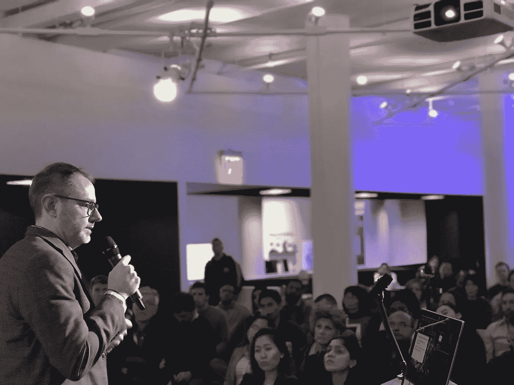

# 机器学习在医疗保健中的应用

> 原文：<https://medium.datadriveninvestor.com/applications-of-machine-learning-in-healthcare-fa4741712607?source=collection_archive---------7----------------------->

Lucy He of Flatiron Health

## 2018 年 12 月机器人与人工智能会议的亮点:“医疗保健中的应用机器学习”

医疗保健中的机器学习应用在纽约观众中大受欢迎。12 月 10 日，至少有 130 名热情的与会者加入了机器人和人工智能的聚会，人群一直延伸到房间的后面。

[熨斗健康](https://flatiron.com)的 Lucy He 以检验机器学习在医学研究队列选择中的影响开始了这个夜晚。一个反复出现的主题是机器学习增加了人类的工作并集中了他们的努力。电子医疗记录(EMR)是非结构化的，通常难以理解，自由流动，难以完全自动化，因此人类经常参与标记和提取数据。这种时间是昂贵的，因此机器学习可以用来预测哪些患者数据可能适合研究，并优先考虑和减少人类策展人的工作量。

有效队列研究的另一个关键方面是确保队列没有降低其有效性的偏见。一种偏倚测量技术涉及识别和比较 ML 产生的队列中与参考标准相比的临床相关变量的分布。

**可以在**[**YouTube**](https://www.youtube.com/playlist?list=PLewz_C2j8x_riJ4Yr4L4tl830LaXZABdL)**:**上观看熨斗健康和 TalkSpace 的完整演讲视频

辉瑞战略总监 Michael Frank 提供了许多提高药物设计 R&D 效率的用例。人工智能与生成对立网络(GANs)的工作可以预测和提出更有效的分子形状。机器学习还可以预测和提高分子化合物的效力和产量。最后，ML 算法可以摄取数据，并在不同的数据集和研究论文之间得出相似性和结论，这些数据集和研究论文涉及单个疗法的适应症、疾病途径、疗效和毒性以及疗法之间的相互作用。

用于在医学成像中识别肿瘤等病理的图像识别(通常是深度学习)正在取得巨大进展。另一个正在兴起的有趣途径是使用可穿戴设备收集数据并预测损伤或风险。佩戴者可以被告知在更糟糕的结果出现之前主动去看医生，例如中风的风险。

增加商业决策也是一个强大的应用人工智能能力。探索行业领域的机器学习算法可以突出趋势和势头。它们还可以用来识别拥挤市场仍有机会进入的空白空间。

Michael Frank, Director of Strategy at Pfizer

最后， [Talkspace](https://www.talkspace.com) 的 Nick Lamm 将这个夜晚带回了人工智能机器人&的聊天机器人根源。医疗保健受众特别感兴趣的是，Nick 解释了 HIPAA-BAA 合规性的供应商和工具选择的一些方面，以及云服务的一些细微差别。虽然亚马逊可以作为一个云平台，但并不是所有的服务都是兼容的。Talkspace 是保持本地聊天数据所有权的 Rasa 核心的粉丝。

Talkspace 正在试验 NLP，但他们目前的早期版本是使用智能和引导式对话框。创建一个具有精心制作的对话选择和个性化上下文记忆的机器人通常是一种更成功的技术，以在添加由 NLP 的自由文本分析增加的意图错误分类风险之前建立用户旅程有效性。

Nick Lamm of [Talkspace](https://www.talkspace.com)

营销和心理学并不是一个不寻常的组合。动机访谈不仅是一种有效的心理治疗技术，也是一种强大的销售/营销技术，甚至在聊天机器人中也可以用来帮助建立信任/融洽关系，并最终赢得客户。

医疗保健是一个如此大的机会空间，观众很高兴能够从三个角度来看问题。活动结束后，我们被激动的观众数量所淹没，他们渴望更多的医疗保健主题内容，也有兴趣发言。

*原载于* [*Bots + AI*](https://medium.com/bots-and-ai)