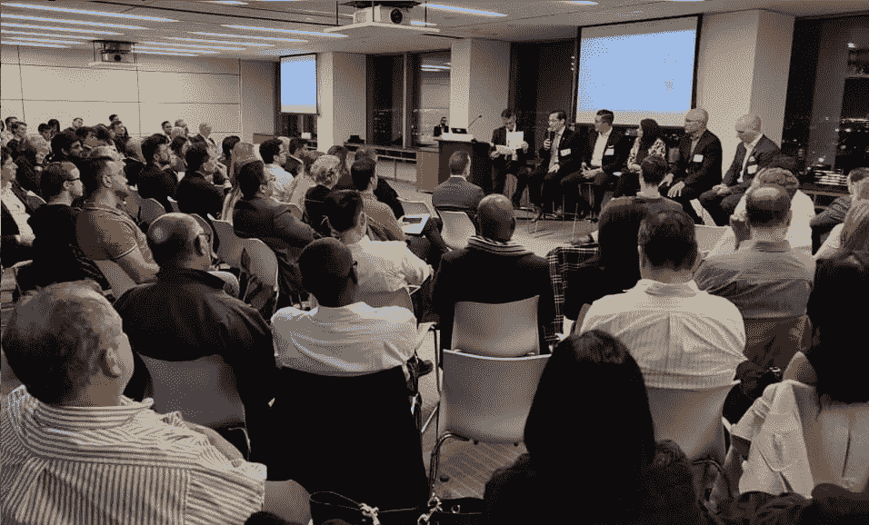

# 在网络安全中应用人工智能和机器学习

> 原文：<https://medium.datadriveninvestor.com/applying-artificial-intelligence-and-machine-learning-in-cybersecurity-1fea3b5505be?source=collection_archive---------21----------------------->

Great Panel Discussion on this Hisponotech’s coordinated networking event.

对一些人来说可能是新闻，根据[身份盗窃资源中心(ITRC) 2017 年数据泄露行业总结报告](https://idtheftcenter.org/2017-data-breaches/)的汇编和报告，过去两个季度被泄露的数据记录数量已经超过了 2017 年全年被泄露的记录总数。还有一些人自信地表示，这些数字远非全面，因此受损记录的数量可能会更高。像脸书、安德玛和哈德逊湾(仅举几例)这样的大公司通过公开承认大规模网络攻击制造了“大”新闻；使网络安全成为我们现代最*【过度炒作】*的主题之一，并提高了防范此类攻击的方法的标准——以及我们对它们的理解。

为了提高认识和揭穿炒作，同时为公众提供一种方法，在当前的安全分析战略中找到使用机器学习的真正价值， [Hispanotech](https://hispanotech.ca/) 自豪地举办了一场关于[在网络安全中应用人工智能(AI)和机器学习(ML)](https://hispanotech.ca/2018/09/14/applying-artificial-intelligence-machine-learning-in-cybersecurity/)的活动。**它的核心原则:随着威胁参与者的创新，防御者也在创新，迫使安全分析发展到许多安全参与者的机器学习声明之外。**机器学习背后的数据科学在更大的分析管道中可能是有用的；今天的需求要求每个人都加入到这场对话中来，并确定供应商产品或服务的真正价值，即使不是数据科学家也是如此。

这一活动——一个充满见解、交流和美味点心的夜晚——带来了与行业领袖的发人深省的讨论。主题演讲人 TK Keanini 是思科系统公司杰出的分析工程师和产品线首席技术官，拥有超过 25 年的安全经验，是许多安全标准的创始成员(如 *CVE* )，他在*发表了“安全分析的今天和明天:从静态列表到机器学习”*。通过声明今天的“攻击者不是闯入，而是登录”，Keanini 先生提高了人们的意识，即通过机器学习，行为检测可以用于检测那些“异常”登录和许多更可疑的活动。此外，这些技术可以在不解密的情况下发现加密数据中的威胁。另一方面，他还强调了*“效用”*应该是这些算法的最终性能指标，并建议网络安全解决方案的购买者优先选择具有*“开放态度”*——发表文章或白皮书和/或为开源平台做出贡献的供应商。

本次活动的后半部分是由 CGI 咨询服务总监 Fernando Martinez 主持的小组讨论。Keanini 先生在其他领导的陪同下出席了会议:在信息安全领域拥有超过 15 年经验的 Cycura 董事总经理 Iain Paterson，他在技术专家和高级领导之间架起了一座桥梁；Iman Abudagga，微软数据和人工智能产品负责人，人工智能爱好者，在*‘云和托管’*业务领域拥有多年经验；Julean Albidone，德勤人工智能产品负责人，通过融合众多技术，从头开始构建应用创新实践；道明银行企业技术部&网络安全副总裁 Eduardo Delgado 领导网络安全计划。

该小组讨论了人工智能的*【doble-edge】*性质——因为它通常是开源的，企业和攻击者都可以获得相同的工具——但也强调了它的可扩展性使其在网络安全工作中至关重要。云加速了数据的积累，为人工智能增加了更多杠杆。他们一致认为，金融机构、学术界、政界和其他商业实体正开始加入对话，释放这些技术的力量。

*在 Hispanotech 的博客里找到这篇文章的* [*节选*](https://hispanotech.ca/2018/11/01/applyingartificialintelligenceandmachinelearningincybersecurity/) *。请随意浏览网站，随时了解其他事件和活动。*