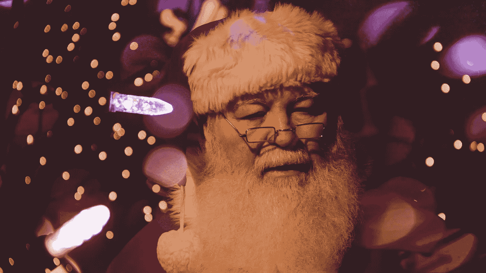

# 1/3 自动化将如何影响圣诞老人？

> 原文：<https://medium.datadriveninvestor.com/applying-automation-how-would-it-impact-father-christmas-6dbd5259724d?source=collection_archive---------8----------------------->

我最近谈了很多关于自动化的问题，以及为什么我认为通过自动化实现业务价值的最佳方式是与最终用户合作，以便我们将他们的专业知识与技术驱动的流程效率相结合。因此，我想分享一些例子来带来这种生活，随着圣诞节的临近(“可爱、光荣、美丽的圣诞节，整个童年都围绕着它旋转！”)为什么不用《圣诞老人的帝国》作为例子，说明自动化如何被用于判断对错，以及它如何影响每个参与者的体验？

在这一点上容忍我！

 [## 不管准备好了没有，革命就在我们面前|数据驱动的投资者

### “对于技术如何影响我们的生活和重塑经济，我们必须形成全面的全球共识……

www.datadriveninvestor.com](https://www.datadriveninvestor.com/2019/02/12/ready-or-not-the-revolution-is-upon-us/) 

如果我们将自动化纯粹作为一种降低成本的方式(无论是努力、时间、人数)，圣诞老人和他的精灵通常投资以确保圣诞节顺利进行，那么我们将对我们快乐的、长胡子的朋友有一个非常不同的看法。那么，对于圣诞老人来说，自动化会是什么样子，会有什么影响，不仅仅是对他的工作量，还会对热切期待他到来的孩子们产生什么影响？

本周我将考虑自动化将如何影响淘气或乖孩子名单的创建。如果圣诞老人收集世界各地儿童的数据，并使用分类算法来完全自动生成每年的淘气或乖孩子名单，会怎么样？

该算法将根据现有数据为淘气和乖孩子设定一条基线，并计算出“乖”孩子和“淘气”孩子的天数。这将节省大量的时间，圣诞老人花在监测儿童和评估他们是否得到礼物，这意味着一个更轻松的运行到他的节日期间！然而，这种方法存在一些问题。这将意味着，一个孩子可能在今年开始时很淘气，然后随着这一年的进展，努力变得更好，但算法不会考虑他们改变和变得更好的努力，如果他们被淘气的天数超过，那么他们仍然会在袜子里收到煤，这不会鼓励明年更好的行为！另一个问题是，该算法不会考虑更广泛的背景，即为什么一个孩子可能会以某种方式行事——也许他们的父母正在经历离婚，或者他们在学校遇到了困难，这影响了他们的行为方式，但他们仍然很好，只是在成长过程中遇到了困难。毕竟，“好名单上的每个人都有位置！”

然而，这并不是说自动化不能增加价值。更好的方法是使用分类算法来为圣诞老人提供关于谁淘气和善良的指导，这样他就可以添加他已知的移情方法来鼓励那些可能被归类为淘气但内心善良并需要正确方向的孩子。这将是节省时间的最佳方法，而不会损害圣诞老人以人为中心的方式来写他的清单——并检查两次！