# 将 Oracle 机器学习应用于 Oracle 自治数据库中的家庭贷款审批数据。

> 原文：<https://medium.datadriveninvestor.com/applying-oracle-machine-learning-in-oracle-autonomous-database-with-home-loan-approval-data-7e10ed887625?source=collection_archive---------10----------------------->

[](http://www.track.datadriveninvestor.com/Split11-20)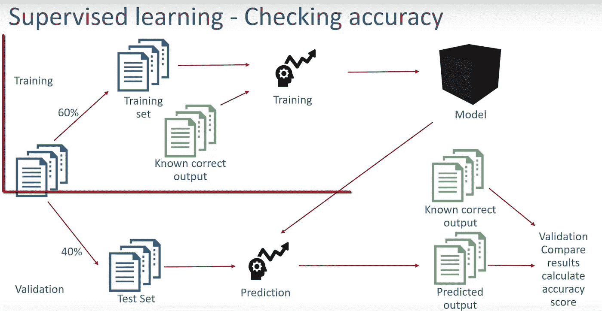

The machine learning process used for this exercise

希望你听说过甲骨文的自动驾驶自主数据库。自治数据库是云中的自治数据管理软件，可提供自动修补、升级和调整，包括在系统运行时执行所有日常数据库维护任务，无需人工干预。这种新的自主数据库是自驱动、自保护和自修复的，这有助于消除手动数据库管理和人为错误。还有，Oracle 自主数据库平台内置的一个盒子里还有一个秘密武器叫做**机器学习。 [**这里的**](https://oracle.github.io/learning-library/workshops/adwc4dev/) 是一个快速实验指南，帮助您开始使用 Oracle 自主数据库平台。**

在本文中，我将向您展示一个实际例子，说明我们如何利用 Oracle 自治数据库平台中的机器学习功能，并即时做出决策。

## 这是我们虚构的公司的背景:从事房屋贷款的 Vision Housing Finance Corp。他们遍布所有城市、半城市和农村地区。客户首先申请住房贷款后，该公司验证客户的贷款资格。

## 问题

VisionCorp 希望根据填写在线申请表时提供的客户详细信息自动执行贷款资格流程(实时)。这些详细信息包括性别、婚姻状况、教育程度、受抚养人人数、收入、贷款金额、信用记录等。因此，他们希望了解是否可以利用他们现有的数据集，并应用一些机器学习来自动化贷款决策过程。您可以从 [**这里**](https://fort-cec-apacanzset01.cec.ocp.oraclecloud.com/documents/link/LFB90D9636CC68B35B6231190805BEF62D46FD23D187/folder/FC6318D48F765975D274BDE4B6712D77340DDD940185/_ADW_ML) 下载该公司提供的历史数据集。

机器学习平台最突出的一个特点就是笔记本。笔记本提供了一个基于 web 的协作工具来创建和共享包含实时代码、公式、算法和叙述性文本的文档。它的用途包括数据清理和转换、数值模拟、统计建模、数据可视化**、**和数据分析。最流行的笔记本工具是 Jupyter 和 Zeppelin。自治数据库中的 Oracle 机器学习使用 Zeppelin 笔记本。根据我到目前为止的研究，笔记本电脑的目标群体是数据科学家，他们知道如何用 R 或 Python 编写代码，在大量数据集之间穿梭，以准备模型、训练数据并得出特定的预测。

然而，我们不需要数据科学家来准备 Oracle 机器学习平台中的学习模型或预测。如果您熟悉 SQL 或 PL/SQL，您可以充分利用这些知识，利用机器学习功能，直接对数据运行这些流程。自治数据库消除了移动数据(包括输入数据和预测数据)的痛苦。因此，让我们看看如何在自治数据库中应用机器学习。

1.  **提供自主数据库(ADW 或 ATP)并加载数据**

按照此处[提到的实验说明](https://oracle.github.io/learning-library/workshops/adwc4dev/)提供一个自治数据库，并将贷款数据集加载到 ADW/ATP 平台。

在本练习中，我在我的数据仓库中创建了一个名为 LOAN_VISIONCORP 的表(见下文),并加载了 VISIONCORP 共享的历史数据。

```
CREATE TABLE "ADMIN"."LOAN_VISIONCORP" 
   ( "LOAN_ID" VARCHAR2(200 BYTE), 
 "GENDER" VARCHAR2(26 BYTE), 
 "MARRIED" VARCHAR2(26 BYTE), 
 "DEPENDENTS" VARCHAR2(26 BYTE), 
 "EDUCATION" VARCHAR2(26 BYTE), 
 "SELF_EMPLOYED" VARCHAR2(26 BYTE), 
 "APPLICANTINCOME" VARCHAR2(200 BYTE), 
 "COAPPLICANTINCOME" VARCHAR2(200 BYTE), 
 "LOANAMOUNT" VARCHAR2(200 BYTE), 
 "LOANAMOUNT_TERM" VARCHAR2(200 BYTE), 
 "CREDIT_HISTORY" VARCHAR2(200 BYTE), 
 "PROPERTY_AREA" VARCHAR2(200 BYTE), 
 "LOAN_STATUS" VARCHAR2(26 BYTE)
   )
```

创建一个开发人员用户来执行下面的机器学习步骤。当您创建一个机器学习用户时(以上链接的实验 4 中提到了相同的说明)，将创建一个实际的数据库用户。

2.**准备机器学习流程，以识别当前贷款审批数据集中的模式。**

使用步骤 1 中创建的开发人员用户登录机器学习 UI。

*提示:当你进入管理界面时，确保你点击了主页，这将引导你进入开发者界面。*

创建一个新笔记本，并开始创建段落，我们可以在其中编写 SQL 或 PL/SQL，以根据我们加载的数据进行检查、建模和预测。在我们的案例中，我们希望通过学习现有客户的数据来了解贷款审批流程的当前趋势，并将其应用于未来的客户。

**第 1 步:**首先，让我们查询刚刚加载的表，该表显示了已经批准贷款或贷款被拒绝的现有客户。在您刚刚创建的笔记本中，在第一段中执行以下查询。

> 从管理中选择*。贷款 _VISIONCORP

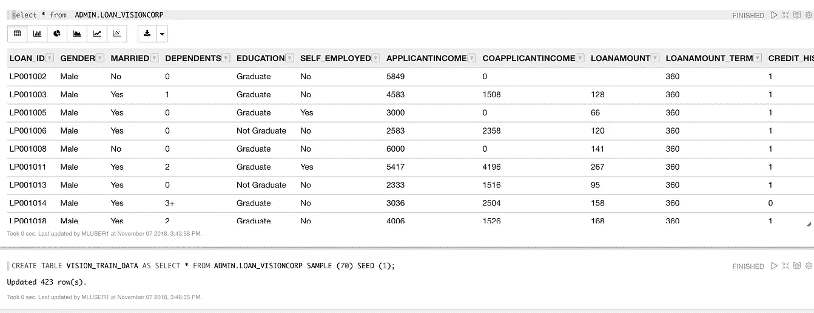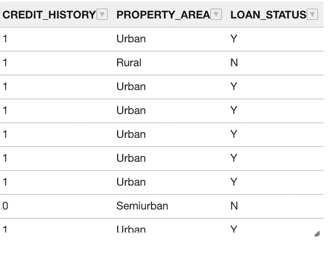

Master Data from the Data Warehouse

因此，如果我们查看上述客户数据和他们的贷款状况，就会发现所有的属性，如教育、收入、就业等。影响他们的贷款是否被批准。这就是机器学习的秘密武器发挥作用的地方，它可以识别这些属性和目标属性(在我们的例子中是 Loan_Status)之间的模式。

**步骤 2:** 让我们把数据集分成两部分，一个训练数据集和测试数据集。我在这里应用了 70-30 的比例。在这个练习中，我选择为训练数据和测试数据创建两个表。

> 将 VISION_TRAIN_DATA 表创建为 SELECT * FROM ADMIN。LOAN_VISIONCORP 样本(70)种子(1)；
> 
> 将表 VISION_TEST_DATA 创建为 SELECT * FROM ADMIN。LOAN_VISIONCORP 减去 SELECT * FROM VISION_TRAIN_DATA

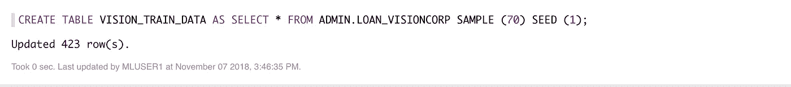

Create a Table that loads the Training Data (70%) from the Master Data Set.

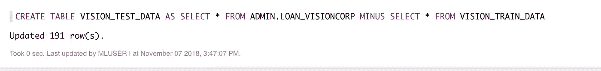

Create a Table that loads the Test Data (30%) from the Master Data Set.

**第三步**。使用其中一种植入的机器学习算法准备数据分类模型。在此之前，我们需要为我们的模型创建一个包含超参数的表。在这张表中，我们有唯一的配置，其中包含我们希望在数据集上使用的机器学习算法的类型。在这个练习中，我选择了**【ALGO 决策树】**，因为我们想了解贷款审批背后的决策过程。

> % script
> BEGIN
> EXECUTE IMMEDIATE ' CREATE TABLE VISIONCORPLOAN _ BUILD _ SETTINGS(SETTING _ NAME varchar 2(30)，SETTING _ VALUE varchar 2(4000))'；
> 立即执行‘插入到 VISIONCORPLOAN _ BUILD _ SETTINGS(SETTING _ NAME，SETTING_VALUE)值(‘ALGO _ NAME’，‘ALGO _ 决策树’)’；
> 执行立即'调用 DBMS_DATA_MINING。CREATE _ MODEL(' VISIONCORPLOAN _ CLASS _ MODEL ' '，' CLASS ' '，' VISION_TRAIN_DATA ' '，' LOAN_ID ' '，' LOAN_STATUS ' '，' VISIONCORPLOAN _ BUILD _ SETTINGS ' ')'；
> 结束；

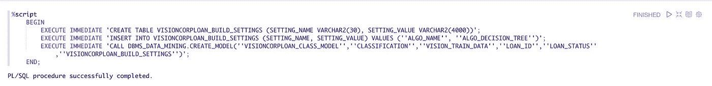

Execute this PL/SQL to create and train the model.

N 注:*为了构建和训练模型，我们需要使用一个 pl/SQL 命令 DBMS_DATA_MINING。接受参数的 CREATE_MODEL。提供要使用的模型名称和训练方法(在我们的例子中，我们使用分类)、要使用的数据表(之前创建的训练表)以及目标变量和超参数。这是训练模型所需的全部内容*

**步骤 4:** 通过将上述模型应用于测试数据集(我们从主数据集提取的 30%数据集)来测试模型的质量。当我们针对该数据集测试模型时，我们可以根据我们在上述步骤中进行的培训来预测测试数据集客户是否有资格获得贷款。

*   在测试数据中创建新的占位符列(预测)

```
ALTER TABLE VISION_TEST_DATA ADD LOAN_STATUS_PRED VARCHAR2(20);
```

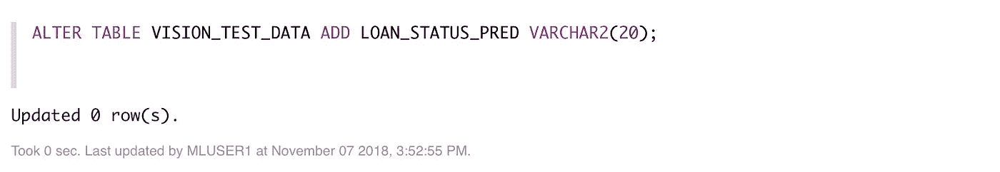

*   让我们运行预测来填充我们刚刚在测试数据表中添加的新列。

```
*UPDATE LOAN_TEST_DATA SET LOAN_ELIGIBILITY_PRED1 = PREDICTION(LOAN_CLASS_MODEL USING *);*
```

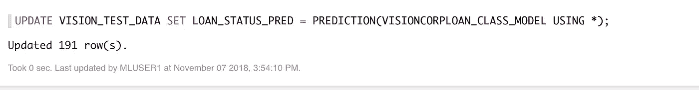

*   让我们查询测试数据表，该表包含所有客户的数据及其原始贷款状态，以及应用于新列的机器学习模型贷款状态预测。

```
SELECT LOAN_ID,LOAN_STATUS, LOAN_STATUS_PRED FROM VISION_TEST_DATA;
```

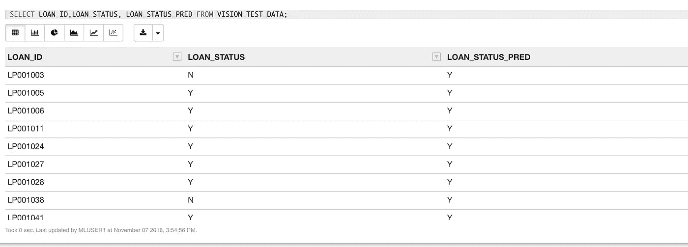

You can see that the Prediction is in line with the decision made by the Loan Approval system.

*   让我们了解一下我们的预测有百分之多少是准确的。

```
SELECT TO_CHAR(((SELECT COUNT(*) FROM LOAN_TEST_DATA WHERE LOAN_ELIGIBILITY = LOAN_ELIGIBILITY_PRED1) /(SELECT COUNT(*) FROM LOAN_TEST_DATA))*100,’999.99') CORRECT_PRED_PERCENTAGE FROM DUAL;
```

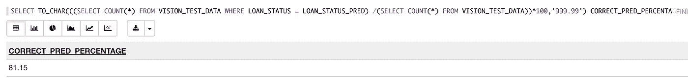

You can see that our training model has a very high accuracy of 81%. We tested only for about 900 Customers. However, these models produce more top accuracy results if we have datasets that run into thousands.

*   我们可以更进一步，在混淆矩阵的帮助下理解预测，假设我们有来自测试数据的贷款状态和来自应用机器学习模型并根据这些属性对它们进行分组后的预测的状态。

```
SELECT LOAN_STATUS, LOAN_STATUS_PRED, COUNT(*) from VISION_TEST_DATA GROUP BY LOAN_STATUS,LOAN_STATUS_PRED ORDER BY 1,2
```

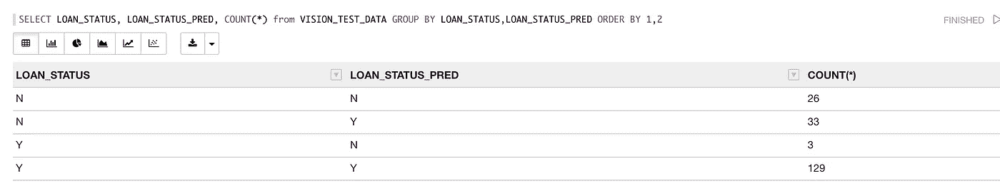

我们可以在这里看到基于我们的预测模型的贷款批准的真负数、假正数、假负数和真正数。

如果我们在测试数据中插入一个新的客户数据，或者创建一个新的表，插入最新的数据并应用预测模型，我们就可以确定这些客户是否有资格获得贷款。我很想知道你的进展如何。期待您的投入。谢谢你的时间。

*PS:* [*这里的*](https://fort-cec-apacanzset01.cec.ocp.oraclecloud.com/documents/link/LFB90D9636CC68B35B6231190805BEF62D46FD23D187/folder/FC6318D48F765975D274BDE4B6712D77340DDD940185/_ADW_ML) *就是我的笔记本上面的查询。您可以下载这个 JSON，将这个笔记本导入到您的实例中并进行测试。*