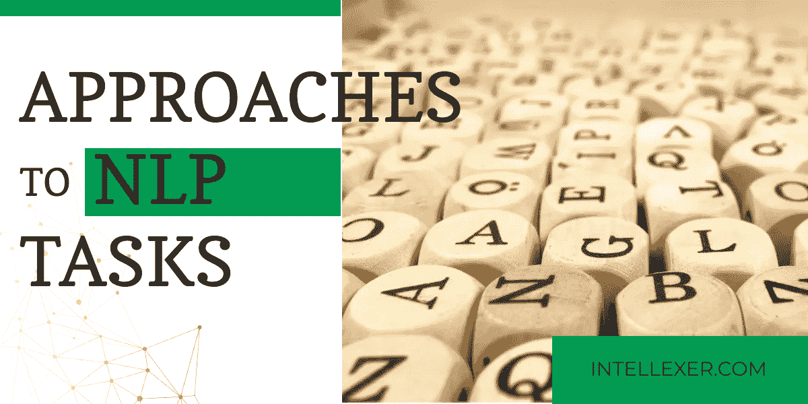

# 自然语言处理任务的方法

> 原文：<https://medium.datadriveninvestor.com/approaches-to-natural-languages-processing-tasks-aa5ba37a7a6f?source=collection_archive---------19----------------------->

1.  基于规则

基于规则的方法可能是 NLP 方法中最古老的一种，但它仍然被广泛使用，尽管是在有限的任务范围内。规则由熟练的专家编写，通常是语言学家或其他知识工程师。该过程从手动执行的深度数据分析开始，以便找到一些一致性和关系，这些一致性和关系可以进一步转换为规则。这个问题可以描述为在规则适用于一小部分的情况和相反的情况之间不断寻找平衡。

正则表达式和上下文无关文法是基于规则的自然语言处理方法的工具。

总的来说，基于规则的方法已经被证明在句子级别上工作良好，例如对于单词边界消歧。当应用于狭窄的领域时，它具有高性能，然而，它往往具有非常差的通用性。

基于规则的方法的另一个明显的缺点是，它是劳动密集型和耗时的，因为规则是手动创建的，并且需要不断更新，最重要的是，这通常会导致规则系统过于复杂且相互矛盾。

2.传统机器学习

机器学习方法不需要专家编写任何规则，相反，基于 ML 的系统建立自己的知识，产生自己的规则和自己的分类器。它可以学习“理解”文本，而无需显式编程。机器学习基于统计方法和训练数据集。唯一需要的是用于训练 ML 模型的带注释的数据集。

机器学习的明显优势是其自主学习的能力，这大大减少了时间支出。这种方法最适用于分类和集群化任务，例如基于主题的文档分类。

您可能已经猜到，使用 ML 执行 NLP 任务的主要问题在于这些训练数据。通常一个训练数据集不能被重复使用，需要准备新的数据。这一过程可能非常耗时，因为数据集大多是手动创建的，并且它们必须足够大以确保模型的高精度。

也可能发生这种情况，即使少量的新数据添加到训练数据集中，也会以不可预测的方式极大地改变模型。

然而，如果有好的训练数据集可用，使用 ML 方法可以大大加快某些 NLP 系统的开发。

3.神经网络

这种方法类似于“传统的”机器学习，但它不需要特征工程，因为特征是由神经网络从非常大的数据集学习的。不同的神经网络可以用来处理 NLP 任务，甚至有一个神经网络能够模拟马尔可夫链。

与“传统的”ML 不同，数据集中的单词被表示为分布在向量空间中的向量。单词之间的关联是基于使用余弦距离测量的相似性来发现的。

这些关联是使用无监督学习自动完成的(其中不需要注释数据)。这种方法只需要一个非常大的自然语言语料库来学习。

最近计算资源和数据集积累的发展与改进的算法相结合，使得神经网络方法能够支配许多 NLP 任务，如语音识别、问答等。

上述所有方法既可以单独使用，也可以相互结合使用，以达到更好的效果。影响方法选择的是应用范围或已开发系统的类型。