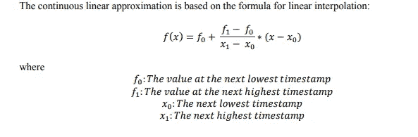
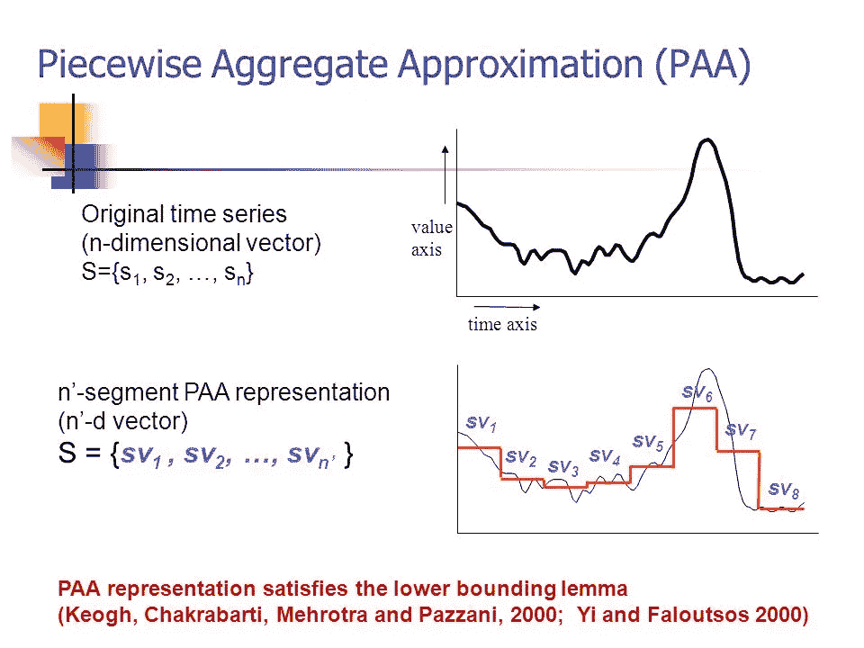
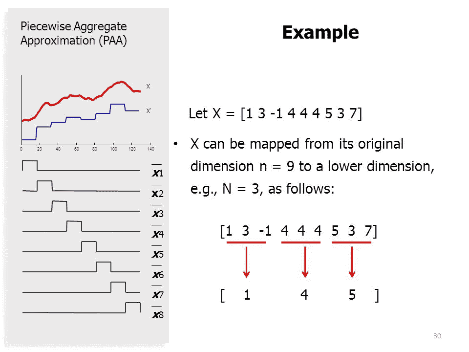
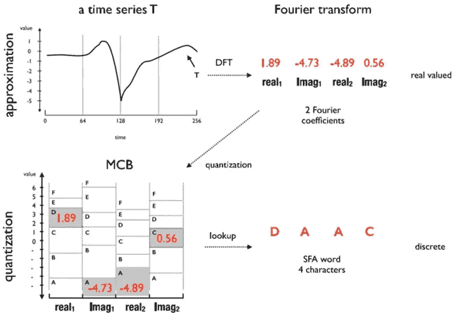
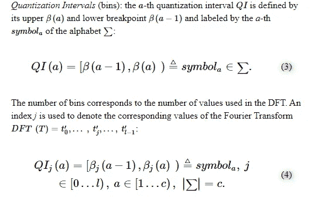
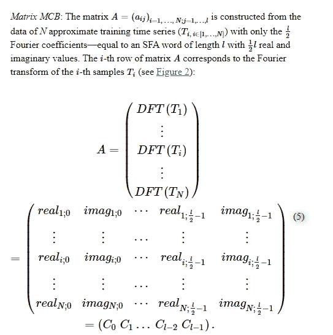
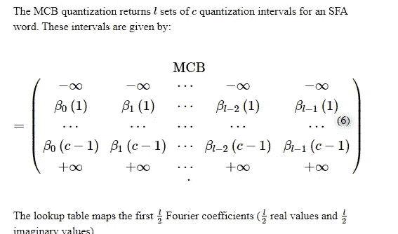
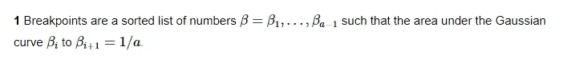

# 时间序列的逼近——时间序列及其分析。

> 原文：<https://medium.datadriveninvestor.com/approximating-a-time-series-time-series-and-its-analysis-923aa81ca80a?source=collection_archive---------4----------------------->

source: [https://freedom.to/](https://freedom.to/)

## [1。第一个](https://medium.com/@venali/the-first-one-lets-define-the-time-series-and-its-analysis-c81abf1e7308) 2。[这一系列的温和开局](https://medium.com/@venali/a-gentle-start-in-this-series-time-series-and-its-analysis-bb0a67503d6e) 3。[逼近一个时间序列](https://medium.com/@venali/approximating-a-time-series-time-series-and-its-analysis-923aa81ca80a)

> “近似算法试图从时间序列中捕捉最重要的信息。它们可以被视为简单的特征提取算法。”

我希望这是一篇关于时间序列中函数逼近究竟是什么的柔和流畅的文章。像样条的概念将被解释，我们将涵盖四个主题
*1。分段聚合近似值
2。离散傅立叶变换
3。多重系数宁滨
4。符号聚合近似*

# **在开始讨论四种算法及其实现之前，让我们先迈出小步。**

**我们来谈谈近似。**
我们已经开始说“近似算法试图从时间序列中捕捉最重要的信息。它们可以被视为简单的特征提取算法。”
对我来说，时间序列只是“反映其结构中时间相关性的附加信息的数据”

给一个合乎逻辑的解释，时间序列是一系列数据，具有:
1。启动
2。end&3。数据点本身的频率。

给定时间序列的这种结构，我们可以说在笛卡尔坐标系中有一个表示数据的 x 值和一个表示时间戳和 ts 的 y 值作为序列{(x，y)}。
肯定会有 x 值因各种原因而缺失的情况。我们可以假设缺失值是时间序列中具有 y 值的值，即它具有时间戳，但没有与之相关联的数据或 x 值。在上一篇文章中，我们填写了“ffill”等
一篇研究论文指出:
“缺失值由时间戳及其相应的值组成，而我们当前正在处理的系列
没有这些值，但它们存在于另一个系列中。”
*来源:* [*链接*](https://www.ifi.uzh.ch/dam/jcr:ffffffff-96c1-007c-0000-000047f93f25/ReportNagaroor.pdf)

近似函数只是寻找缺失值的另一种方法。
然后应使用近似值“猜测”缺失值。

作为一个公认的定义，近似是从一组明确定义的类中选择一个与目标函数紧密匹配的函数，也称为“近似”
。可以通过两种主要方式选择函数。首先通过数值分析，其次通过建立目标函数。

**Wiki 关于函数逼近**
*来源:* [*链接*](https://en.wikipedia.org/wiki/Time_series#Function_approximation)一个人可以区分两大类函数逼近问题:
1 .首先，对于已知的目标函数，近似理论是数值分析的一个分支，它研究某些已知函数(例如，特殊函数)如何被一类特定的函数(例如，多项式或有理函数)近似，这些函数通常具有理想的性质(廉价的计算、连续性、积分和极限值等)。).

2.第二，目标函数，叫它 g，可能未知；只提供了(x，g(x))形式的一组点(时间序列)，而不是显式公式。根据 g 的域和余域的结构，几种近似 g 的技术可能是适用的。例如，如果 g 是对实数的运算，可以使用内插法、外推法、回归分析法和曲线拟合法。如果 g 的共域(值域或目标集)是一个有限集，那么我们正在处理一个分类问题。

 [## 数据科学和软件工程哪个更有前途？数据驱动的投资者

### 大约一个月前，当我坐在咖啡馆里为一个客户开发网站时，我发现了这个女人…

www.datadriveninvestor.com](https://www.datadriveninvestor.com/2019/01/23/which-is-more-promising-data-science-or-software-engineering/) 

**让我们谈谈线性近似，再走一步定义样条。**

我们的任务是通过近似值找到缺失值。让我们用线性近似法来试试。线性近似只是根据下一个最低时间戳的值(y 值)和下一个最高时间戳的值(y 值)猜测值，使用以下公式

该方程采用两个相邻点，并基于它们查找缺失的 x 值。更具体地说，为丢失的时间戳选择下一个最高值和下一个最低值，并使用上述公式在时间戳的丢失 x 值处插值。

***样条***

样条是三次函数，而不是上面的线性函数。样条是两点之间的三次多项式函数，也称为“结”点({(x，y)}时间序列上的两点),{(x，y)}上的所有点(缺少 x 值的点除外)被选择作为结点，以拟合每两个结点之间的三次多项式函数“样条”。然后，该函数用于在时间戳缺失的 x 值处插入值。

因此，对于 N 个给定点，我们将需要以下形式的 N-1 个样条函数 Si(x ):

我想分享我发现的三个很棒的资源来理清我的概念。【https://slideplayer.com/slide/6100297/】 **2。*[*https://slideplayer.com/slide/3238820/*](https://slideplayer.com/slide/3238820/) *3。*[*https://slideplayer.com/slide/1506841/*](https://slideplayer.com/slide/1506841/)*

# *我们已经准备好了#1 分段聚合近似*

*我不确定上面这个名字中的片段是否来自于一个时间序列片段。段是时间序列的一部分。称为 K 段是时间序列的一部分，用 K 条直线逼近长度为 n 的时间序列 T 是一项逼近任务。*

*分割问题可以用几种方式来描述。给定一个时间序列 T，仅使用 K 个片段产生最佳表示。给定时间序列 T，产生最佳表示，使得任何段的最大误差不超过某个用户指定的阈值 max_error。给定时间序列 T，产生最佳表示，使得所有片段的组合误差小于某个用户指定的阈值 total_max_error。*

*在 [***的链接***](http://citeseerx.ist.psu.edu/viewdoc/download?doi=10.1.1.23.6570&rep=rep1&type=pdf) 中解释了最先进的方法*

*分段聚合近似函数将时间序列划分为段，并在段内应用近似，而不是使用上面的线性公式。这有助于降低时间序列的复杂性，因为它不再需要为整个时间序列寻找全局近似函数。*

*分段聚合近似计算给定段的平均值，并用平均值替换该段的所有现有值。这种近似可以用于各种情况，其中一个系列的复杂性应该大大降低，而不会丢失太多的信息。下面解释分段集合近似的简单工作*

****

# *我们将转向#2 离散傅立叶变换*

*离散傅立叶变换是信号处理的基础之一。我们将讨论 DFT，这也是我们解释多系数宁滨的基础。*

*DFT 将时间序列分解成基本正交函数的和，例如正弦波，例如正弦波表示为 Xu=(real_u，imag_u)。u 是傅立叶系数。傅立叶系数的 n 个值是 1，…n-1，在等式中给出*

**

*它类似于 MP3 播放器的声音。声音是 x 轴时间，y 轴电压。但当你听一段旋律时，它是不同乐器的组合，通常，人们可以区分吉他和长笛。DFT 试图做同样的尝试。*

*我们来看一个更形象的解释。对于多系数宁滨，我们将回到相同的画面*

**

# *我们将转移到#3 多系数宁滨*

*多系数宁滨将建立在 DFT 上*

*我们先来解释一下量子化。量化生成时间序列间隔的搜索/查找表。这个搜索查找表被称为 MCB(多系数宁滨)。*

*MCB 专注于通过量化最小化信息损失。MCB 间隔来自上述 DFT 解释。*

************

# *我们实际上计算了#4 符号聚合近似值。*

*SFA 中唯一值得注意的区别是使用高斯分布通过等概率分配量化/离散化*

**

# *信用*

*该系列参考了一些数据源、软件包、研究论文、博客、书籍、vlog、实用建议、工业工作和个人经历。我感谢这一领域的每一个人，特别是我接触到的他们的工作使我能够把这些放在一起。所有的荣誉都属于外面的聪明人！*

*此外，这个系列是第一次有意识地努力建立自我证明的基础，而不期望在职业阶梯上获得赞赏。虽然每个人都生活在未知的奋斗和目标的发现中，但我个人认为，偷偷微笑一下，对在各种情况下做出的所有正确或错误的生活选择表示感谢是没问题的，因为否则你就不可能做出更好的选择。*