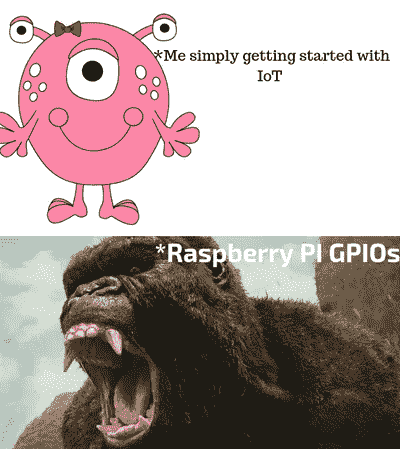
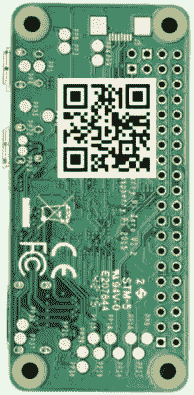

# AR-pi zero——面向物联网的增强现实

> 原文：<https://medium.datadriveninvestor.com/ar-pizero-augmented-reality-for-iot-1210062198c0?source=collection_archive---------1----------------------->

# **你还记得你的第一次物联网体验吗？**

> 因为我知道，当我第一次使用 Raspberry Pi 涉足物联网世界时，体验是这样的:

Noobs like me starting with Raspberry Pi 😐

我们每个人在制造产品时都遭受过复杂的电子芯片原理图的困扰，如果我们从新手的角度来看，这看起来就像是一个不可能完成的任务。

# **那么我建造了什么？**

> AR-PiZero 是一个 SparkAR 应用程序，使用脸书相机提供身临其境的增强现实体验。

Spark AR Studio 允许用户使用脸书相机跨所有平台设计、构建和共享 AR 体验。它还在其 AR 库中提供了丰富多样的 3D 资源。此外，用户还可以将他们的 AR 模型发布到 AR 库中，如果您能够将整个包的大小控制在小于 *20 MB* 的话，还可以与社区共享它们。我设法做到了这一点，所以这不是什么大问题。

因此，AR-PiZero 在一个非常简单和沉浸式的 AR 体验中提供了一个复杂的 GPIO 引脚原理图，如 Raspberry Pi Zero，这对专业人士和学生都有帮助。由于脸书已经提供了一个生态系统，该生态系统使用脸书相机提供了巨大的分销优势，制造商甚至可以将二维码嵌入芯片本身，将用户重定向到 AR 体验，没有任何麻烦，即

> 不再需要安装应用程序

**Embedded QR-Code (feel free to try the QR-Code)**

# 最后是 AR 体验:

Experience SuperCool IoT devices😎

# 而且是开源的！

查看 Github 上的资源库:[https://github.com/ashleymavericks/AR-PiZero](https://github.com/ashleymavericks/AR-PiZero)

在这里体验一下，你需要的只是一个脸书账号:[https://www . Facebook . com/fbcameraeffects/tryit/638474867603874/](https://www.facebook.com/fbcameraeffects/tryit/638474867603874/)