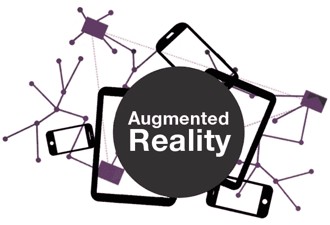

# AR——游戏的未来

> 原文：<https://medium.datadriveninvestor.com/ar-the-future-of-gaming-dbafbdf2cf9?source=collection_archive---------0----------------------->

Augmented Reality — Gaming

视频游戏通常名声不好，被认为是青少年暴力行为的罪魁祸首。然而，事实是[的研究](https://www.psychologytoday.com/us/blog/freedom-learn/201803/benefits-play-revealed-in-research-video-gaming)表明玩视频游戏会导致感知、自上而下的注意力、空间认知、多任务处理和认知灵活性的增加。更不用说玩视频游戏也有助于减轻压力和抑郁，正如副教授 Christopher J. Ferguson 博士在德克萨斯 A & M 大学进行的一项 [2010 年研究发现的那样。](http://www.tamiu.edu/newsinfo/7-08-10/article5.shtml)

所以不管人们对视频游戏的血腥有多少抱怨，他们都会留在这里，事实上，视频游戏行业正在崛起。根据 Newzoo 的全球市场报告服务，视频游戏预计在 2018 年产生 1379 亿美元的收入，比 2017 年增长 13.3%。据估计，全球将有创纪录的 23 亿游戏玩家为这一数字做出贡献。

 [## 人工智能和虚拟现实的融合-你能期待什么|数据驱动的投资者

### 在技术领域，融合是合乎逻辑的一步。就在几十年前，你可能需要一个专门的…

www.datadriveninvestor.com](https://www.datadriveninvestor.com/2018/08/30/the-convergence-of-ai-rv-what-you-can-expect/) 

这些年来，游戏不仅在数量上有所增长，而且融入其中的技术也在不断改进。基于文本的游戏或 8 位游戏动画的时代已经一去不复返了。现在，人们不仅可以在游戏机上玩视频游戏，还可以在个人电脑甚至智能手机上玩。因此，无论游戏玩家身在何处，他们总是与他们的游戏保持联系。那么，游戏的下一步是什么？大多数人会把钱投在 AR 和 VR 上。

VR 或虚拟现实已经成为人们谈论的话题有一段时间了，现在终于发挥出了它的潜力。虽然虚拟现实确实令人兴奋，但 VR 的问题是在日常使用中实现它仍然相当昂贵。一个玩家需要投入相当多的硬件才能充分利用 VR；诸如虚拟现实谷歌眼镜、动作捕捉控制器之类的东西，如果他们想出去的话，可能还需要一台全方位跑步机，更不用说一台真正强大的计算机来运行虚拟现实游戏和所有这些设备了。

一个普通的游戏玩家还没有准备好进行如此巨大的投资，尤其是对于他们还不确定其发展方向的技术。然而，AR 或增强现实是传统游戏和完全 VR 之间的一个很好的妥协。更不用说 AR 有如此未开发的潜力，甚至可能比 VR 更重要。

增强现实的工作原理是在真实的物理世界之上覆盖一个虚拟的数字世界。虽然这可能不像完全虚拟现实那样令人身临其境，但它肯定比投资几乎没有更容易实现。口袋妖怪 Go 等移动 [**游戏开发**](https://www.eduonix.com/unity-game-programming-for-absolute-beginners?coupon_code=sfbsh10&utm_source=medium&utm_medium=referral&utm_campaign=sdaprl) 已经证明了 AR 可以多么有效，用户/游戏玩家唯一需要的硬件就是他们的智能手机。这肯定比虚拟现实有效得多，在虚拟现实中，人们甚至需要在玩虚拟现实游戏之前投入大量资金。

AR 的另一点是每个人或几乎每个人都有智能手机。因此，每个人都可以使用 AR，然而，对于 VR 来说，这并不完全正确。尽管如此，人们确实需要大量的带宽来加载和玩 AR 游戏，然而，移动数据连接已经在改善，世界上大部分地区正在从 3G 连接转向 4G 连接。然后，5G 连接也即将到来。据估计，5G 应该能够轻松达到 10Gbps 左右的速度，这肯定会允许 AR 游戏在任何地方无缝运行。

增强现实拥有巨大的潜力，看似无限的能力。Pokémon Go 等游戏已经证明了它在智能手机上的有效性。随着越来越多的游戏玩家选择在手机和平板电脑上玩游戏，这一点尤为重要。事实上，根据 [Newzoo 的全球市场报告服务](https://newzoo.com/insights/articles/global-games-market-reaches-137-9-billion-in-2018-mobile-games-take-half/)，来自手机游戏的收入将占游戏总收入的 50%以上。2018 年移动游戏将占约 703 亿美元，比 2017 年增长 25.5%。这只是证明了移动游戏市场是巨大的，而且注定会增长。因此，声称游戏的未来将受到手机游戏的极大影响并不是一个巨大的跳跃。

AR 已经开始变得流行起来，因为它允许玩家自己玩游戏。相反，看着他们的化身在屏幕上跑来跑去做事情，一个人可以有效地成为化身，在他们的房间或邻居周围跑来跑去，追捕恶棍或外星人，或者收集隐藏的物品或神奇宝贝。这当然比传统游戏或玩具有更多的惊喜因素。

AR 可以层叠在泰迪熊、棋盘游戏、涂色书或动作人物之上。从本质上来说，这些随着手机游戏的出现而过时的旧玩具可以通过增强现实获得新的生命。例如，AR 使智能手机指向泰迪熊成为可能，泰迪熊可以活过来，人们可以像最好的朋友一样生活，或者像宠物一样生活，可以照顾。同样，AR 可以让棋盘游戏变得栩栩如生，代币可以在棋盘上自行移动，或者在玩家的智能手机上在玩家面前进行冒险。这肯定会让最初发誓不再玩桌游的一代人再次享受到桌游的乐趣。

许多公司都承认增强现实的力量。联想最近与迪士尼合作，发布了一款新的 AR 游戏《星球大战:绝地挑战》。该游戏配有一个幻影 AR 耳机，你可以进入一部智能手机，将凯洛·伦投影到你的房间里，你还可以使用蓝牙光剑与他进行模拟决斗。光剑也有触觉反馈传感器，当阻挡或打击对手时会振动，从而使决斗看起来更加真实。

这只是 AR 的一个实例。孩之宝最近展示了其新的钢铁侠面具，可以像钢铁侠一样与灭霸战斗。你需要做的就是戴上头盔和手套，在房间周围设置三个 AR 标记，并在你的客厅里与灭霸和他的军队战斗。

苹果、谷歌和硅谷的几乎每一家公司都在试图做出改进，将 AR 推向前沿，从而让 AR 体验感觉更真实、更具吸引力。在 AR 游戏中，你不仅仅是在扮演一个角色，你是在和灭霸战斗的钢铁侠，你是在和凯洛·伦战斗。有了 AR，你终于可以成为你的英雄，过他们的生活，而不只是看着它在屏幕上播放。AR 还允许孩子们再次成为孩子，在他们自己的房子里跳上跳下，或者在他们的邻居周围奔跑，而不是整天坐着盯着屏幕。这就是游戏的未来，也是 AR 的承诺。