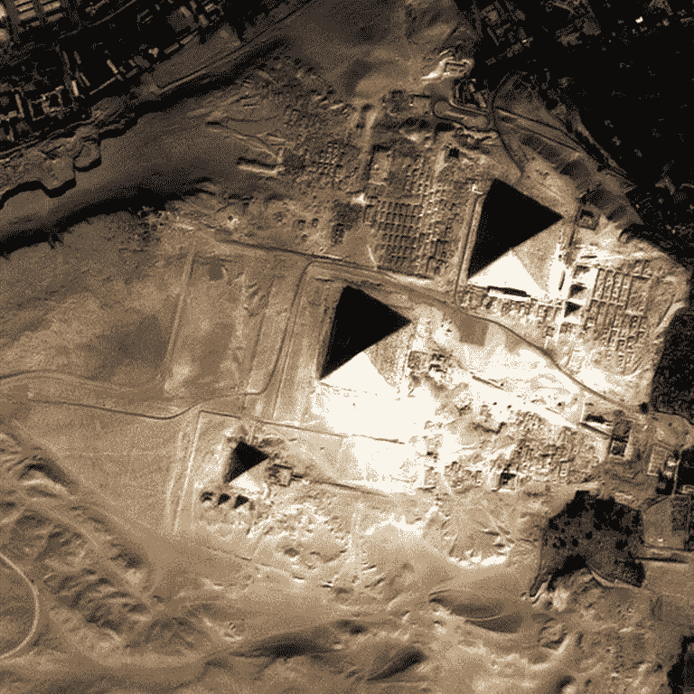

# 人工智能在考古分类中的应用

> 原文：<https://medium.datadriveninvestor.com/archaeology-in-the-age-of-ai-75d2e538e584?source=collection_archive---------3----------------------->

如果让你想象一个考古学家，你会想到什么？也许是一个印第安纳·琼斯式的人物，在尘土中挖掘，寻找一个遗失已久的宝藏。

这是媒体助长的考古学的浪漫想法。然而，今天考古学上最大的挑战不是做出新的发现，而是通过不断增加的已经挖掘和数字化的物品进行工作。试图从如此多的人工制品中得出结论，研究人员别无选择，只能着眼于一个狭窄的子集。现在根本不可能查看每一份相关记录，这限制了研究人员看到广泛模式的能力。我们如何在现有的数字馆藏中找到一根针？人工智能和机器学习(分别为 AI 和 ML)的发展将使我们能够对现有的数字化考古文物进行分类，提高数据的可搜索性，并帮助我们更好地理解古代文化。

 [## 人工智能与创意:作为创意引擎的 BigGAN |数据驱动的投资者

### 的确，2018 年可以被视为人工智能创造的创造力全盛时期的开始。当然可以…

www.datadriveninvestor.com](https://www.datadriveninvestor.com/2019/02/13/ai-creativity-biggan-as-a-creative-engine/) 

考古学是通过发掘遗址和分析实物遗迹来研究人类历史。如今，考古学家发现他们自己在堆积如山的收集数据中搜寻，但事实并非如此。这项工作的大部分很容易实现自动化。[global explorer](https://www.globalxplorer.org/about)倡议已经众包分析卫星图像。参与者帮助探测秘鲁的劫掠地点。很快，人类就可以完全脱离这个过程，但这项工作本身是有用的，因为一旦实现了机器学习方法，人类的工作就可以重新用作训练数据。

此外，最近的发展使研究人员能够更有效地搜索数字收藏— [按照位置、形状等进行分类](https://blog.paessler.com/augmented-reality-artificial-intelligence-and...-archeology-an-unexpected-combination)。这是一个游戏规则的改变。虽然分类记录的有效方法已经被发明出来，但是大多数基于人类的数据分析方法将被基于计算机的算法方法大大超越，因为分析不需要人类的主观性。在这种情况下，我们正在分析工件的位置、形状和其他物理属性，这些都是可数字化的属性。

最后，机器学习可以应用于收集、翻译和分析用古代语言编写的文学语料库。机器学习模型不需要“理解”它们正在分析的东西。事实上，他们不能。在许多情况下，研究人员发现古代语言很难理解，采取面向机器学习的方法可能会有所帮助。这不是一个全面的解决方案，但在“强力”解决方案似乎是唯一出路的情况下，它会有所帮助。

Satellite Imagery of the Great Pyramids

因为机器学习很容易应用于考古收藏，所以它将对考古专业产生深远的影响。如果我们有强大的 AI/ML 系统来完成自动化工作，考古学家可以专注于补充这些强大的算法技术。考古学家可以转向三个可预见的专业领域:编写机器学习模型，数字化输入模型的藏品，以及解释人工智能驱动的结果。然而，这种影响并没有随着考古学成为一种职业而停止。行业本身也会深受影响。考古学家从事制造知识的工作，利用机器学习将提高知识产生的速度。此外，由于需要较少的人力，这些技术减少了促进知识创造所需的资金。此外，考古知识的消费者(广义而言，博物馆、大学和公众)将受到影响。我们可以认为这些消费者是考古学的“顾客”,如果 ML 工具完成了自动化工作，他们将免费获得更多的知识。

人工智能将在考古学领域发挥出色，因为大多数数据都是数字化的，而当代问题需要对庞大的数字收藏进行分类。计算机更擅长考虑、分类，并从诸如水壶形状这样的可量化指标中得出相似之处。然而，考古学的邻近领域，如古代史或人类学，可能无法从考古学提供的进步中获益。

最终，机器学习并不是一个全面的解决方案。很难将需要主观专业知识的问题数字化。幸运的是，考古学领域提出的问题允许我们对专业知识进行编码，因此，我们可以从我上面概述的所有进步中受益。