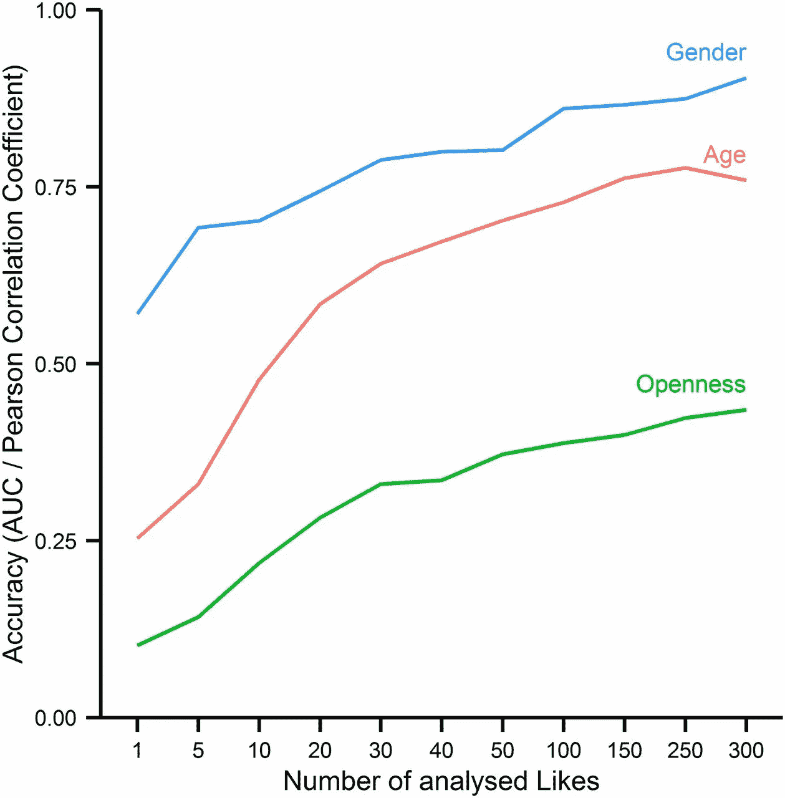
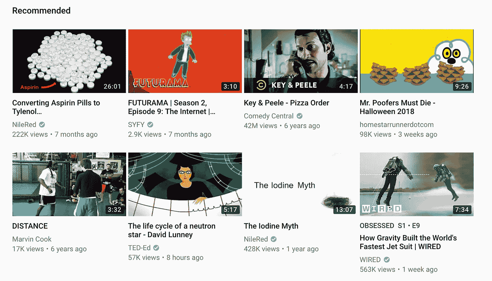

# 算法正在改变你的行为方式吗？

> 原文：<https://medium.datadriveninvestor.com/are-algorithms-changing-how-you-behave-55756c3b08c0?source=collection_archive---------7----------------------->

## 我们生活在一个被管理的世界里。对你有什么影响？

All your data are belong to us. Image from [Icons8](https://icons8.com/icon/pack/industry/color).

算法。算法操纵了选举。算法限制了我们对世界的看法。算法已经把曾经多样繁荣的网络社区变成了停滞不前、固执己见的回音室，导致了[政治极化](https://justin.vashonsd.org/Resources/BadScience+Evidences/CounterFactualRationale/PolarizationInAmericanPolitics-PewResearchCenter-FrontPage.pdf)。

这些说法有根据吗？还是我们在责怪一个不相干的降临，这样我们就可以拒绝我们丑陋的本性？

# 接管

算法允许研究人员以中等准确度预测[某些性格特征](http://www.pnas.org/content/pnas/suppl/2013/03/07/1218772110.DCSupplemental/st01.pdf)。仅仅使用脸书喜欢，他们就能够预测开放性、年龄、性别、关系状态、药物使用和朋友数量。你可以在这里看到[全文学习](http://www.pnas.org/content/110/15/5802)。

From the study mentioned; more likes = more accurate profiling

研究人员只考虑了 58000 名志愿者，并取得了实质性的结果。脸书拥有[超过 22 亿的月活跃用户](https://www.statista.com/statistics/264810/number-of-monthly-active-facebook-users-worldwide/)，*几乎是 38000 倍的用户数量值得学习！你可以肯定，他们的预测要准确得多，也更能说明问题。*

脸书根据这些数据运行预测算法和统计模型，以便更好地为你做广告。

另外，请注意脸书的武器库要大得多；这项研究只考虑了喜好，这仅仅是脸书自身可用数据的一个方面。

# 这怎么可能呢？

用一个叫**“机器学习”**的东西。在弗吉尼亚理工大学的第三年，我研究了机器学习。

在机器学习中，程序被**训练**去做一件特定的事情，比如给你推荐一个 YouTube 视频，给你看一个特定的帖子，或者为你提供一个特定的广告。

培训可以归结为:

1.  写程序做某事
2.  给程序一些输入数据
3.  如果程序没有产生预期的输出，调整程序(有点随机)
4.  重复，直到程序做我们想要的

程序能够根据你给它的数据进行改进。给定足够的数据，你可以训练一个程序来分类、预测、决定…当你啜饮一杯爪哇咖啡时，做几乎任何事情。

然而，经过一个学期的研究论文和我们自己的一些分析，我的研究团队达成了共识:没有人确切了解这些算法是如何工作的。我们所知道的是，如果我们有足够的数据，我们可以训练机器做几乎任何事情。

> 我的研究项目可视化了经过训练对无线电信号进行分类的神经网络(机器学习算法):AM、FM、BPSK 等[你可以在这里查看源代码](https://github.com/rpck/signals)。如果你对学习什么是机器学习感兴趣，[看这个视频](https://www.youtube.com/watch?v=z-EtmaFJieY)。

# 学习生活

像 Instagram、脸书、优步、AirBnb 这样成功的大型网站现在都使用这种算法来改善他们的体验或提高底线。每一点信息:你看一张图片多长时间，你点击了什么，你买了什么，一切都在审查之中。当我们以 70%的准确率知道如果我们给你看某个广告，你会购买该产品时，为什么还要给你平衡的选择呢？做其他任何事情都只会对生意不利。

可怕的是，你的行动和你的不行动是一样的。你选择离开脸书几天吗？别担心，下次你来的时候，我们会确保你想留下来。跳过了一首我们推荐的歌？那一定意味着你讨厌那种音乐类型。

这些都是极端的例子，但是即使是对这些数据最小的误解也会产生深远的影响。

当亚马逊针对你的某些产品时，*它们会影响你买什么*。当优步向你收取额外费用时，它们会影响你如何选择交通工具。当 YouTube 向您推荐某些视频时，*它们会影响您观看的内容*。当约会网站推荐你与某人匹配时，*他们会影响你的关系*。我们使用的服务在我们生活的每一个角落都发挥着作用。

Here are my recommended YouTube videos. How do yours compare?

# 你的算法生活

这就是问题所在。没有算法是完美的。我们不仅仅是数字，然而管理我们信息的计算机感觉很矛盾。

广告、推荐内容和建议行动会影响我们的自我形象。想象一下，如果你小时候每次想出去，你父亲都会建议你去读书，因为这能激起你兄弟姐妹的兴趣。最终，你会变得宽容，成为一个书呆子。

我们很多人都不想成为书呆子。我们想去外面；做我们自己。获得自由。尽管我们很相似，但我们保留了自己的个性。我们每个人内心都有一个独特的灵魂，是算法永远无法封装的。

也许这就是为什么社交媒体如此令人麻木。它导致人们形成精神畜群，绝望地像牛一样被圈起来；被算法强制“个性化”饲料，变成他们无法逃脱的笔。

或者也许这些算法在展示我们的真实面目。当我们可以自由获取信息时，我们选择完全沉迷于我们最喜欢的宣传。难道我们宁愿把自己局限在社会安全空间里，在那里我们总是对的，而不是去面对音乐吗？

你可以让*算法*决定你如何看待这个世界。或者，你可以亲眼看看*——在他们奋力追赶的时候窃笑。*

*选择权在你。*

*感谢阅读！和平✌️✌️✌️*