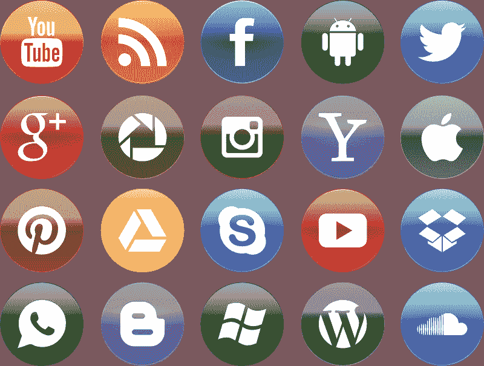
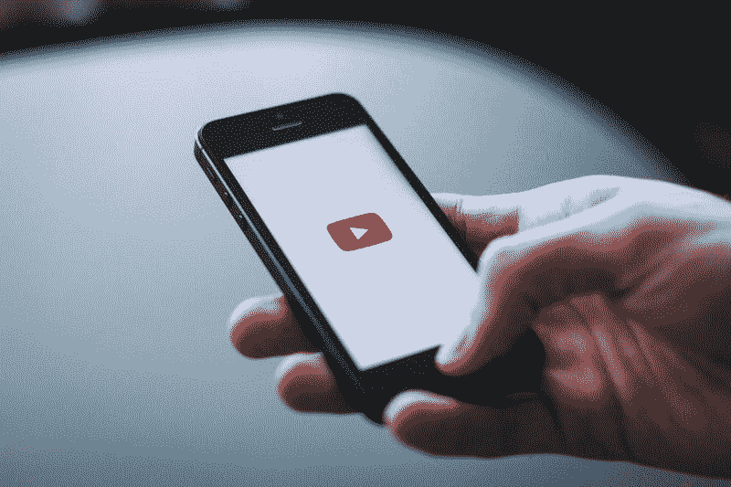
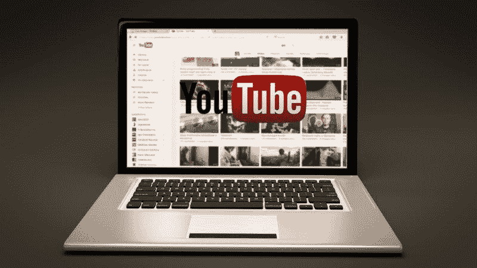
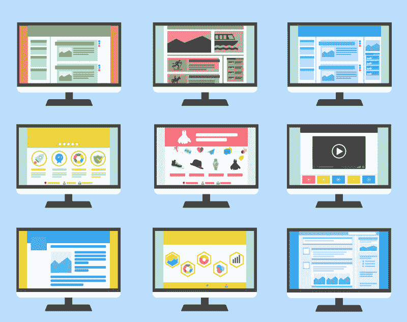
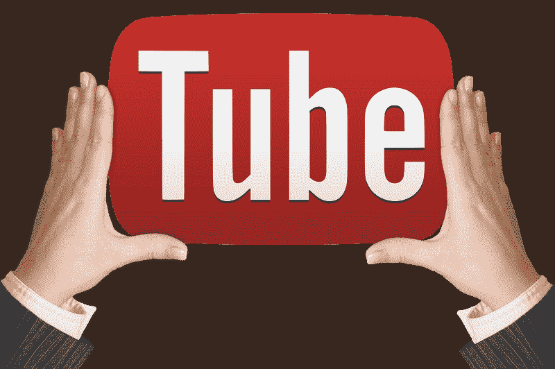

# Alphabet 和 YouTube 赚钱了吗？—市场疯人院

> 原文：<https://medium.datadriveninvestor.com/are-alphabet-and-youtube-making-money-market-mad-house-2c770c936d59?source=collection_archive---------3----------------------->

奇怪的是， **Alphabet(纳斯达克代码:GOOGL)** 是地球上最被误解的公司之一。事实上，许多记者甚至连公司的名字都搞错了。

管理层称该公司为 **Alphabet Inc .(纳斯达克代码:GOOG)** ，而非谷歌。相反，Alphabet 是一家控股公司，拥有许多业务和平台。搜索引擎谷歌是这些企业中历史最悠久、规模最大、最知名的。

 [## 算法交易的机器学习|数据驱动的投资者

### 当你的一个朋友在脸书上传你的新海滩照，平台建议给你的脸加上标签，这是…

www.datadriveninvestor.com](https://www.datadriveninvestor.com/2019/01/30/machine-learning-for-stock-market-investing/) 

著名的字母表业务包括:谷歌、YouTube、Android、 [Nest Labs](https://nest.com/) 、SideWalk、Calisco、X、Doubleclick、谷歌光纤、谷歌地图、AdSense、Alphabet Capital、Waymo、Verily、Jigzaw、Deepmind、Alphabet Hardware、Alphabet Access & Energy 和 Alphabet Infrastructure。然而，这些组织只是冰山一角。

# Alphabet 拥有 200 多家公司

事实上，Alphabet 拥有超过 200 家公司，Investopedia 估计。许多这样的公司起源于 X；Alphabet 的研究&开发部门。澄清一下，X 是孵化器和智库 Alphabet runs 的组合。

因此，许多 Alphabet 子公司经营着无利可图的尖端业务。例如， [Waymo](https://marketmadhouse.com/is-waymo-worth-175-billion/) 正在开发自动驾驶汽车，DeepMind 创造了人工智能，Nest Labs 致力于物联网(IoT)，Verily Life Sciences 正在涉足医疗保健和医药。

# 为什么 Alphabet 像伯克希尔·哈撒韦

在这种情况下，Alphabet 与沃伦巴菲特的伯克希尔哈撒韦公司(纽约证券交易所代码:BRK)有更多的共同点。A) 比传统科技公司。比如**伯克希尔哈撒韦公司(纽约证券交易所代码:BRK。B)** Alphabet 旗下拥有众多子公司，分散管理，收益颇丰。

另一个相似之处是，Alphabet 经营着许多看似毫无关联的业务。例如，Alphabet 通过 Waymo 参与交通运输，通过 YouTube 参与娱乐，通过 Google Fiber 参与光纤，通过 Verily 参与医疗保健，通过 Nest Labs 参与家用电器。

与此同时，伯克希尔·哈撒韦公司[拥有](https://www.berkshirehathaway.com/subs/sublinks.html)家具店、管道、报纸、货运公司、[保险公司](https://www.biberk.com/)，汽车经销商、房地产经纪人、发电厂、一家内衣制造商，甚至一家制砖商。然而，大多数公司都赚了钱。

大量的子公司创造了多样化，提供了免受损失的保护。例如，如果谷歌光纤亏损，YouTube 或者 AdSense。收入可以弥补损失。

# Alphabet 是新的伯克希尔·哈撒韦吗？

此外，如果 Waymo 在 R&D 汽车上亏损， [DeepMind](https://deepmind.com/) 可以通过人工智能和[机器学习](https://deepmind.com/blog/article/alphazero-shedding-new-light-grand-games-chess-shogi-and-go)赚钱来弥补损失。同时，权力下放限制了管理成本，并通过保持业务分离来控制风险。

最后，伯克希尔和 Alphabet 都做了大量的数字运算。巴菲特在购买股票前会仔细检查财务报告。值得注意的是，众所周知，沃伦大叔每天大部分时间都在阅读财务数据。值得注意的是，Alphabet 的旧名 [Google](https://english.stackexchange.com/questions/45883/what-did-google-mean-in-the-1900s) ，来自数字 [Googo](https://english.stackexchange.com/questions/45883/what-did-google-mean-in-the-1900s) l(一后面跟着 100 个零)。

与伯克希尔帝国的另一个相似之处是，Alphabet 收购或创办了具有巨大增长和收入潜力的公司。值得注意的是，YouTube 现在是世界上最大的电视网络。

# YouTube 是美国最大的电视网络

例如，据 Statista [估计](https://www.statista.com/statistics/469152/number-youtube-viewers-united-states/)，YouTube 是美国最受欢迎的“电视网络”，2018 年拥有 1.92 亿观众。此外，Statista 估计，到 2022 年，YouTube 的美国观众群可能会增长到 2.1 亿。

事实上，Statista [估计 2017 年 2 月有 68%的美国人在 YouTube 上听音乐。与此同时，2016 年，82%的 YouTube 用户在该平台上听音乐。另外，2016 年，32%的美国游戏玩家在 YouTube 上观看了游戏。](https://www.statista.com/topics/2019/youtube/)

令人难以置信的是，应用商业[估计](https://www.businessofapps.com/data/youtube-statistics/) 73%的美国成年人使用 YouTube，全球每月有 20 亿人使用 YouTube。此外，他们在 2018 年 12 月在 50 亿台安卓设备上安装了 YouTube。此外，人们每天向 YouTube 上传 500 小时的内容，每天在电视屏幕上观看 2.5 亿小时的 YouTube 视频。

# YouTube 比你想象的要大

例如，YouTube Kids 在 2018 年有 800 万观众，注册了 300 亿次观看，Business of Apps 计算。与此同时，YouTube 在 2019 年 1 月平均每天播放 4405 场游戏。

令人印象深刻的是，YouTube 前 10 大频道在 2017 年 6 月至 2018 年间创造了 1805 亿美元的收入。此外，2018 年，人们观看了 500 亿小时的 YouTube 游戏内容。

YouTube 利润丰厚，很难确定它赚了多少钱。然而，Business of Apps 声称，YouTube 年在美国创造了 33.6 亿美元至 44.43 亿美元的广告收入。然而，Business of Apps 估计 YouTube 2018 年的广告总收入为 95 亿美元至 140 亿美元。

# Alphabet 是对社交媒体的一项重大投资

值得注意的是，YouTube 是唯一有能力与脸书展开激烈竞争的美国社交媒体。Statista 估计，2019 年 6 月，YouTube 是世界上第二大最受欢迎的社交媒体，拥有 20 亿用户。

此外，YouTube 是 2019 年 6 月全球四大社交媒体中唯一一个非脸书产品。Statista [计算](https://www.statista.com/statistics/272014/global-social-networks-ranked-by-number-of-users/)那些媒体是脸书；23.75 亿用户，YouTube 二十亿用户，WhatsApp16 亿用户，以及 Facebook Messenger13 亿用户。

在这种情况下，对于那些讨厌脸书的人来说，Alphabet 是社交媒体的一项重大投资。目前，Alphabet 是唯一一家有能力在全球范围内与马克·扎克伯格的帝国竞争的公司。

# Alphabet 赚了多少钱？

YouTube 证明 Alphabet 可以建立令人难以置信的平台，但该公司赚了多少钱？斯托克罗对这个问题的回答是很多。

例如，Alphabet 报告称，2019 年 6 月 30 日，其季度毛利为 216.48 亿美元，收入为 389.44 亿美元。令人震惊的是，Alphabet 报告截至 2019 年 6 月 30 日的季度收入增长率为 19.25%。

这些数字导致 2019 年 6 月 30 日的营业收入为 91.8 亿美元，高于 2019 年 3 月 31 日的 66.08 亿美元。此外，Alphabet 在 2019 年 6 月 30 日报告的净收入为 99.47 亿美元，高于 2019 年 3 月 31 日的 66.57 亿美元。

可以预见的是，Alphabet 正在带来大量现金。截至 2019 年 6 月 30 日，运营现金流为 126.27 亿美元，自由现金流为 66.47 亿美元。运营现金流在上个季度从 120 亿美元增长到 126.27 亿美元。然而，同期自由现金流从 73.96 亿美元降至 64.67 亿美元。

# Alphabet 有多少钱？

Alphabet 现在是世界上现金最充裕的公司之一。令人震惊的是，Alphabet 在 2019 年 6 月 30 日报告了 1210.56 亿美元的现金和短期投资。这一数字比 2019 年 3 月 31 日的 1134.88 亿美元有所增长。

具体而言，Alphabet 在 2019 年 6 月 30 日拥有 165.87 亿美元的现金和等价物以及 1044.69 亿美元的短期投资。相比之下，伯克希尔·哈撒韦公司在 2019 年 6 月 30 日拥有 446.34 亿美元的现金和短期投资。

我认为这些现金证明了投资者对 Alphabet 的信心，以及市场先生在 2019 年 8 月 13 日给出的 1199.54 美元的股价。Alphabet 表明，它可以识别现金充裕的企业，并将其货币化。

所以， **Alphabet (NASDAQ: GOOG)** 是一只很棒的成长股，也是一个优秀的长期投资。然而，Alphabet 是一只可疑的收益股，因为像伯克希尔哈撒韦公司一样，它不支付股息是出了名的。

# Alphabet 的增长将会继续

归根结底，字母表的未来增长前景是巨大的。我认为 Alphabet 的几个子公司可以像 YouTube 一样大，一样有影响力。

尤其是自动驾驶汽车公司 Waymo，可以利用大规模的。详细来说，T2 统计局估计 2017 年有 2.7248 亿辆注册车辆。如果 25%的美国车辆使用 Waymo 的自动驾驶车辆操作系统， [Waymo](https://waymo.com/) 仅在美国就可能拥有 6812 万“用户”。

尖锐地说，Waymo 正在与主要汽车制造商合作，包括 [**【菲亚特克莱斯勒】**](https://www.reuters.com/article/us-autonomous-waymo/waymo-says-it-will-build-self-driving-cars-in-michigan-idUSKCN1PG22R) **【纽约证券交易所:FCAU】****日产-雷诺(PA:RNO)**[**塔塔汽车**](https://www.tatamotors.com/jlr-press-release/waymo-and-jaguar-land-rover-announce-long-term-partnership-beginning-with-self-driving-jaguar-i-pace/) **(纽约证券交易所:TTM)** 。日产-雷诺将把 [Waymo 的自动驾驶汽车技术](https://medium.com/waymo/how-evolutionary-selection-can-train-more-capable-self-driving-cars-a7191f771982)引入法国和日本，例如*The Verge*[claims](https://www.theverge.com/2019/6/20/18692764/waymo-nissan-renault-self-driving-car-japan-france)。

此外，Waymo 正在开发 Waymo One，这是一种拼车服务，可以与**优步(纳斯达克:优步)**和 **Lyft(纽约证券交易所:LYFT)** 竞争。令人印象深刻的是，据 Statista [估计](https://www.statista.com/statistics/833743/us-users-ride-sharing-services/)，全球有 9500 万人使用 2018 年最知名的拼车应用优步。此外，Statista 估计优步在 2019 年创造了 113 亿美元的收入。

# Alphabet 是 21 世纪的终极孤儿寡母股票

因此，Alphabet 是一台赚钱机器，它将继续增长，增长，赚更多的钱。

那些寻求安全的人需要研究 Alphabet，因为 GOOGL 和 GOOG 可能是 21 世纪最好的“寡妇和孤儿股”。解释一下，孤儿寡母股票是股票，所以安全的投资顾问推荐给没有其他收入来源的人。

有趣的是，我认为 Alphabet 符合当今市场上的孤儿寡母标准，并将长期保持这一地位。特别是，我认为 Alphabet 是安全的，因为它的管理层愿意通过投资研发来多元化和保护公司。

*原载于 2019 年 8 月 13 日*[*https://marketmadhouse.com*](https://marketmadhouse.com/are-alphabet-and-youtube-making-money/)*。*