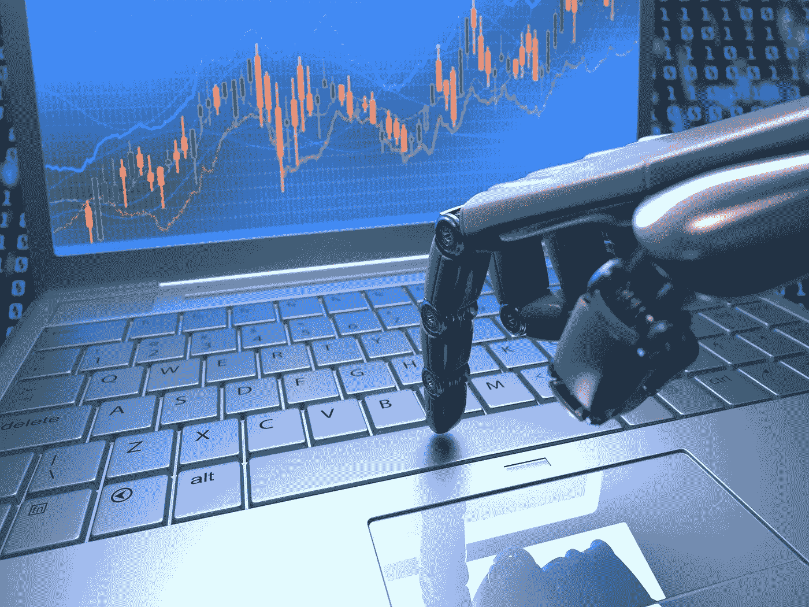

# 机器人控制了密码市场吗？

> 原文：<https://medium.datadriveninvestor.com/are-bots-controlling-crypto-markets-5bab6f61534d?source=collection_archive---------0----------------------->

所以，是时候购买一些你一直关注的加密货币了。你已经做了调查，市场价格足够低，你已经决定这是扣动扳机的正确时机。

你前往币安，在订单簿买方顶部低于当前市价的位置下限价单，期望价格稍有下跌，你的订单就会被迅速执行。

但是等一下…刚刚发生了什么？下订单后，您注意到另一个买家以略高的价格下了一个大订单，从而将您的订单排在了后面。

当你决定提高订单的投标价格，以保持在队列中的“领先地位”,并再次领先于新的竞争对手时，你会说“很公平”。但是同样，竞争对手通过提高他们自己的价格立即超过你的新订单。

在你意识到之前，你想利用的诱人的定价机会已经消失了。好烦啊！

为什么会这样？总之，**僵尸工具**。

# 什么是机器人？

机器人是一个自动交易实体，它被编程为识别市场趋势并自动执行交易。使用算法，这些机器人交易员可以复制人类交易员在应对各种市场情景时会做的事情。

但至关重要的是，机器人处理信息和做出交易决策的速度比任何人都快。更重要的是，他们只会越来越好。他们利用大量市场数据来分析趋势，改进算法，最终做出更明智、更有利可图的交易决策。

如今，高频交易者在许多金融市场利用机器人来利用微小的价格异常。事实上，货币等市场近年来经历了某种 bot 革命。拥挤的交易大厅里充斥着交易员喊着“买入！”还有“卖！”正逐渐成为过去。随着自动化的发展，取而代之的是电子交易设施和一排排的计算机服务器。

# 机器人和密码市场:完美的匹配

事实证明，机器人现在在加密社区中特别受欢迎，其复杂程度从为每个人设计的免费服务到为专业人士设计的更昂贵的基于订阅的机器人。

事实上，加密交换被证明是机器人扩大影响力的理想场所:

*   与通常在晚上和周末关闭的传统金融市场不同，加密市场每周 7 天、每天 24 小时开放。这使它们成为自动化交易的理想选择——人类会睡觉，而机器人不会。
*   随着一些加密资产现在可以在几十个交易所交易，机器人可以比交易员更有效地利用大量的套利机会。

去年，彭博估计一些交易所的比特币自动交易量高达总交易量的 80%。机器人也可能是我们在整个密码市场看到的巨大价格波动的部分原因。根据 2014 年对全球股票市场的一项研究，发现尽管算法交易使这些市场更具流动性和效率，但也使它们更不稳定。

但可以肯定的是，相当大一部分交易所的订单正受到 bot 活动的影响。令人沮丧的是，这些机器人可以诱使交易者以比他们最初打算的更高的价格买入或更低的价格卖出。事实上，**限价单**的情况通常是，机器人将是市场上最高的出价和/或最低的要价，并且贯穿订单簿的其余大部分。

而且，机器人很讨厌处理！看到你的出价几乎瞬间被一个机器人(甚至不是另一个交易者)超过，可能会非常令人恼火，特别是如果你下初始订单的目的是利用你认为的市场“错误定价”。

至于**市场订单**，人们也可能观察到一系列数量可忽略不计的 bot 订单存在于接近市场价格的地方，在任何真正重要数量的第一个订单被发现远离市场之前。同样，机器人试图欺骗你下一个市场订单，这个订单会被立即执行，但是大部分订单会以更低的价格执行。

# 对抗 bot 活动

通过简单地以稍微“更差”的价格重新提交您的限价订单，即略高于机器人出价的买入订单，或略低于机器人出价的卖出订单，可以很容易“胜过”机器人。

虽然这种一次性交易策略可能不会严重损害你的日末利润，但如果你是一个认真的加密交易者，每天在多个交易所进行几笔交易，这些小而频繁的麻烦从长远来看将不可避免地导致相当大的损失。

因此，最好将您的订单保持在您最初打算的价格。如果市场至少有一些波动，那么你的订单就会被执行，只是需要更长的时间。

或者，如果你不是特别着急，也建议花一分钟观察订单簿的行为。通常，机器人订单会出现，然后突然消失，或者由于不断的价格调整而在账面上移动。通过尝试识别机器人的意图，你可能最终会在如何以及何时下单方面处于一个更加知情的位置。

当然，自己买一个机器人可能也会有所帮助。随着更多关于各种加密资产价格行为的数据得到整理，这些机器只会进一步发展，在交易能力方面变得更加复杂。

但无论你做什么，意识到机器人的存在和影响将有助于防止你被骗去满足于次优的交易位置。

*原载于 2018 年 5 月 31 日*[*【www.datadriveninvestor.com】*](http://www.datadriveninvestor.com/2018/05/31/are-bots-controlling-crypto-markets/)*。*