# BP 和大石油赚钱了吗？—市场疯人院

> 原文：<https://medium.datadriveninvestor.com/are-bp-and-big-oil-making-money-market-mad-house-e6ea15cd6356?source=collection_archive---------2----------------------->

许多观察家想知道像英国石油公司这样的大石油公司是否仍然是价值投资。

在[的时代，大石油已经过时了，但是我们大多数人仍然每天都在使用它的产品。此外，英国石油公司可能有大量石油出售，因此，英国石油公司至少符合一个价值标准它不流行，不受欢迎，但仍有很大价值。](http://www.karmatube.org/videos.php?id=433)

 [## 值得购买的 4 大人工智能股票及其原因|数据驱动型投资者

### 人工智能(AI)在 2019 年继续进入大众意识。通过应用程序…

www.datadriveninvestor.com](https://www.datadriveninvestor.com/2019/03/06/top-4-artificial-intelligence-stocks-to-buy-and-why/) 

美国消费者新闻与商业频道[报道](https://www.cnbc.com/2019/01/08/bp-just-discovered-a-billion-barrels-of-oil-in-gulf-of-mexico.html)，事实上，英国石油公司声称在墨西哥湾的雷马油田发现了 10 亿桶石油。因此，当沙特王储穆罕默德·本·萨勒曼(MBS)发出“难以想象的油价上涨”的歇斯底里的警告时，英国石油公司可以增加产量。

# 沙特王储如何帮助英国石油公司赚更多的钱

就个人而言，我严重怀疑 MBS 的说法，因为王储是一个试图影响其他国家政治结果的政治家。为了澄清，MBS 在美国 CBS 电视杂志 60 *分钟*上做了[声明](https://www.cbsnews.com/news/highlights-from-this-weeks-mohammad-bin-salman-interview-on-60-minutes-2019-09-29/)。

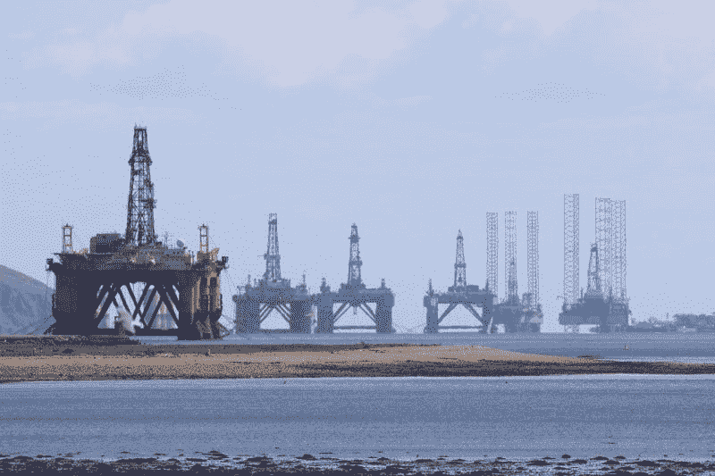

因此，我认为萨尔曼想影响美国的民意，并推动他对伊朗的战争。从历史上看，战前索赔；就像乔治·w·布什总统在第二次海湾战争前关于大规模杀伤性武器的断言一样，是错误的。

然而，如果 MBS 哪怕只是部分正确，英国石油也能在短期内从石油中获得更多现金。解释一下，即使油价短暂上涨，英国石油公司也能产生大量现金。

# 英国石油公司现在赚钱了吗？

目前，英国石油公司从石油中赚了很多钱。例如，2019 年 6 月 30 日，英国石油公司报告季度收入为 726.76 亿美元，毛利为 70.02 亿美元。

此外，英国石油公司报告截至 2019 年 6 月 30 日的季度营业收入为 39.43 亿美元，净收入为 24.02 亿美元。因此，英国石油公司从石油中赚了很多钱。

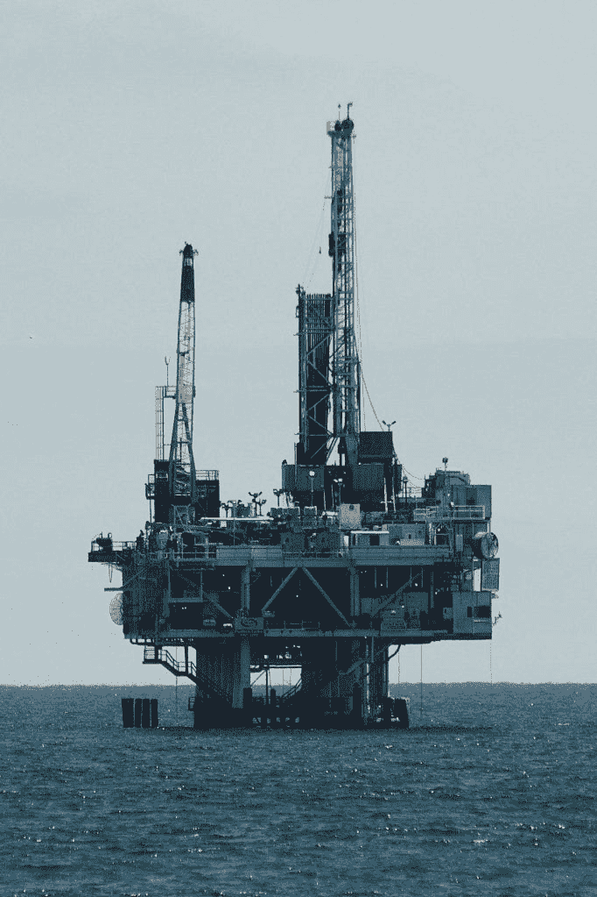

令人印象深刻的是，Stockrow 披露英国石油公司在 2019 年 6 月 30 日报告的运营现金流为 121.11 亿美元。英国石油公司在 2019 年 6 月 30 日报告没有自由现金流，但该日报告的投资现金流为负 104.92 亿美元，融资现金流为 34.37 亿美元。

最后，英国石油公司是一家现金充裕的公司，2019 年 6 月 30 日报告的现金和短期投资为 241.93 亿美元。因此，在英国石油公司，石油仍然是黑金，很容易变成现金。

# BP 是价值投资吗？

我认为英国石油公司可能是一项价值投资，因为其股票在 2019 年 10 月 4 日的交易价格为每股 36.96 美元。然而，英国石油公司有巨大的价值，包括:

科罗拉多州、夏威夷州、堪萨斯州、爱达荷州、印第安纳州和宾夕法尼亚州的发电农场。因此，如果司机购买电动汽车，BP 仍然可以赚钱。

Castrol；美国一家主要的机油和润滑油品牌。

M 在科罗拉多州、路易斯安那州、新墨西哥州、俄克拉荷马州、得克萨斯州和怀俄明州经营天然气业务，名称为 BPX 能源公司。在发电的发电厂，天然气是煤的普遍替代品。因此，英国石油公司有另一种方式来兑现电动汽车。

F 我们在[墨西哥湾](https://www.bp.com/en_us/united-states/home/where-we-operate/gulf-of-mexico/our-platforms.html)的钻井平台。

在全球 78 个国家开展业务。

北海、墨西哥湾、阿塞拜疆、二叠纪盆地、越南、安哥拉、印度尼西亚、澳大利亚和俄罗斯的油气田。

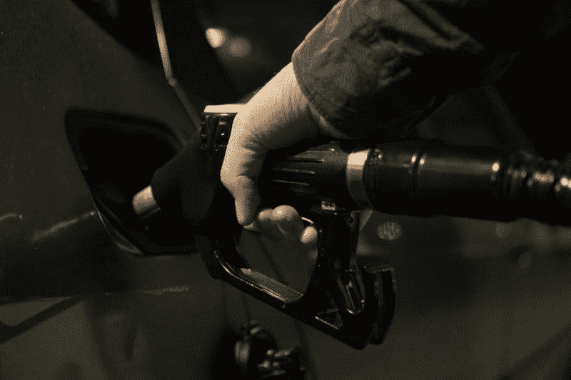

因此，英国石油公司拥有大量的石油，赚了钱，但其股票价格很低。在我看来，这是一项价值投资。

# BP 是好的分红股吗？

此外，英国石油公司现在是一个很好的股息股。例如，**英国石油公司(纽约证券交易所代码:BP)** 于 2019 年 8 月 8 日支付了 61₵的季度股息。

总的来说，Dividend.com 认为英国石油公司在 2019 年 10 月 4 日的股息收益率为 6.60%，年化股息为 2.44 美元，股息支付率为 71.8%。然而，英国石油公司只提供一年的股息增长。

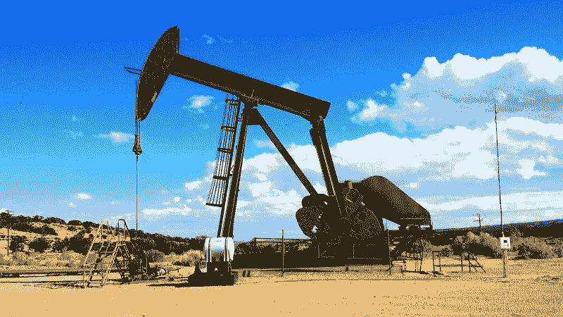

有吸引力的是，英国石油公司现在很便宜，其股价在 2019 年 10 月 4 日为 36.96 美元。因此，对于那些需要股息收入的人来说，英国石油是一只好股票，而且价格便宜。然而，BP 的地位并没有你想象的那么稳固。

# 市场先生如何威胁英国石油公司和大型石油公司

英国石油公司处境危险，因为世界上充斥着廉价石油。有如此多的石油，很难跟踪供应情况。

事实上，英国石油公司自己估计沙特阿拉伯的石油储量比之前宣称的多 12%。路透社[报道](https://www.reuters.com/article/us-bp-energy-reserves/bp-raises-saudi-oil-reserves-12-in-first-big-change-in-30-years-idUSKCN1TC1LM)称，英国石油公司将其对沙特石油服务的估计从 2018 年的 2662 亿桶上调至 2019 年的 2977 亿桶。因此，石油比以往任何时候都多，这可能导致价格大幅下跌。

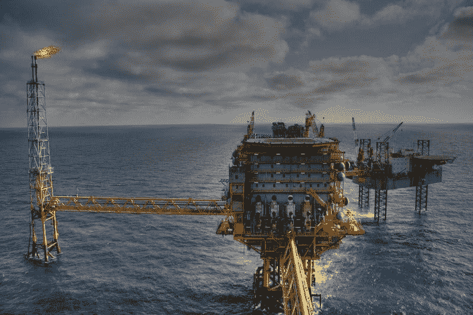

因此，像我这样的愤世嫉俗者认为 MBS 关于高油价的声明是对市场操纵的肤浅尝试。

# 来自 Saudi Aramco 的威胁

值得注意的是，有[的猜测](https://www.nytimes.com/2019/09/05/business/aramco-ipo.html)沙特正计划为其国有石油公司 Saudi Aramco 进行 2 万亿美元的首次公开募股(IPO)。此外，还有[网上传言](https://www.nytimes.com/2019/09/05/business/aramco-ipo.html)阿美的股票可能会支付 750 亿美元的股息。

因此，王储歇斯底里的警告看起来就像是提振阿美股价的廉价尝试。我觉得如果 MBS 是美国 CEO，证券交易委员会(SEC)会调查他。

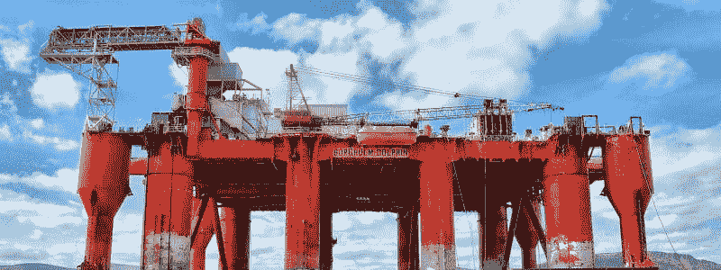

值得注意的是，美国证券交易委员会指控**特斯拉汽车公司(纳斯达克股票代码:TSLA)** 首席执行官埃隆·马斯克在三月份用推特违反了一项证券欺诈和解协议， *Vox* [揭露](https://www.nytimes.com/2019/09/05/business/aramco-ipo.html)。为了解释这一点，美国证券交易委员会指责马斯克在推文中对特斯拉的生产进行了有问题的声称。

MBS 在 *60 分钟*的行为比 Musk 的更糟糕，但是 SEC 不能碰王储，因为他是外国元首。然而，美国证交会可能禁止阿美股票在美国交易。

如果有人揭露 MBS 是一个骗局和骗子，王储的滑稽行为可能会伤害 BP 和所有石油公司。具体来说，我认为，如果公众认为沙特阿美是一个骗子，就没有人会相信任何石油公司的任何说法。

# 特朗普被弹劾可能如何伤害大型石油公司和英国石油公司

对大石油公司来说，一个相关的噩梦是美国众议院开始的弹劾调查。详细地说，政治分析家杰夫·格林菲尔德认为，多达六个众议院委员会可以调查唐纳德·j·特朗普总统(纽约州共和党)涉嫌的不当行为。

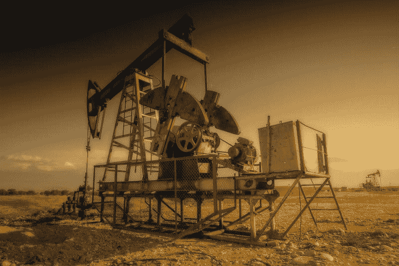

我认为，其中一个委员会可能会揭露特朗普参与阿美石油公司的交易。这样的调查可能会在社交媒体和互联网上传播阿美的所有肮脏秘密，给特朗普和大石油公司制造一场公关噩梦。

我认为弹劾可能会指向沙特阿拉伯，因为钱，总统的家族公司，特朗普集团从沙特阿拉伯赚的钱。例如，*商业内幕* [声称](https://www.businessinsider.com/trump-saudi-arabia-financial-interests-ties-hotel-bookings-sales-2018-10)川普组织与沙特有超过 30 年的商业往来。特别是， *Business Insider* 声称，2018 年第一季度，一次沙特官方访问增加了特朗普国际酒店的收入。

像英国石油这样的公司可能会因为与沙特阿拉伯的合作而遭受损失。然而，价值投资者可以从石油股票价格下跌中受益。

# BP 古怪的历史和迷人的未来

BP 最大的价值之一是它在不同但混乱的历史时代中生存、发展和赚钱的能力。

[**英国石油有限责任公司**](https://www.britannica.com/topic/BP-PLC) **(纽约证券交易所代码:BP)** 于 1909 年成立英国-波斯石油有限公司，1935 年成为英国-伊朗石油有限公司。该公司于 1954 年成为英国石油公司，1998 年成为 BP 阿莫科公司，2000 年成为 BP 公司。

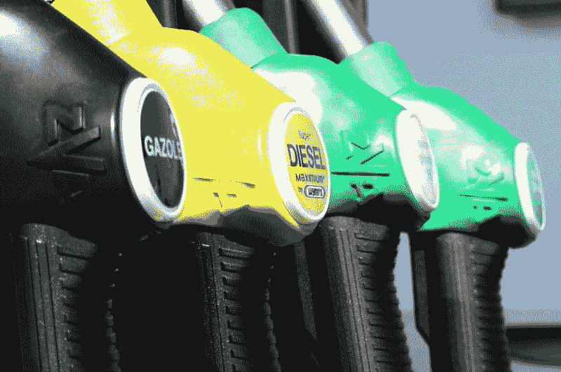

当英国企业家威廉·达西从探险家乔治·雷诺兹那里得知波斯(伊朗)可能有油田时，盎格鲁-波斯人就开始了。1901 年，伊朗国王(皇帝)给了达西 60 年的特许权，让他在波斯寻找石油和天然气。

1908 年，达尔西的勘探队在苏莱曼清真寺发现了 25 米高的石油喷泉。这一发现使达西得以首次公开募股，并开始建设输油管道和炼油厂。

# 温斯顿·丘吉尔如何拯救英国石油公司

尽管发现了石油，盎格鲁-波斯公司在 1914 年几乎破产。然而，一个不太可能的救世主出现了，他就是温斯顿·丘吉尔。丘吉尔作为海军大臣掌管皇家海军。

皇家海军正在改造他们的船只，以燃烧石油来使它们更快，但是那时英国没有石油。然而，英国有一家石油公司专门供应石油；盎格鲁-波斯人。不幸的是，盎格鲁-波斯破产了。

丘吉尔用两种方式帮助盎格鲁-波斯公司摆脱破产。首先，丘吉尔让英国政府在 1914 年购买了盎格鲁-波斯公司的大部分股票，从而拯救了该公司。

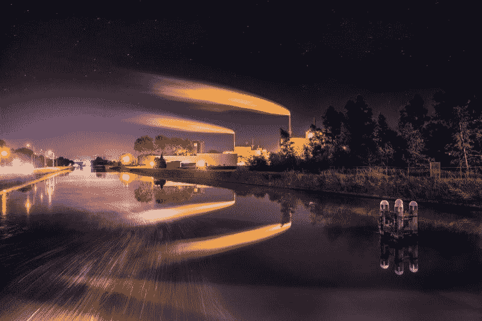

第二，丘吉尔安排国王陛下的政府将一家名为英国石油公司的资产出售给盎格鲁-波斯。最初的英国石油公司是一家德国公司，在英国有销售网络。第一次世界大战开始时，英国政府没收了英国石油。

在丘吉尔的帮助下，盎格鲁-波斯及时成为世界上最大的石油公司之一，赶上了 20 世纪 20 年代的汽车热潮。到 1938 年，英国-伊朗的ābādān 炼油厂成为世界上最大的炼油厂。

# 英国-伊朗-英国石油公司

1954 年，英伊公司成为一家名为英国石油的控股公司，但仍归政府所有。1977 年，英国政府开始向公众出售股票。他们在 20 世纪 80 年代将英国石油公司私有化。

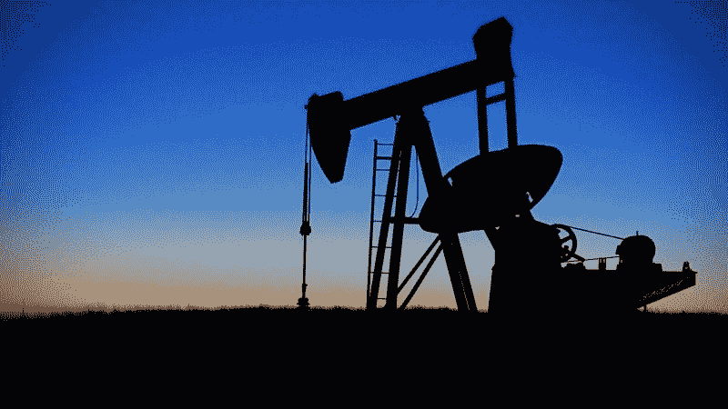

1987 年，英国石油公司收购了俄亥俄州标准石油公司的美国子公司。1998 年，英国石油公司与美国石油巨头阿莫科公司合并，创建了世界上最大的石油公司之一。2000 年，他们在收购 Burmah Castrol 和 Atlantic Richfield Company 或 ARCO 后成立了 BP LLC。

BP 是便利店、加油站和可再生能源的主要参与者。2010 年，英国石油公司在深水地平线灾难中幸存下来，这是墨西哥湾钻井平台上有史以来最大的一次石油泄漏。

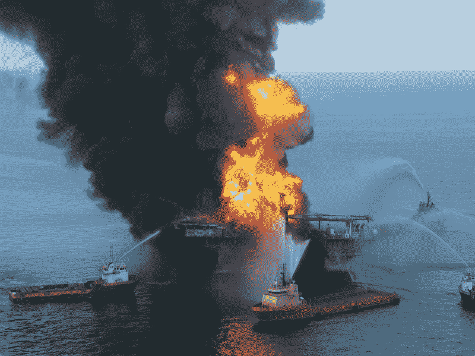

历史上，英国石油公司是世界上最著名的石油公司之一。例如，英国石油公司是 T2 七姐妹之一，从第二次世界大战到 20 世纪 70 年代中期主导全球石油市场的七大公司之一。

今天，*石油&天然气 IQ* 将英国石油公司列为世界第五大石油公司和第三大上市石油公司。据世界最大的石油公司是:

**1。中石化**

2.Saudi Aramco

3.中国石油天然气集团公司(CNCP)

**4。荷兰皇家壳牌(NYSE: RDS)** **5。英国石油公司**

**6。埃克森美孚(纽约证券交易所代码:XOM)**

**7。总计(纽约证券交易所代码:TOT)**

**8。瓦莱罗(纽约证券交易所代码:VLO)**

**9。俄罗斯天然气工业股份公司**

10。菲利普斯 66 号(纽约证券交易所代码:PSX)

总之，我认为英国石油公司和其他大型石油公司仍然是价值投资。然而，未来几年，这些公司的道路将会崎岖不平。英国石油公司在未来几年将会赚钱，因此对于那些能够忍受大石油公司的人来说，它仍然是一项价值投资。

*原载于 2019 年 10 月 5 日*[*【https://marketmadhouse.com】*](https://marketmadhouse.com/are-bp-and-big-oil-making-money/)*。*