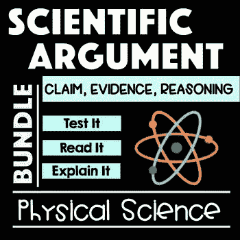

# 某些人在喊气候变化是“狼来了”吗？

> 原文：<https://medium.datadriveninvestor.com/are-certain-humans-crying-climate-change-wolf-5c590d456d5e?source=collection_archive---------18----------------------->

## 有点像在拥挤的剧院里喊“着火了”。

毫无疑问，地球上的气候正在发生变化。世界上大多数人倾向于在那个问题上达成一致。大多数生活在地球上更热更干燥地区的人都知道气候正在变暖。

Underground Town in Australia

例如，在澳大利亚，至少有一个社区已经转移到地下以躲避不断增加的热量。一些科学家公开声明，世界上有些地区几年后将变得不适合居住。印度的一些地区气温持续上升，最高可达 40 摄氏度，最低可达 50 摄氏度。对于我们的美国同胞来说，那分别是 104 华氏度到 115 华氏度和 124 华氏度左右。

Global Warming — The Two Camps

全球变暖的原因分为两大阵营。第一，声称气候变化和地球逐渐变暖是地球自然消长的一部分，而不是人类活动造成的。

 [## 气候变化、ESG 和对更好数据的追求|数据驱动的投资者

### 在地球上许多地方经历了另一个令人难以置信的炎热夏季后，来自 S&P 的最新发现…

www.datadriveninvestor.com](https://www.datadriveninvestor.com/2018/08/24/climate-change-esg-and-the-quest-for-better-data/) 

另一个阵营声称世界气候逐渐变暖；冰川的消失和极地冰川的融化是人类活动的结果，并指出地球大气中二氧化碳气体数量的增加是证据，地球上的 70 亿居民是原因。

谁是正确的，他们为什么采取自己的立场？双方都提出了大量的数据来支持他们的立场，非人为原因的一方声称人为原因的一方是在喊狼来了。对许多人来说，问题是该相信哪一方？哪一组有最可信的科学来支持他们的观点？

这就是你自己做作业发挥作用的地方。如果你想深入了解事实，你必须避免社交媒体账户及其经常带有偏见和无意义的信息。有许多好的科学出版物，既有你们当地新闻机构的杂志形式，也有书店和当地图书馆的由有良好资质的著名作家写的书。使用互联网上可证实的来源来核实事实。请记住，科学每次都击败伪科学，有许多骗子和有自己既得利益的人提供表面上看起来真实的信息，但如果你深入研究，你可能会发现提供的信息不是真实的。

我想到了几本好杂志，包括《经济学人》、《国家地理》、《名利场》、《地球杂志》和《自然》。加入你所在地的讨论组。看看你所在地区的环境发生了什么变化。最近十几年有什么变化？更多的洪水还是更多的干旱？

争论的双方都有很多人有既得利益。从化石燃料到可再生能源的过渡正在升温，双方的立场都越来越强硬。有趣的是，这与内燃机开始逐渐取代马时发生的话语和争论并无二致。

直到 19 世纪末，马车和货车还是日常的交通工具。用了 50 多年的时间，内燃机，包括汽油和柴油发动机，取代了马在世界范围内的货物运输、农业、公共交通和个人运输中的作用。正如历史学家所指出的，你不可能改变一个系统的条件而不损害伴随这种改变的许多人、企业、实践和习惯。

## 如果世界达成协议，从化石燃料转向可再生能源，这将是困难和时间框架。

在内燃机取代了马之前，污染的形式是成吨的粪便堆积在街道上，并被磨成吸引老鼠和苍蝇的粪肥和灰尘。死马经常堵塞城市街道，由时间紧迫的马队拉着的快速送货车给公共街道增加了威胁。

一百年后，我们面临另一个污染问题。人类引起的气候变化组织认为，数亿辆燃烧化石燃料的汽车、卡车、飞机、船只和辅助发动机产生的二氧化碳正在污染地球的大气层，影响着地球上的每个人和所有东西。

# 谁有正确的科学？由你来决定。