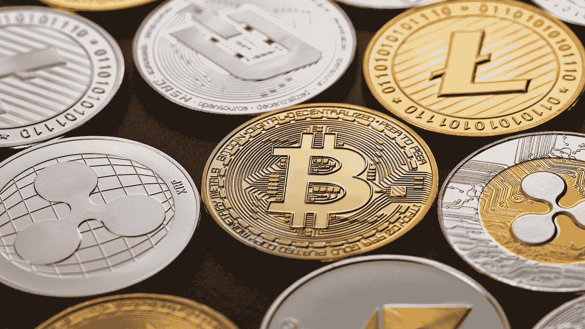

# 企业正在为区块链和加密货币收购做准备吗？

> 原文：<https://medium.datadriveninvestor.com/are-corporations-preparing-for-a-blockchain-and-cryptocurrency-takeover-e536a72f6760?source=collection_archive---------1----------------------->

在比特币的整个发展过程中，有几种情况表明，一场重大的企业收购可能即将发生。

企业界一些最知名家族的进入，以及硬分叉期间的权力整合(如 SegWit2X 辩论)，是表明比特币不可避免地向完全或准企业实体转变的主要原因之一。

尽管比特币的根源是去中心化的，但比特币自此分成了几个核心部分。从理论上讲，这似乎类似于一个分支机构保持制衡的政治系统，然而，在表面之外，有一个明显的权力整合，少数群体拥有的权力超过了大多数人的愿望——这在比特币世界中普遍存在。

# 作为权力整合的一种形式

2017 年的几次硬分叉，让加密货币社区产生了距离和分化。硬分叉除了细分社群，还对加密货币本身进行了划分。一个分叉硬币所在的链条分叉成两条不同的链条。

比特币现金和 SegWith2X 是 2017 年发生的两个最值得注意的分叉。这些分叉是在争夺中形成的，将许多加密货币爱好者分成了两边。一些人认为 SegWit2X fork 有问题，与其说是因为技术的变化，不如说是因为提出变化的方式，或者像一些人认为的那样，是因为变化被[“宣布”的方式。](https://www.forbes.com/sites/ktorpey/2017/10/31/is-bitcoin-facing-a-corporate-takeover-via-the-2x-fork-a-developer-and-a-business-leader-debate/#6a37d35e3bff)

[Alex Morcos 和 Mike Belshe](https://www.forbes.com/sites/ktorpey/2017/10/31/is-bitcoin-facing-a-corporate-takeover-via-the-2x-fork-a-developer-and-a-business-leader-debate/#6a37d35e3bff) 都对这一争论发表了广泛的评论。有人认为，这一决定更类似于公司收购，而不是基于共识的决定，原因有几个。

# 纽约协定

原因之一是，只有少数人宣布了这一变化。Morcos 认为，比特币的工作定义被 SegWit2X 硬分叉抛弃了，因为比特币应该是一种“分散的、廉洁的、抗审查的货币”。由于 SegWit2X fork 诞生于已经引起争议的[纽约协议](https://cointelegraph.com/news/opinion-collapse-of-bitcoins-new-york-agreement-would-have-long-term-consequences)，即 2017 年举行的会议，来自社区不同部分的代表人数不足，Morcos 认为，这一决定为企业收购即将到来提供了理由。

我们不会进入比特币纽约协议(或其后果)的整个经典希腊传奇，然而，简而言之，你应该知道，在做出决定时，比特币社区的重要部分并不都在场。虽然实施 SegWit2X 的协议是由 50 多家不同的比特币相关公司达成的，但 SegWit2X 协议是在没有得到比特币核心开发团队批准的情况下达成的。因此，该决定遗漏了比特币社区的一个重要部分，即在 Satoshi 最初打开加密货币蠕虫罐后继续工作的那部分社区。

这一信息的主要含义是，从比特币中获利的企业和公司，而不是开发商**，才是推动纽约协议的人。**

纽约协议是一场漫长而持续的战斗的开始，这场战斗后来演变为“BTC 对 BTH”的辩论。

[你可以在这里阅读更多关于这个传奇是如何继续的。](https://coincentral.com/btc-vs-bch-feud/)

如果这对于一篇文章来说还不够戏剧化，那么一些世界上最富有的家族的投资/风险投资部门刚刚进入加密货币领域。应该注意的是，这些家族的存在不仅仅是一群相关人士的一些共同投资。这些家族对自由世界的金融和企业利益有着重大影响。

# 今年，与企业有联系的主要家族都加入了加密货币

三个最大的[公司家族](https://www.rt.com/business/423559-rockefellers-soros-rothschilds-cryptocurrency-investment/)(以及相应的投资办公室)今年进入了加密货币领域:洛克菲勒家族、索罗斯家族和罗斯柴尔德家族。这些家庭进入区块链空间代表着许多人对加密货币的不确定性的转折点。这些家庭在 4 月初到达现场后，比特币的价格从 6800 美元上涨到 9800 美元。也许这只是一个巧合。其他大型家族理财室会继续效仿吗？

某些*家族进入数字货币领域，如洛克菲勒家族，将标志着企业界与区块链交汇的一个重要切入点。这些家族有潜力利用他们对金融界的影响力来满足他们的要求。同样，这是一个更广泛、更响亮的主题的一部分，反映了很少有影响者能够代表整个社区做出决策。这就是亚历克斯·莫科斯试图警告我们的*声明式*怪物。*

尤其是索罗斯家族，对于企业界和区块链的交集并不陌生。乔治·索罗斯拥有 Overstock.com 的股份，这家总部位于华尔街的互联网公司已经拥有像 tZero 这样的主要加密股份。

索罗斯会像上世纪 80 年代对企业突袭那样，把区块链世界打得落花流水吗？或许更好的问题是，预测数字货币在不久的将来会遭到企业突袭吗？

随着渴望收回评估的创始人数量回到以前的高度，答案是*可能。什么会阻止一家区块链公司的创始人进行股权交易，以换取公司 70%的股份，甚至更糟，整个公司的股份？或许更糟糕的是，有什么能阻止一家企业向任何愿意接受股权交易的体面公司提供股权交易呢？*

# 结束语

随着硬分叉、亿万富翁家庭和对去中心化原则的摒弃继续分离数字货币社区，什么能让这个社区变得更紧密？对于对加密货币的信心和信念来说，今年是艰难的一年，这一考验继续区分真正的霍德勒和街区里那些用租金支付加密的不可靠的家伙。我们将会看到，金融危机后诞生的硬币是否会继续沿着预期的去中心化道路前进，或者企业是否会接管它以满足自己的需求。敬请关注。

*原载于 2018 年 8 月 21 日*[*【www.datadriveninvestor.com】*](http://www.datadriveninvestor.com/2018/08/21/are-corporations-preparing-for-a-blockchain-and-cryptocurrency-takeover/)*。*