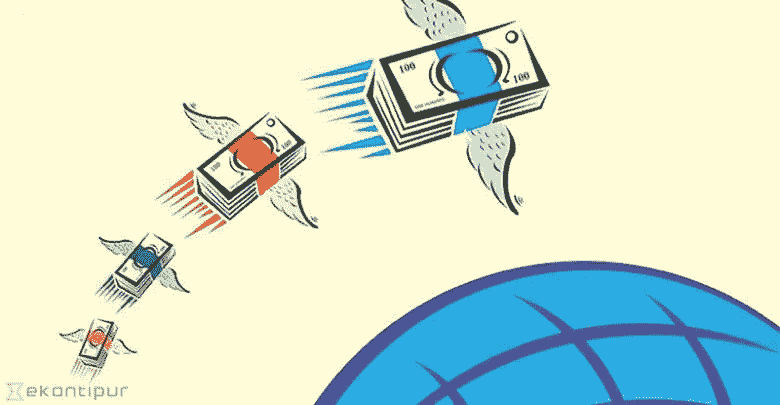
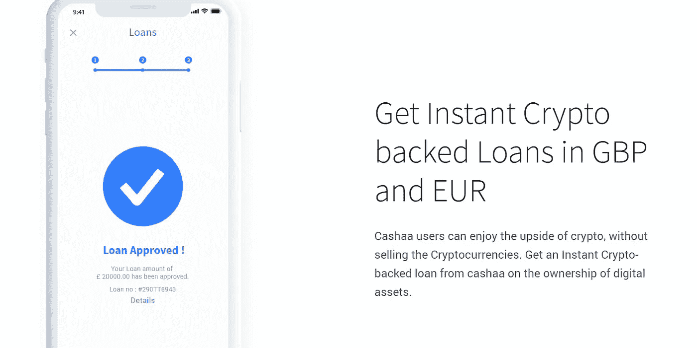

# 加密货币是汇款系统的未来吗？

> 原文：<https://medium.datadriveninvestor.com/are-cryptocurrencies-the-future-of-the-remittance-system-313cc09820c6?source=collection_archive---------1----------------------->

2025 年，全球数字汇款市场将达到 85.9 亿美元(来源:[https://www . market watch . com/press-release/digital-mission-market-2018-global-analysis-opportunities-and-forecast-to-2023-2018-07-10](https://www.marketwatch.com/press-release/digital-remittance-market-2018-global-analysis-opportunities-and-forecast-to-2023-2018-07-10))。目前，这个市场在全球范围内转移资金的规模约为上述预测的六分之一，这已经非常巨大了。我们可以很容易地说，获得这个市场的份额对于银行和其他服务提供商来说具有根本性的战略重要性。每年发布的新服务数量以及为未来服务提供的解决方案都证明了这一点。尽管到目前为止已经取得了一些进展，但目前的汇款服务存在的问题是众所周知的:其中一些服务速度慢、效率低、费用高，而且依赖 Swift。随着世界的不断发展，新的新兴技术和我们日常生活的变化，我们需要问自己，是否是时候中断这些服务了。

他的回答很简单:是的，正是时候！如果我们回顾 10 年前，我们会注意到银行和西联汇款是跨境交易的主要媒介。如今，我们可以数出几个收费较低但功能相当类似的服务，比如 Transferwise、Revolut、CurrencyFair 等。我个人每天都在使用 Revolut，而且经常使用 CurrencyFair。我必须说我对这些产品非常满意，因为我发现它们又快又便宜。当我意识到 Revolut 也允许加密货币时，我非常激动，但当我注意到你实际上不能将这些代币/硬币发送到任何其他加密地址时，我的期望被超越了。将应用程序开放给 Crypto 是件好事，因为这扩大了公众的一般可访问性，但仅此而已。一个只能交易法定货币(费用也很高)而不能转移货币的钱包是没有用的，至少对我来说是这样。

在加密领域，已经有一些非常好的汇款产品，其中的王者毫无疑问是 XRP:超级快、可靠、便宜，是最好的加密产品之一。但这是一个主要面向银行的产品，而不是面向像你我这样的普通人。我的意思是，你当然可以用它作为其他加密和法定货币的基本交易对，但仍然缺少一些东西。BTC 是第一种被认定为“新世界货币”的加密货币，但鉴于其技术限制、采矿系统、工作证明、昂贵的费用和速度，它现在更像是一种价值硬币的储存手段，类似于我们投资黄金的方式。还有其他的选择。

如果我将上面提到的一些产品的功能放在一起，我最终会认为我们需要一个结合以下内容的服务:

1.  传统的银行账户是法定货币，可以用来储存货币、向国外汇款以及获得信贷(贷款、抵押贷款等等)；
2.  加密货币，从存储它们，到将它们兑换成法定货币，到交易它们，将它们发送到其他加密钱包等等；
3.  在菲亚特汇款费用低，速度快；
4.  进入像印度这样的新兴市场。

这项服务已经存在，它的平台将很快发布，名为 Cashaa。这是一个为个人和企业持有、接收&兑换各种货币和加密资产的全球账户:传统银行(法定)、创新银行(加密货币)和金融(交易)的一站式账户。多亏了区块链技术，它几乎可以瞬间将钱转移到 120 多个国家，而且费用很低。但不仅如此。假设你想在印度或加拿大或任何其他兼容的国家花你的法定货币(请见网站):你会有一张卡，你可以用它从自动取款机上取款，并以当地货币进行非接触式支付。如果菲亚特不是你的茶，你也可以随时随地花你的 BTC，瑞士联邦理工学院和其他！这很像类固醇革命。

这可能是该平台最重要的特征之一:加密货币仍然相对难以获得，更真实的是，如果没有一些计算机或技术知识，它们很难在我们的日常生活中消费和使用。事实上，这个平台的目标是让无数人都可以使用 crypto，重点是印度市场，从潜在的数量和机会来看，这是最好的选择。除非日常生活中的人们能够轻松地使用和消费加密技术，否则不可能有全球性的采用:这是我们都在寻找的革命的一部分。

其他一些特性也值得一提。你需要贷款？你可以用你的加密货币作为贷款的抵押品，而不需要卖掉它们:你可以继续持有你最喜欢的硬币，也可以得到一些钱来满足你的日常需求。太棒了！此外，您将能够从您的 Cashaa 帐户的便利参与 ICOs:一站式商店再次为您所有的法令和加密的需要。

我非常高兴能够对平台进行测试:尽管根据路线图，我们需要等到 2018 年 11 月至 12 月才能发布，希望它背后的技术已经足够成熟，能够容纳设想的功能。该团队正在努力实现这一目标。同时，获得一些 CAS 令牌可能是个好主意，它们是平台的本地货币。它们目前的交易价格约为 0.02 美元，所以它们真的很便宜:它们可以在 Cashaa exchange、HitBTC、Idex、Etherdelta 等网站上购买其他加密货币。关于 CAS 值得一提的几件事是，它的总供应量是 10 亿，其中 51%预留给代币销售，只有 20%预留给团队。未售出的代币现在将在一年内分发给有 PoS 的 ICO 参与者:这将是一个很好的激励霍德勒不出售他们的硬币，并有可能提高价格。更多关于 CAS 令牌的信息可以在这里找到[https://cashaa.com/cas-token.php](https://cashaa.com/cas-token.php)，我建议你仔细阅读一下。

我很想知道你对此的想法，如果你喜欢这篇文章，请随时评论，分享和鼓掌。

谢谢大家！

**免责声明**:本文不构成在任何司法管辖区买卖证券的邀请，也不构成 Cashaa、CAS token 或任何其他加密货币的招揽或投资建议，发布仅供参考。读者承诺进行适当的研究，并在任何情况下，在做出任何关于 Cashaa 或任何其他加密货币的决定之前咨询专业人士。本文中表达的观点属于个人性质，与任何公司、加密货币交易所没有任何联系，不构成金融或法律建议。使用平台及其他交易所风险自担。