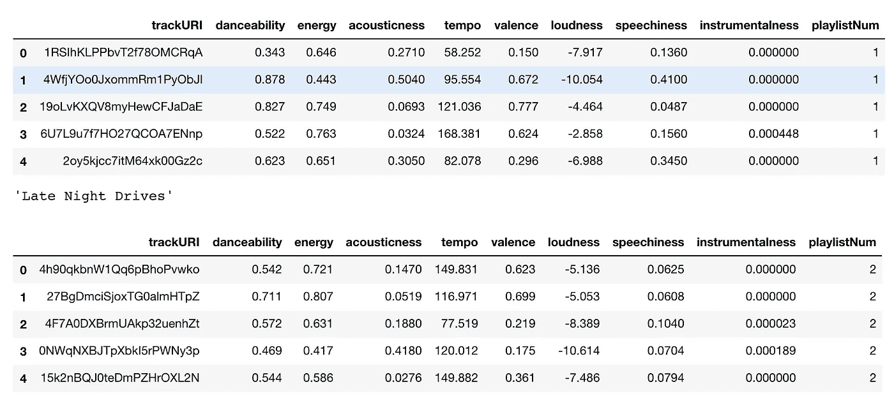
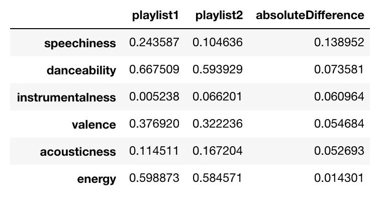
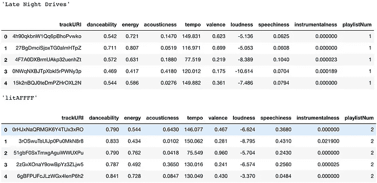
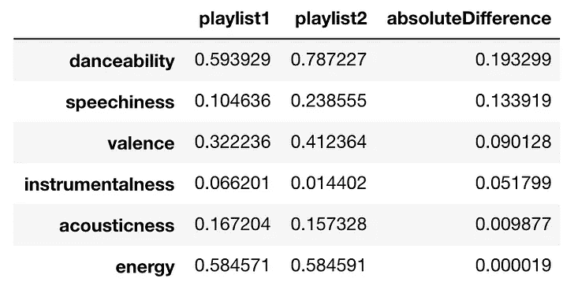
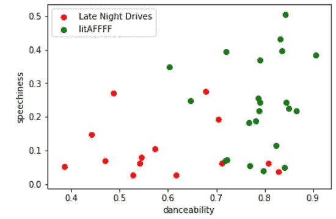
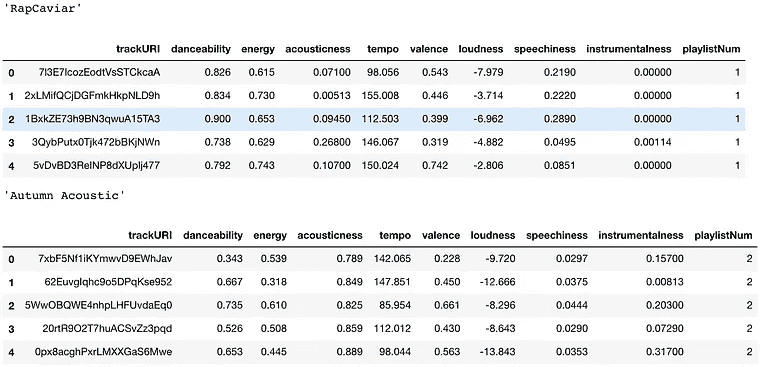
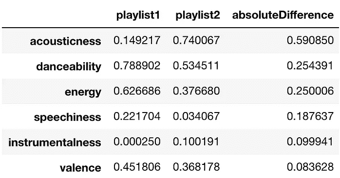
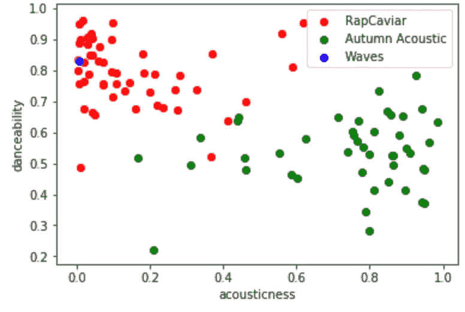

# 我的 Spotify 播放列表有用吗？…数据方法

> 原文：<https://medium.datadriveninvestor.com/are-my-spotify-playlists-any-good-a-data-approach-9f24aa0cf28c?source=collection_archive---------2----------------------->

管理播放列表很难。整理你图书馆里的无数首歌曲，并策划它们来填充某种感觉/氛围是需要时间的。我有一些朋友非常珍惜他们的 Spotify/Apple Music 播放列表，甚至不与他人分享。


[https://unsplash.com/photos/Jiu5uMx6mGU](https://unsplash.com/photos/Jiu5uMx6mGU)

作为一个对技术充满热情的人，我想知道我可以用 Spotify 的 API 做些什么来帮助我了解我的播放列表是否有任何好处。它们真的符合某种审美吗？或者它们是随机的 jibberish 和我是个糟糕的音乐策展人吗？如何用硬性的数字和数据来回答这个问题？

我开始用一些我最近学到的关于机器学习和数据科学的技术来回答这个问题。我绝不是专家，但我总是乐于学习新兴技术，并认为这是一种很好的学习方式。

# 我在寻找什么？

我们如何定义一个*好的*播放列表:品味因人而异，所以我认为一个**好的播放列表是那些歌曲在组成歌曲的特征上是一致的。**

这种方法非常简单:如果我可以获得组成播放列表的歌曲的特征，并将这些特征绘制在一个简单的散点图上，那么这些歌曲应该(在很大程度上)与组成另一个播放列表的歌曲在不同的簇中。

**差不多吧，如果我的播放列表是我自己精心策划的，那么我希望当它们按照它们的特征绘制在图上时，它们会在不同的簇中。**

# Spotify 的 API😍

Spotify 的 API 非常出色。他们有这个 API 调用，你可以输入一首歌曲 URI，它会返回给你一个组成这首歌的特征列表。这些特征包括声音，效价，速度，响度，能量等等。

# **过程⚙️**

*   获取播放列表，并将曲目及其特征导入熊猫数据框。



My Pandas DataFrames. Actual DataFrame is waaaay bigger — this is only the top 5 rows of each

*   通过合并播放列表中的曲目来计算组成播放列表的特征的平均值。*我选择不做中位数平均，因为我没有看到可能会使我的数据成为大问题的异常值。*
*   使用一个简单的欧几里德距离公式来识别顶部不相似的特征:这是一种表示某物有多远的奇特方法… *不，这只是简单的减法。*



*   将顶部两个不同的特征绘制到一个图表上，看看它们是如何被可视化地表示出来的。

# 调查结果🔍

我想用几个场景来测试这一点。我还想挑选具有相同曲目数量的播放列表，这样 KNN 算法就不会有太大的偏差(我稍后会详细介绍 KNN)。

1.  我的播放列表与我的另一个播放列表
2.  Spotify 管理的播放列表与另一个 Spotify 管理的播放列表

## 我的播放列表与我的另一个播放列表

播放列表 1: *深夜开车*。这些是我想象自己在一个凉爽的夜晚沿着穆赫兰道在山上开车时听到的歌曲。

播放列表 2:*litafffff。*我想这是我在高中时制作的许多健身播放列表中的一个。包含 Bangerz 喜欢“面具关闭”和其他大说唱命中。



不是巴德·穆斯塔法！从散点图可以看出，似乎有一个不错的趋势。 *litAFFF* 曲目有更多的单词，显然更适合跳舞。我可以向你保证我不是在和他们跳舞…😅

## Spotify 管理的播放列表与另一个 Spotify 管理的播放列表

这让我想知道 Spotify 的播放列表“更好”吗？它们是否比我的播放列表定义得更明确，聚集得更好？让我们来看看。我比较了

播放列表 1: [*说唱鱼子酱*](https://open.spotify.com/user/spotify/playlist/37i9dQZF1DX0XUsuxWHRQd?si=AMBtCto8TcKdT8ndL9HbKg)

播放列表 2: [*秋声*](https://open.spotify.com/user/spotify/playlist/37i9dQZF1DWUNIrSzKgQbP?si=kLVk2adpQSmmNPMBB7vHQA) 。



很明显，Spotify 的播放列表不仅更加清晰，而且有更多的功能被很好地分开。当他们可能首先使用这些功能来制作播放列表时，我不能责怪他们。

对于进一步的实验，我们可以通过使用降维技术来扩展这个项目，将这个实验从 2D 扩展到 Spotify 为其曲目功能返回的所有维度(功能)。

## **额外积分**

tbh …这部分并不难。比其他的更容易…但是为了好玩，我将 k = 5 的 KNN 算法扩展到等式中，看看我是否能成功预测一首歌最有可能属于哪个播放列表。

[**什么是 KNN 或 K 近邻算法？**](https://en.wikipedia.org/wiki/K-nearest_neighbors_algorithm)


illustration to help understand how KNN Algorithm works

> 简而言之……想象一下绿点代表我们想要预测的点。我们想要预测那个绿点(歌曲)是属于播放列表 1(蓝色)还是播放列表 2(红色)。如果 k=3，那么我们看第一个实心圆，因为它们是 3 个最近的邻居。基于 k = 3，算法将输出点(在这种情况下是歌曲)属于红色播放列表 2，因为在那个圆中红色三角形比蓝色正方形多。

在上面的例子中，我将使用相同的 Spotify 播放列表，因为它们比我的更清晰。我将在 KNN 模型中输入 4 首歌曲，看看它会输出什么。

1.  《未来与周末》中的“低级生活”
2.  德雷克的《十六岁的夏天》
3.  Probz 先生的“Waves-Robin Schulz Radio Edit”
4.  在争吵中“低声歌唱”

我期待前两首放在*说唱鱼子酱*后两首放在*秋声*。让我们看看我们是怎么做的:

```
Using the KNN Algorithm, 'Low Life' best belongs in 'RapCaviar' playlistUsing the KNN Algorithm, 'Summer Sixteen' best belongs in 'RapCaviar' playlistUsing the KNN Algorithm, 'Waves - Robin Schulz Radio Edit' best belongs in 'RapCaviar' playlistUsing the KNN Algorithm, 'Singing Low' best belongs in 'Autumn Acoustic' playlist
```

3/4 … 75% …不错的🧐.虽然没有成功通过，但暂时可以了！

**“惊涛骇浪”没有如期而至。我们来看看为什么？**



看了图表后，很容易看到它在“跳舞能力”中排名很高，当你想到它的时候，它确实有点高。我没想到声音这么低。总的来说，在*说唱鱼子酱*集群的权利，所以不能责怪算法。

# 改进/建议

现在我们可以对这个项目的分类器做很多改进。这里有几个建议:

1.  获得 3 维(特征)来说明歌曲的更好的图片并更好地分类
2.  见鬼…我们不要停在 3 点。让我们使用降维来对尽可能多的特征进行分类(同时保持方差)，以便更好地理解播放列表和组成它们的歌曲。
3.  我还想输入更多的播放列表(3，4，5 等)，看看他们是否足够好地集群。当你只处理 2 个播放列表时，事情就有点简单了。

希望听到您的想法、意见和建议。

你可以在 gitHub @【https://github.com/mustafahoda 上找到代码