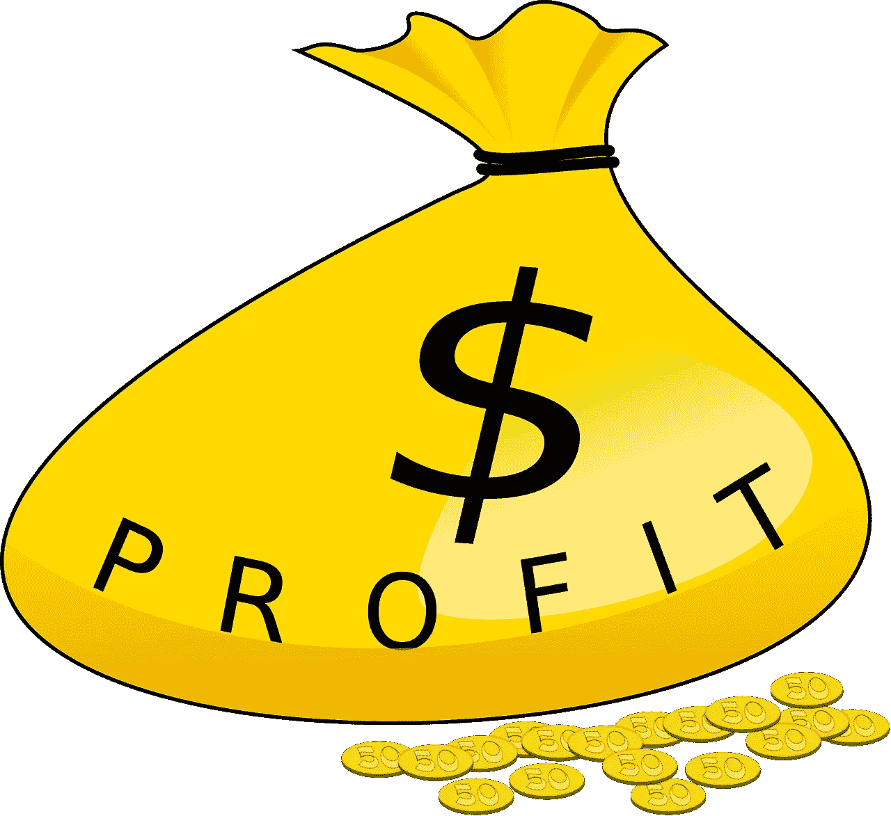
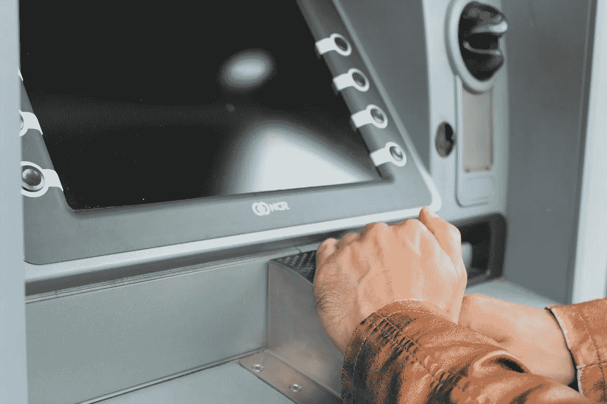

# 小银行比美国银行更好吗？

> 原文：<https://medium.datadriveninvestor.com/are-smaller-banks-better-at-us-bancorp-ad78b7224456?source=collection_archive---------8----------------------->

很多人；包括纽约美联储，都在问“像美国银行这样的小银行更好吗？”事实上，纽约联邦储备银行在一篇新论文中提出了这个问题。

值得注意的是，路透社[报道](https://www.reuters.com/article/bc-finreg-big-banks-complexity/us-big-banks-remain-complex-despite-post-crisis-simplification-goals-fed-paper-finds-idUSKCN1QV324)称，美联储研究人员琳达·s·戈德堡(Linda S. Goldberg)和艾普丽尔·米尔(April Meehl)认为美国银行的复杂程度太高了。此外，论文； [*美国大型银行的复杂性*](https://papers.ssrn.com/sol3/Papers.cfm?abstract_id=3342464) *，*自 2008 年金融危机以来，美国各州银行从未出现过萎缩。

为了解释这一点，戈德堡和米尔认为美国银行太大太复杂。因此，他们认为美国银行比小型金融机构更容易倒闭。

 [## 金融科技初创公司正在扰乱世界各地的银行业-数据驱动的投资者

### 传统的实体银行从未真正从金融危机后遭受的重大挫折中恢复过来…

www.datadriveninvestor.com](https://www.datadriveninvestor.com/2018/10/20/fintech-startups-are-disrupting-the-banking-industry-around-the-world/) 

# **美国 Bancorp 是否大到不能倒？**

在这种情况下，许多投资者会问，像美国银行这样的小金融机构；或**美国 Bancorp(纽约证券交易所代码:USB)** ，是一个更好的风险。

例如，美国银行报告 2018 年第四季度收入为 52.33 亿美元。相比之下，巴菲特青睐的富国银行(纽约证券交易所代码:WFC)同期收入为 204.59 亿美元。

然而，美国银行仍然很大，有 3，067 家分行和 4，471 台自动柜员机在运行。相比之下，[富国银行](https://marketmadhouse.com/wells-fargo-is-accumulating-lots-of-cash/)运营着 5000 多家分行和 13000 台自动取款机。

因此，美国银行是一家大型金融机构，资源比富国银行少。因此，美国银行更有可能倒闭，因为它赚的钱比富国银行少。

# **美国 Bancorp 赚钱了吗？**

相比之下，美国 Bancorp 从其较小的足迹中赚了很多钱。例如，美国银行报告 2018 年 12 月 31 日的毛利为 54.33 亿美元，营业收入为 21.53 亿美元，净收入为 18.56 亿美元。

此外，美国银行报告 2018 年第四季度运营现金流为 26.5 亿美元，融资现金流为 34.78 亿美元，自由现金流为 26.5 亿美元。因此，美国银行从其业务中赚了很多钱。

很明显，这家美国银行在 2018 年 12 月 31 日拥有 214.53 亿美元的现金和等价物。然而，富国银行在同一天拥有 1732.87 亿美元的现金和等价物。

# 美国银行比你想象的更有可能倒闭

在这种情况下，美国银行更有可能倒闭，因为它的资金更少。解释一下，美国银行可能缺乏现金来弥补巨额亏损或支付巨额罚款。

因此，美国银行没能用沃伦·巴菲特的“[白痴侄子 tes](https://www.businessinsider.com/warren-buffett-good-business-could-be-run-by-idiot-2016-3) t .”来解释巴菲特喜欢投资那些即使你的白痴侄子在经营也能生存下去的公司。

具体来说，沃伦叔叔认为“傻瓜侄子证明”的公司简单、易于运营，并能产生大量现金。富国银行通过这些测试是因为它的业务；贷款、发放抵押贷款、提供银行账户和兑现支票都很简单。更重要的是，富国银行产生了大量的现金。

例如，富国银行在 2018 年 8 月支付联邦政府 20.9 亿美元的罚款没有问题。解释一下，监管机构对富国银行罚款是因为它故意根据不良信息发放抵押贷款。然而，这样的罚款可能会占用美国银行近 10%的现金储备。

# **美国 Bancorp 是价值投资吗？**

因此，我认为 US Bancorp 在 2019 年 3 月 22 日被高估至每股 48.59 美元。

因此，想想富国银行；该公司在同一天的交易价格为每股 48.27 美元，这是一笔好得多的交易。例如，富国银行在 2019 年 3 月 1 日支付了 45 英镑的股息。

然而，美国银行是一个值得尊敬的股息股。例如，美国 Bancorp 股东在 2019 年 1 月 15 日收到了 37 英镑的股息。此外，美国银行的股息在 2019 年增长了 7%，高于 2018 年 4 月的 30%。

2019 年 3 月 22 日，美国 Bancorp 股东的股息收益率为 3.04%，年化派息为 1.48 美元，派息率为 36.4%。此外，美国银行的股息在过去几年一直在增长。

相比之下，富国银行向投资者提供的股息收益率为 3.72%，年化派息为 1.80 美元，派息率为 39。%在同一天。此外，富国银行提供了七年的股息增长。因此，我认为，富国银行比美国银行交易更好，因为它提供了更少的风险和同等价格的可比股息。

# 巴菲特的白痴侄子对美国银行的看法是正确的

归根结底，美国银行是一只好股票，但你可以在富国银行以类似的价格找到更低的风险和可比的股息。这就是为什么巴菲特承认拥有价值 12.63 亿美元的富国银行股票。B) [股东信](http://www.berkshirehathaway.com/letters/2018ltr.pdf)。

再次，理解，巴菲特的傻逼侄子可以帮你规避风险，赚钱。然而，如果你想从他身上赚钱，你将不得不忍受这个白痴侄子的道德问题。