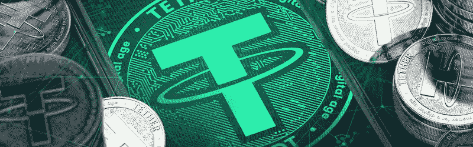

# Stablecoins 是证券吗？国际监管机构说可以

> 原文：<https://medium.datadriveninvestor.com/are-stablecoins-securities-international-regulator-says-yes-658e29181b38?source=collection_archive---------21----------------------->

国际证券监管机构国际证券委员会组织(IOSCO)近日[发布声明](https://www.iosco.org/news/pdf/IOSCONEWS550.pdf)称 [**稳定债券**](https://cryptolawinsider.com/stablecoins/) **可能是证券。**

对于任何关注加密法律领域一段时间的人来说，你会知道这对 stablecoin 项目和投资者有多么重要。

去年 11 月，当 SEC 认定 ico 是安全产品时，它对整个行业造成了严重破坏。

许多项目突然发现自己面临数百万美元的罚款。一些人付清了，而其他许多人破产了。

[一个项目试图反击](https://cryptolawinsider.com/sec-vs-kik/)，甚至在审判开始前就已经花费了超过 500 万美元的法律费用。

我不是说这些会发生在稳定的人身上。但是我确信你可以看到如果[稳定债券](https://cryptolawinsider.com/stablecoins/)被归类为证券*会有多么广泛的影响。*

因此，业内人士的问题是， ***稳定的债券能被归类为证券吗？如果可以的话，监管者追查 stablecoin 项目的证券违规行为的可能性有多大？***

请继续阅读今天的文章，我将带您浏览 SEC 的标准来回答这个问题…

# 将豪威试验应用于稳定曲线

[为了确定一项资产是否是证券](https://cryptolawinsider.com/security-token/)，美国证券交易委员会使用豪威测试，如标志性案例*美国证券交易委员会诉 W. J .豪威公司*中所述。如果(I)有金钱投资，(ii)在普通企业中，(iii)有利润预期，(iv)完全来自他人的努力，则某物将被归类为证券。

如果所有这四项标准都得到满足，发行人就必须向美国证券交易委员会(SEC)注册其发行，否则就属于监管豁免范围。这不是一个小任务。这需要一个由律师和会计师组成的团队来协助这一过程，并且可能涉及数百万美元的费用。

当然，与被抓到逃避合规相比，这是一个很小的代价。这就是为什么对所有的*项目来说，在继续提供服务之前，完全相信他们的代币的状态是至关重要的。*

以下是 stablecoins 在豪威测试中与四项标准的对比情况:

豪威测试的第一个要点非常直接，是用钱来换代币吗？

尽管你可能会忍不住就数字代币实际上是钱的技术细节进行辩论，但这不会让你与 SEC 走得太远。因此，我不会浪费您的时间深入讨论这个问题。

简而言之，你必须用钱购买稳定的代币，不管是法定代币还是数字代币，所以稳定币显然符合这个标准。

豪威测试的第二个方面是指购买者的资金是否被集中在一个共同的投资中。更重要的是，损失和回报是由资产的所有持有者共同承担的吗？

关于这一点的一个很好的辩论可以在去年[关于云采矿服务](https://cryptolawinsider.com/genesis-mining-ordered-to-stop-selling-in-south-carolina-over-unregistered-securities/)的争论中看到。

例如，如果你加入了一个[采矿](https://cryptolawinsider.com/is-crypto-mining-still-profitable/)池，池中的每个人都分享奖励，这个*将*符合“普通企业”的标准。

然而，另一方面，如果你向一家公司支付[采矿](https://cryptolawinsider.com/is-crypto-mining-still-profitable/)服务，而你纯粹基于*你的*租用服务器的活动而获得回报，那么*就不是*一种“普通企业”的形式。

对于加密货币来说，几乎所有都符合普通企业的要求。当一个代币的价格上涨或下跌时，每个持有它的人都会意识到他们的投资会带来相应的收益或损失。

Stablecoins 也不例外。所以，是的，stablecoins 很明显也符合这第二个特点。

# 3)利润预期

豪威测试的第三个方面是最重要的，也是事情变得最复杂的地方。这是指一个人购买代币是为了它的效用还是为了获得利润。

对于今天的大多数加密货币，鉴于市场上的投机水平，监管机构不难证明购买代币是为了获利。

但这是否仍然适用于 stablecoins？理论上，stable coins 与资产是一一对应的。

如果你谈论的是一种与单一法定货币挂钩的稳定货币，你可以说没有利润预期。*我投资了一美元，我希望它保持在一美元。我不指望有任何收获。*

然而，如果一种稳定的货币与一篮子(T4)货币挂钩，那就另当别论了。令牌是*而不是*预期的稳定，显然提供了潜在的利润。(注意天秤座属于这一类，而*很可能*符合这一点。)

因此，在评估 stablecoin 项目时，查看令牌所关联的特定资产非常重要。

在我看来，美国投资者对美元稳定的债券一比一的支持，并不期望盈利，因此豪威测试的这一点不应该得到满足。像 Tether 这样的美元稳定债券应该*而不是*被视为证券。

然而，也就是说，有可能认为，即使单一货币稳定，也可以预期盈利。正如我们已经看到的[系绳](https://cryptolawinsider.com/tether-scandal-governance-failure/)一样，稳定的硬币挂钩可以被打破，代币可以高于或低于美元的价值进行交易。即使是最微小的波动也可能提供投机的机会，这可能是一个论点，即这一点得到了满足。

# 4)完全来自他人的努力

豪威测试的最后一个方面也是最复杂的。这一点指的是资产的价值是否完全由其他人的活动决定，而不是由市场力量决定。

以比特币为例。作为一个分散的项目，没有中央权力机构可以影响代币的价格。相反，比特币的价值受到市场力量及其固定挖掘算法的引导。

然而，如果你要投资一个 ICO 或 STO，你的代币价格会随着项目的进展而上涨，那么这个项目就会符合这一点。因为令牌的价值会受到项目经理和开发人员工作的影响。

要了解这一点如何适用于稳定的货币，我们需要非常仔细地观察该项目提供了什么，以及如何维持这一挂钩。

从案例法中，我们看到了企业家活动和管理活动之间的区别。换句话说，这个项目*是积极地*管理联系汇率，还是他们除了文书或部长级工作之外什么也不做？

例如，让我们以一个 stablecoin 项目为例，该项目简单地接受法定货币，将其放在银行，发行相应的稳定令牌，其他什么也不做。

如果该项目没有就挂钩或储备基金的使用做出进一步的管理决定，这可以被视为纯粹的文书工作。因此，代币不符合这一点，不会被视为证券。

也就是说，大多数项目并不是不干涉的。

这方面的一个例子是 [stablecoin 项目基础](https://cryptolawinsider.com/sec-killing-innovation/)。该项目旨在像中央银行一样运作，管理三个独立的令牌，并实施一个复杂的算法来维持稳定的价格。

尽管该项目尚未正式成为目标，但在 SEC 发布其关于加密安全产品的官方指导后，该项目自愿关闭，并向投资者返还了超过 1.33 亿美元的资金。

从证券法的角度来看，这是一个明智的决定，因为该项目可能符合这一点。然而，从加密的角度来看，看到这样一个有前途的项目消失是令人难过的，不是因为这个想法失败了，而是因为遵守法规的成本太高了。

# 这对*秘密法律内部人士意味着什么？*

总之，正如我们在基差案例中已经看到的，一些稳定的债券确实有可能被视为证券。

也就是说，这不应该被视为对*所有* stablecoin 项目的全面评估。

一种稳定的硬币是否能被归类为一种证券取决于它的结构和它的挂钩是如何保持的。

如果一种稳定的货币与美元一比一挂钩，而项目经理不干预以维持这种挂钩，那么就有一个强有力的论据证明这种货币是一种证券。

然而，如果稳定的硬币与一篮子货币挂钩，并且项目经理积极参与维持这种挂钩，那么这种代币可以被认为是一种证券。

当然，监管者是否认为追逐稳定资本是一个非常不同的问题。

例如，Tether 是一个有问题的项目，最终可能会受到监管机构的调查。该项目已无法维持其承诺的一比一挂钩，它没有透明的会计，项目业主被指控挪用资金。

然而，舞台上新的明星们正在努力建立更好的声誉。他们正在通过增加透明度、与更有声望的经理合作，以及煞费苦心地展示自己受到监管和合规来做到这一点。

正因为如此，在当前的法规下，更新的 stablecoin 项目不太可能成为 SEC 的目标。这是不值得的，而且这些项目已经受到其他方式的监管。

迪安·斯坦贝克

迪安·斯坦贝克(Dean Steinbeck)是 [*Crypto Law Insider*](https://www.cryptolawinsider.com) 的董事总经理，是加密货币和区块链技术相关法律问题的主要权威。[了解更多](https://cryptolawinsider.com/are-stablecoins-securities/)

*原载于 2019 年 12 月 11 日*[*https://cryptolawinsider.com*](https://cryptolawinsider.com/are-stablecoins-securities/)*。*