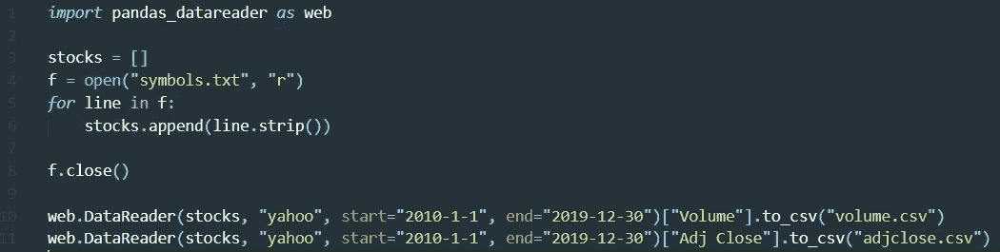
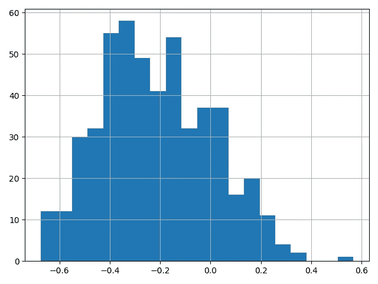

# 股票价格与交易量相关吗？

> 原文：<https://medium.datadriveninvestor.com/are-stock-prices-correlated-to-trading-volumes-285cc390956f?source=collection_archive---------2----------------------->


Let’s see how those two parameters are correlated

通常，当获得不同股票的市场数据时，你可能会收到开盘价/高价/低价/收盘价数据以及交易量。这篇文章探究了标准普尔 500 强名单上的几乎每一家公司，发现了交易量变动和价格变动之间的相关性。

> 在资本市场中，交易量是在给定时间内交易的证券数量。

## 关于数据

如前所述，本文将关注标准普尔 500 榜单上的几乎每一家公司。这个符号列表是从 [**这里的**](https://www.slickcharts.com/sp500) 得到的。只有 BRK。b 和 BF。b 被排除在外，因为我无法从雅虎财经 API 中获得任何数据。

*注意:错误在于我使用了符号 BRK。B 和 BF.b 代替 BRK-B 和 BF-B，后者用于 YF。*

[](https://www.datadriveninvestor.com/2019/02/07/8-skills-you-need-to-become-a-data-scientist/) [## 成为数据科学家所需的 8 项技能|数据驱动型投资者

### 数字吓不倒你？没有什么比一张漂亮的 excel 表更令人满意的了？你会说几种语言…

www.datadriveninvestor.com](https://www.datadriveninvestor.com/2019/02/07/8-skills-you-need-to-become-a-data-scientist/) 

时间段设定在 2000-1-1 和 2019-30-12 之间(几乎整整十年)，一天的间隔应该足够了。

对 Python 用户来说也是如此。以下代码用于创建计算所需的数据文件:



This code was used to obtain two .csv files: one for volumes and one for prices

*符号. txt* 的内容可以在 [**这里找到**](https://gist.github.com/markusrenepae/3cbd728aad14d79cbc6312b157e3bdc8) 。结果，两个。获得了 csv 文件:一个用于交易量，一个用于股票价格。

**澄清:**为了获得或多或少同步的价格数据，使用了调整后的收盘价。

# 相关系数

相关系数衡量两个变量之间的联系。它可以取-1 到 1 之间的值。为了解释它的值，让我们检查下面的列表:

*   恰好-1 意味着它们完全负相关。如果一个上升，另一个下降，反之亦然。
*   -0.7 表示强的负线性关系。
*   -0.5 表示中度负线性关系。
*   -0.3 表示弱负线性关系。
*   0 代表没有线性关系，因为这两个变量在数学上没有任何关系。
*   0.3 表示弱正线性关系。
*   0.5 表示中度正线性关系。
*   0.7 表示强正线性关系。
*   恰好 1 意味着两个变量完全正相关。如果一个上升，那么另一个也会上升。

在我们的分析中，我们期望遇到一些资产，它们的相关性尽可能远离 0(符号不重要)。

# 结果

以下是相关系数最高的 10 个符号:

```
AMD     0.567865
AGN     0.332846
FANG     0.332107
CHTR     0.305433
ROL     0.296130
SNA     0.275953
HRL     0.262222
O     0.229912
FOXA     0.221118
NCLH     0.220210
```

除了 AMD，相关系数都挺低的！因此，当交易量增加时，期望股票价格上涨是错误的。

以下是负相关系数最低的 10 个符号:

```
VLO    -0.674450
XOM    -0.660209
LVS    -0.656895
LNC    -0.655770
DFS    -0.650572
TRV    -0.649521
AAPL    -0.635755
GL    -0.634931
LOW    -0.628619
CF    -0.623034
```

哇！那是另一回事！根据相关系数列表，它们介于中等和强负相关之间。这意味着，当交易量激增时，我们可能会预计股价会下跌，反之亦然。

注意:很难预测股票价格的上升趋势，因为这需要交易量下降。当谈到交易量时，这些下降通常发生在跳跃之后。这是我的观点，这个观点是基于我观察到的数据。:)

要了解这些相关性是如何分布的，请参见下面的直方图:



This histogram shows that the correlation coefficients often tend to be negative

从这里我们可以得出结论，大部分权重设置在相关系数-0.3 附近。注意，有更多的符号是负相关的。

# 这些成果是如何取得的

以下是用于此分析的代码:

简单介绍一下:

*   第 3-8 行创建了一个列表(*股票*)，其中包含了将要被分析的所有符号。
*   第 10–11 行从导入有关交易量和调整后收盘价的数据。我们之前创建的 csv 文件。
*   第 12 行用于初始化一个空字典来存储结果。
*   第 14–16 行代表一个 for 循环，其中找到每个资产的相关系数，然后存储到*结果*字典中。
*   第 18–20 行创建了一个 Pandas 数据帧，并将数据存储在其中，这样我们就可以用一种可读性更好的形式来保存数据。

# 接下来呢？

你可以进一步分析这个问题。我可能会做的一些例子:

*   取另一个时间间隔较短的数据。如果相关系数的绝对值保持在 0.5 以上，那就太棒了。
*   创建一个基于机器学习的价格预测算法，最终给出投资建议。

请记住，有了这些结果(有了这些数据)，预测股票价格的上涨是相当困难的。然而，这可能是预测下跌和崩溃的一个很好的工具。