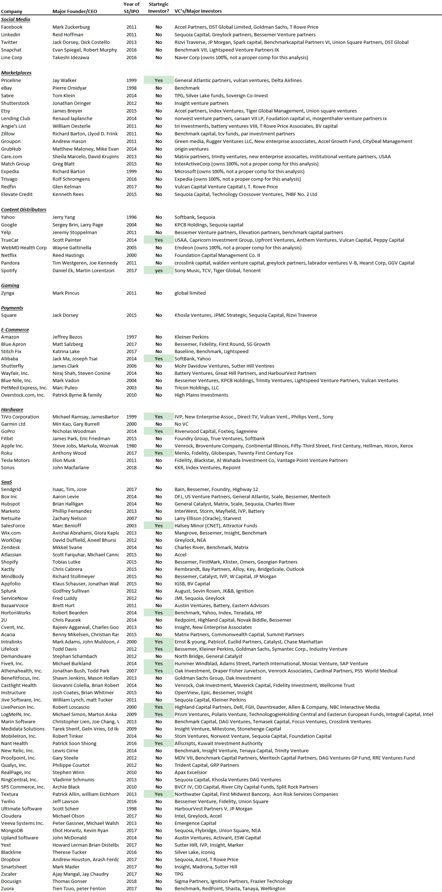

# 战略投资者重要吗？不

> 原文：<https://medium.datadriveninvestor.com/are-strategic-investors-important-no-25c6f68e9fe5?source=collection_archive---------15----------------------->

企业家总是在寻找“战略投资者”——企业风投，如英特尔、威瑞森、SAP、微软等。这种观点认为，这些投资者不仅提供资本，还提供产品路线图、工程/开发资源、关键介绍方面的指导，而且他们自己通常也是客户。例如，Cloudera 在上市前由英特尔持有 22%的股份。对战略投资者的需求让我们不禁要问:战略投资者有多重要？他们是成功的关键吗？我们认为答案是否定的。

为了得出这个结论，我们调查了 104 家上市前科技公司的主要投资者。我们发现，在 104 家公司中，只有 17 家有战略投资者。其余 87 家公司只有传统的风投或金融机构作为投资者，但没有战略家。换句话说，对于我们调查的 84%的公司来说，拥有一个战略投资者并不是成功上市的关键。数据如下。

尽管拥有战略投资者肯定有其价值，但他们并不是成功的关键，因为投资于上市科技公司的策略密度很低。更重要的是找到那些在他们力所能及的情况下提供帮助的投资者，那些支持企业的投资者(无论是在经济上还是情感上)，以及那些知道什么时候应该放手让你做自己的事情的投资者。

*在 blossomstreetventures.com 拜访我们*