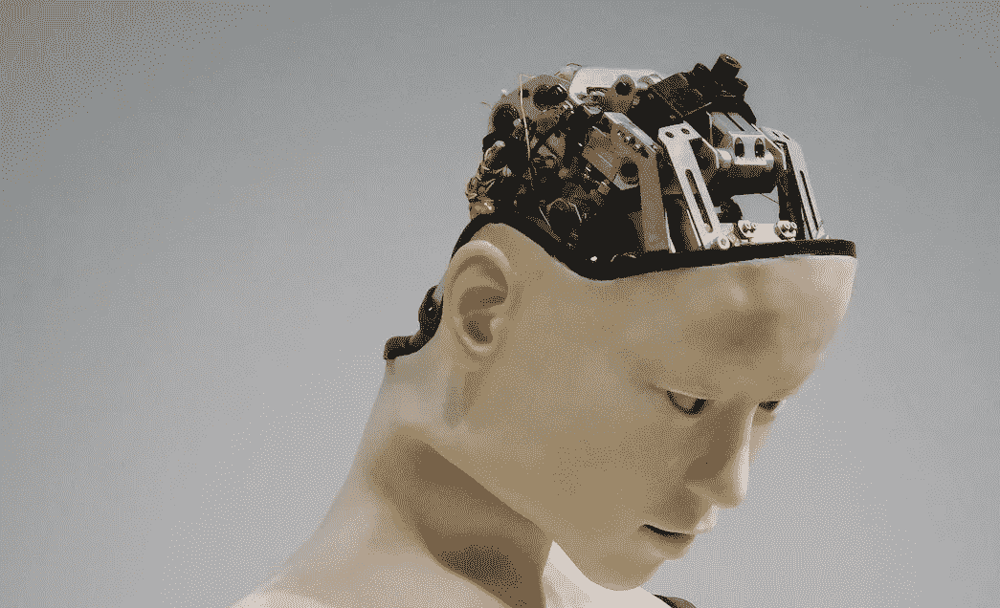

# 机器人接管了吗？

> 原文：<https://medium.datadriveninvestor.com/are-the-robots-taking-over-10a72ab851b8?source=collection_archive---------22----------------------->

Insidious humanoid

# 人类的专业知识无法比拟…暂时。随着新兴技术成为常态，许多问题不可避免地被提出。

人工智能(AI)和机器学习目前是金融服务领域的热门词汇，但它们会有利于人类进步还是会取代人类？

# 机器人顾问

TCC 专家 Phil Deeks 在 [New Model Adviser 中评论 robo 的建议是否对顾问构成威胁。](http://citywire.co.uk/new-model-adviser/news/how-the-quiet-robo-revolution-will-transform-advice-firms/a1095936)他总结道，至关重要的是，机器人顾问不会在一夜之间出现并接管，而是会逐渐与财务顾问整合，以协助他们做出决策。

同样明显的是，客户更喜欢真人的建议，而不是机器。随着人工智能技术的发展和普及，顾问和最终消费者都愿意信任和依赖机器人的建议吗？

# 利用人工智能

TCC 的关联公司 reg tech product[record sure](http://www.recordsure.com/)，通过组织和处理来自各种来源的数据，提供对对话的独特见解。随着人类的不断发展和指导，这是人工智能如何节省时间和提供宝贵见解的一个很好的例子。然而，正如 [FCA Insight 评论](https://www.fca.org.uk/insight/ai-no-match-your-average-four-year-old)所言，AI 目前还不是一个 4 岁孩子的对手！机器可以进行深度学习(使用算法从数据集彻底测量潜在结果和趋势的过程)，以非常有效地测量客户的风险和脆弱性等领域。然而，他们不能从观察他们周围的世界中发展出假说——这是小孩子一直在做的事情。如果没有对世界的这种概念性理解，机器将只能在没有更广泛的背景或对环境的评价的情况下报告客观事实……暂时如此。

# 结论

有了人类必要的指导和概念上的理解，人工智能的发展应该受到欢迎，成为实现我们目标的伙伴。也就是说，随着我们让机器变得更加智能的努力取得进展，我们必须密切关注它们的活动，小心不要让它们坐上驾驶座。

*插头……*

在 TCC[我们已经看到了人工智能和机器学习在简化和加速人类流程方面的力量。我们已经将我们开发的技术嵌入到我们的战略中，因此我们的专家团队可以更好地完成他们的工作，并提高效率。](http://www.tcc.group/)