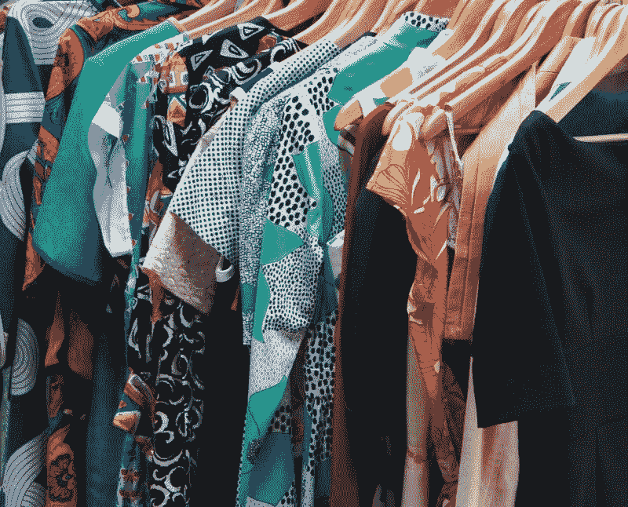
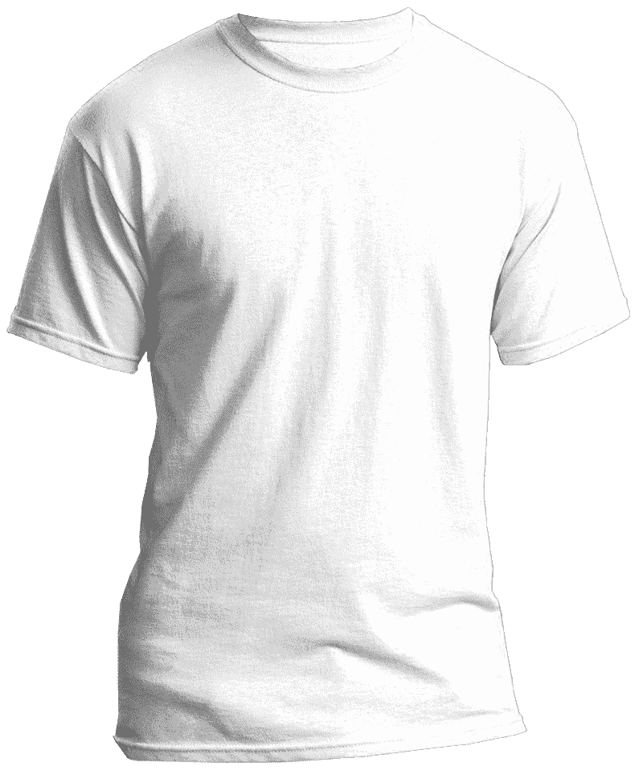
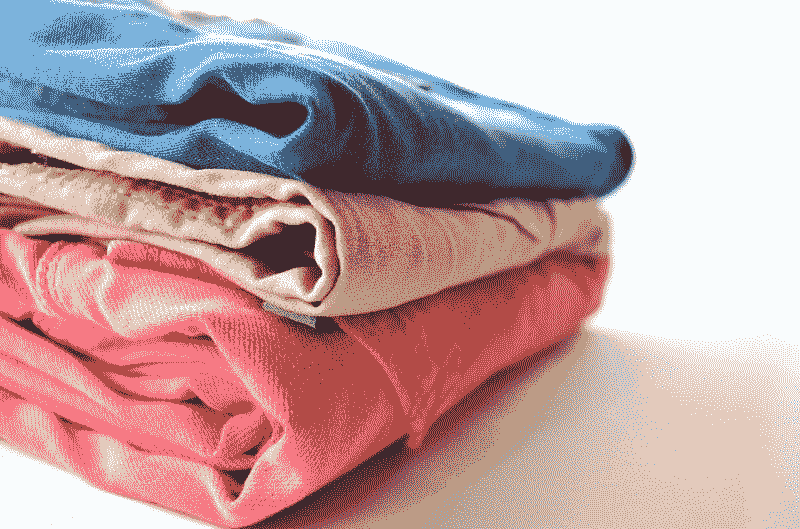

# 罗斯商店是价值投资吗？—市场疯人院

> 原文：<https://medium.datadriveninvestor.com/are-the-ross-stores-a-value-investment-market-mad-house-dc44c290be30?source=collection_archive---------12----------------------->

底层百货公司经营者罗斯商店公司(纳斯达克股票代码:ROST)可能是一项价值投资。

有趣的是，市场先生似乎对罗斯的价值观点买账。事实上，罗斯的股价从 2019 年 10 月 4 日的 107.50 美元上涨到 2019 年 10 月 14 日的 111.93 美元。

 [## 算法交易的机器学习|数据驱动的投资者

### 当你的一个朋友在脸书上传你的新海滩照，平台建议给你的脸加上标签，这是…

www.datadriveninvestor.com](https://www.datadriveninvestor.com/2019/01/30/machine-learning-for-stock-market-investing/) 

因此，市场先生认为罗斯的增长前景在美国当前的经济中是好的。值得注意的是，罗斯[声称](https://investors.rossstores.com/investor-overview)是“美国最大的低价服装和家居时尚连锁店，在 39 个州、哥伦比亚特区和关岛拥有 1523 家分店。”

# 罗斯是否从收入不平等中获利？

澄清一下，我认为关于美国收入不平等加剧的头条新闻正在推动投资者对罗斯商店的兴趣。

例如，美国人口普查局的数据表明，美国的收入不平等处于“50 年来的最高水平”，NBC 新闻[声称](https://www.nbcnews.com/news/us-news/u-s-income-inequality-highest-level-50-years-economic-gap-n1058956)。此外，NBC 声称不平等性增长最大的是“六个核心州”。

这些州是新墨西哥州、阿肯色州、阿拉巴马州、内布拉斯加州、新罕布什尔州和堪萨斯州。我的谷歌搜索显示，罗斯在六个中心州中的五个州经营着商店；NBC 新闻提到了内布拉斯加州、堪萨斯州、新罕布什尔州、新墨西哥州和阿拉巴马州。

# 罗斯能从收入不平等中获利吗？

因此，当许多普通美国人钱少的时候，罗斯卖打折服装。因此，普通美国人有更强的动力去罗斯购物。

因此,“市场先生”正在做空美国。我认为罗斯的股票表现表明投资者对美国的“经济复苏”或我们的政府修复经济状况的能力没有信心。

注:我认为这对承诺彻底经济变革的总统候选人来说可能是个好消息。其中包括美国参议员伯尼·桑德斯(I-佛蒙特州)、美国参议员利兹·沃伦(D-马萨诸塞州)和[杨安泽](https://marketmadhouse.com/if-you-hate-billionaires-vote-for-andrew-yang/)(D-纽约州)。相反，日益加剧的收入不平等和对美国缺乏信心，对唐纳德·j·特朗普总统(纽约州共和党)和前副总统乔·拜登(特拉华州民主党)等当权派候选人来说是个坏消息。

# 罗斯商店赚钱了吗？

很能说明问题的是，罗斯商店公司。**(纳斯达克代码:ROST)** 正在赚钱。特别是，罗斯在 2019 年 8 月 3 日报告的季度毛利为 11.36 亿美元，收入为 39.79 亿美元。

此外，Stockrow [估计](https://stockrow.com/ROST/financials/income/quarterly)罗斯商店在上一季度的收入增长率为 6.47%。因此，罗斯可能是一只成长型股票。

此外，Ross 报告上一季度净收入为 4.1272 亿美元，营业收入为 5.4405 亿美元。加上 Ross 同期报告的运营现金流为 5.7448 亿美元，自由现金流为 4.1979 亿美元。

最后，罗斯商店有现金。罗斯在 2019 年 8 月 3 日报告了 13.82 亿美元的现金和等价物。因此，罗斯商店是在艰难的零售环境中赚钱和成长的？

# 罗斯商店能和亚马逊竞争吗？

我认为罗斯商店将很难与 21 世纪美国最受欢迎的百货公司**亚马逊(纳斯达克代码:AMZN)** 竞争。

例如，亚马逊的现金供应量是罗斯现金和等价物的 41 倍。具体而言，Stockrow 报告称，截至 2019 年 6 月 30 日，亚马逊的短期投资为 188.47 亿美元，现金和短期投资为 226.16 亿美元。

因此，亚马逊可以花费数十亿美元[扩展](https://www.ttnews.com/articles/amazon-expands-two-hour-whole-foods-delivery)其送货服务，开发[自有品牌服装品牌](https://www.businessinsider.com/amazon-private-label-brands-list-2018-4)与罗斯竞争。例如，商业内幕 [推测](https://www.businessinsider.com/amazon-van-order-worry-usps-ups-2019-7)亚马逊从 Supreme 订购了超过[2000 辆 Spartan Cargo](https://supremecorp.com/truck-bodies/spartan-cargo/) 大型送货车。

亚马逊可以使用 Spartan 货车进行最后一英里的送货，让 Everything Store 对 Prime 订户来说更便宜、更方便。此外，斯巴达的交易是亚马逊升级其交付的几个步骤之一。

此外，亚马逊正在向**戴姆勒(DE: DAI)** 订购 2 万辆奔驰 Sprinter 面包车。此外，据《The Verge》[报道](https://www.theverge.com/2019/9/19/20873947/amazon-electric-delivery-van-rivian-jeff-bezos-order),首席执行官杰夫·贝索斯声称亚马逊可以在未来几十年向 Rivian 订购 10 万辆电动送货车。

我认为所有这些货车可以使亚马逊的送货如此便宜和方便，没有零售商可以与之竞争。例如，在 2025 年，一个女人可以从亚马逊订购任何她想要的衣服，并在两三个小时内以低价送到她家门口。这样，女人就不需要为了买衣服而中断她两周的玩耍或狂欢。

# 罗斯能在亚马逊时代生存下去吗？

因此，罗斯可能很难在亚马逊时代竞争和生存。然而，罗斯商店 6.47%的收入增长率表明，它现在可以与亚马逊竞争。

另一方面，我认为罗斯将很难与亚马逊竞争，亚马逊可以在几个小时内将低价服装送到任何人的家门口。解释一下，人家就有借口不去罗斯了。

因此，亚马逊会给所有讨厌购物的人一个不购物的借口。另外，亚马逊是在赌美国人的懒惰。亚马逊会给你送同样的衣服，为什么要从沙发上起来开车去罗斯呢？

鉴于美国人的习惯，我认为杰夫·贝索斯正在做一个安全的赌注。然而，市场先生不同意杰夫的观点。

# 罗斯商店是一只好的分红股票吗？

我不认为**罗斯商店(纳斯达克代码:ROST)** 是一个好的股息股票，尽管 12 年的股息增长。澄清一下，我认为罗斯在 2019 年 9 月 11 日支付的 25.5₵股息并不能证明 2019 年 10 月 10 日 110.35 美元的股价是合理的。

我认为市场先生在 2019 年 10 月 10 日将罗斯的价格定在了 110.35 美元。然而，罗斯商店的股息在 2019 年由 3₵增长。具体来说，罗斯于 2019 年 6 月 10 日支付了 22.5₵，并于 2019 年 9 月 10 日支付了 25.5₵股息。

总体而言，Dividend.com[在 2019 年 10 月 14 日给](https://www.dividend.com/dividend-stocks/services/apparel-stores/rost-ross-stores/)罗斯商店的股息收益率为 0.91%，年化派息为 1.02 美元，派息率为 24.8%。尽管有这些数字，我还是不看好罗斯商店。

具体来说，我不认为美国经济的低迷能够维持罗斯的增长。此外，对于我的价格来说，罗斯商店在亚马逊的曝光率太高了。

我建议投资者对罗斯商店保持警惕，因为亚马逊和收入不平等。总之，我认为 ROST 正走向价格崩溃，因为市场先生高估了它。

*原载于 2019 年 10 月 14 日*[*https://marketmadhouse.com*](https://marketmadhouse.com/are-the-ross-stores-a-value-investment/)*。*