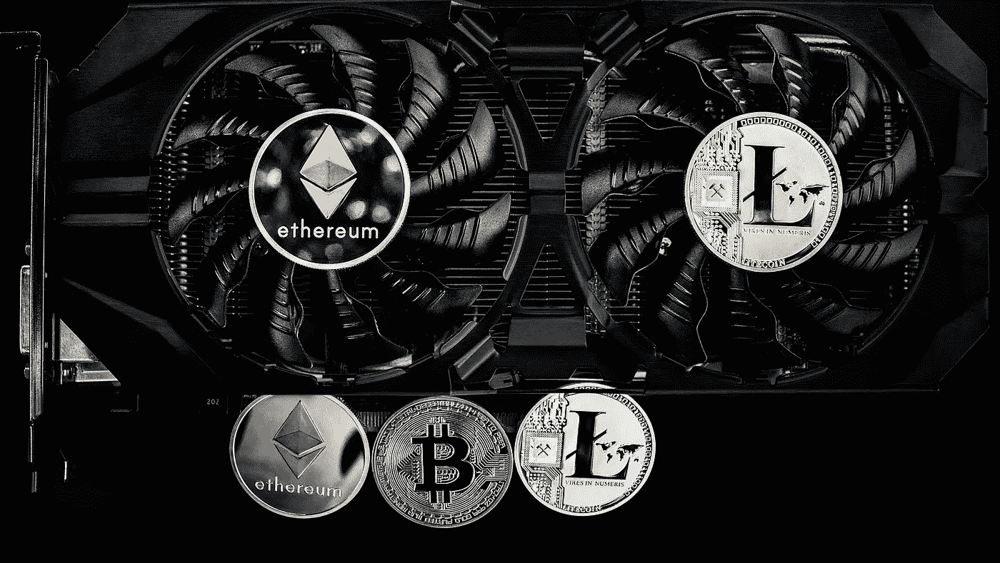

# 代币是 ICO 投资平台的前进方向吗？

> 原文：<https://medium.datadriveninvestor.com/are-tokens-the-way-forward-for-ico-investment-platforms-6bdf4bd76b1b?source=collection_archive---------18----------------------->

*众筹*和*共享经济*是 2017 年最常用的流行语，*区块链*和*智能合约*也是如此。让这两个领域走到一起似乎很自然，这正是从 2018 年开始发生的事情。Daicore 和几个较新的项目提出了通过释放智能合同的潜力来确保 ico 投资的想法。如你所知，我们致力于使投资更加安全，并创造一个系统，让认真努力工作并交付成果的人更容易说服投资者进入他们的项目。

当我们开始考虑我们的 ICO 投资管理平台时，我们最初的想法是推出我们自己的 ICO。然而，有经验的商人和经济学家说“不要！”。而我们没有。当然，推出我们自己的 ICO 会使我们更容易筹集资金，分配创建和实施基础设施、营销战略所需的资金，并使我们能够花更多的时间寻找优秀的 ICO 和参加会议。但后来我们意识到，从长远来看，为我们的平台推出 ICO 可能会对我们的项目产生反作用。

ICO 暗示着一种*代币经济*。加密货币很棒，但它们只有在你的商业生态系统中有真正的用途时才有用。当你的企业可以使用现有的法定货币或加密货币，以完全相同、甚至更简单的方式运作时，你不应该只是为了筹集资金而发行硬币。我们知道，如今许多企业仍在这么做，但这往往是它们最终失败的主要原因之一。如果没有用途，任何硬币都不会稳定。将你的硬币上市本身并不会让它变得有价值。如果你非常幸运的话，创建一个 ICO 可以让你变得富有，而且这很可能是以牺牲他人为代价的。我们不希望 Daicore 出现这种情况。

为什么 ICO 投资管理平台真的真的需要一枚硬币？对于这样的项目，令牌唯一能产生的就是更大的复杂性。这是为什么呢？让我通过一个例子来引导你。x 通过平台推出 ICO。投资者想要支持这个项目。假设他们已经拥有了像 BTC 或瑞士联邦理工学院这样的加密货币(并不总是这样)，他们现在需要将他们的硬币兑换成平台的硬币。好吧，所以他们得损失一些交易费用。没什么大不了的。然后，ICO 将平台的硬币兑换成他们可以用来资助项目开发的东西(回到 ETH 或 BTC，回到菲亚特)。你猜对了，更多的交易费。耶！现在，投资者拥有一些硬币，这些硬币在 a)平台的硬币在交易所上市或 ICO 推出其产品之前没有用处。万一许多投资者决定在上市首日兑换硬币，硬币的价值将会经历巨大的波动。除此之外，绝对不能保证这个平台的硬币真的会在某个大型交易所上市。在 *b* 的情况下，投资者现在应该将平台的硬币换成 ICO 的硬币，这将导致你猜怎么着，其他交易费用。

而且越来越糟。现在想象一下，这些平台中的一些带有双令牌经济，对于任何投资者来说，这应该已经引起了一些严重的怀疑。尽管加密可能很酷，但不要忘记，当你创建一家向人们承诺投资回报的企业时，经济学很重要。

简单来说，这些平台无法真正解决以下问题:

1.代币的流动性 ICOs 能够轻松获得足够的资金来支付开支吗？在平台令牌在第三方交易所上市之前，ICO 如何使用其平台令牌？事实上，如果对该平台的代币没有足够的需求，即使在上市后，他们也完全有可能无法使用这些代币。

2.市场操纵——大多数投资平台都储备了大量代币。这使他们在各自的生态系统中处于主导地位，因为他们可以很容易地用更多的硬币淹没市场，并降低其整体价值，以赚取更多的利润。

3.硬币的波动性与稳定性——如果平台的硬币仅用于为 ico 提供资金，如何弥补潜在的汇率大幅下跌？考虑一个处理 3 个并发 ico 的投资管理平台。第一个项目筹集了相当于 1000 万美元的平台代币。ICOs 2 和 ico 3 更快地完成融资，并将其平台令牌交换给 ETH 或 BTC。价格下降。现在，ICO 1 可能只能获得价值 100 万美元的平台令牌。

投资平台应该是一个工具，它的成功应该只取决于上市项目的成功。如果我们提倡基于交付的融资体系，我们应该对自己适用同样的规则。我们希望投资者和 ico 信任我们，但我们希望这种信任建立在结果的基础上。你也不应该退而求其次！

