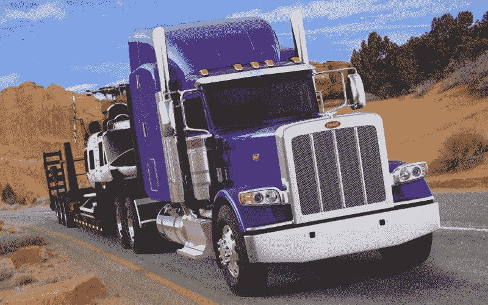
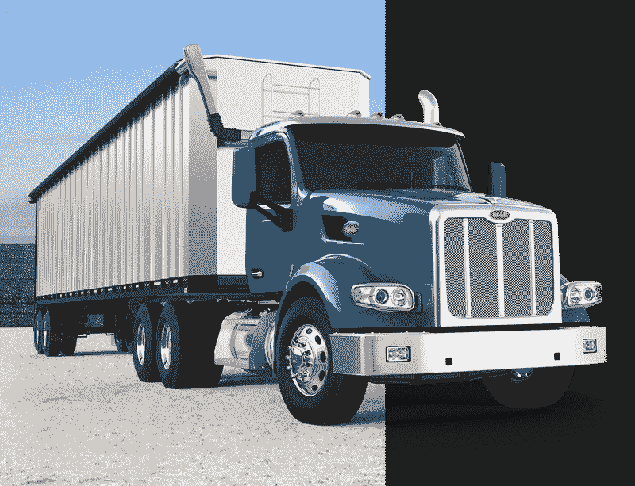
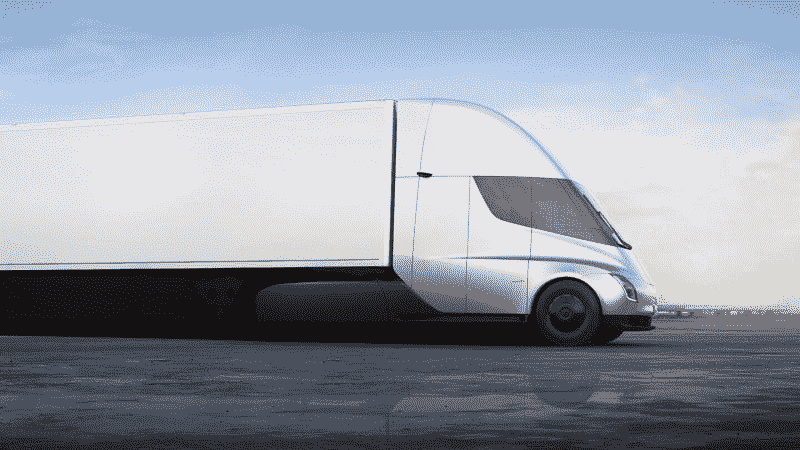
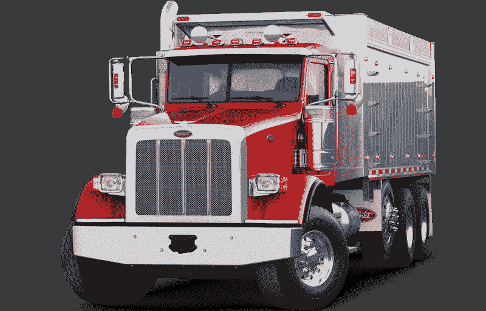
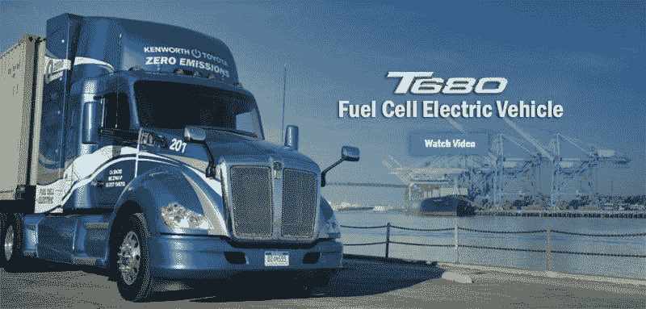

# 卡车在 PACCAR 赚钱吗？—市场疯人院

> 原文：<https://medium.datadriveninvestor.com/are-trucks-making-money-at-paccar-market-mad-house-ec61d78aae49?source=collection_archive---------9----------------------->

**特斯拉汽车公司(纳斯达克股票代码:TSLA)** 投资者正在询问卡车是否赚钱，因为埃隆·马斯克把他公司的未来押在了半拖车上。

事实上， *Eletrek* [声称](https://electrek.co/2019/07/12/tesla-semi-prototype-spotted-without-driver/)目击者在加州 101 或太平洋海岸高速公路上发现了一辆无人驾驶的特斯拉 Semi 原型车。一些观察者甚至在社交媒体上发布了无人驾驶 semi 的照片。

这样的实验会让特斯拉的股东感到奇怪，为什么马斯克如此热衷于开发电动卡车。答案很简单，像 PACCAR Inc .(纳斯达克代码:PCAR) 这样的商用卡车制造商可以赚很多钱。

 [## 在自动驾驶汽车发生事故的情况下，谁应该承担法律责任？数据驱动的投资者

### 我仍然认为自动驾驶汽车是一种奢侈品，而不是必需品…

www.datadriveninvestor.com](https://www.datadriveninvestor.com/2018/11/02/who-is-legally-accountable-in-the-case-of-an-autonomous-vehicle-accident/) 

# PACCAR 在赚钱

事实上，肯沃斯、DAF、利兰和彼得比尔特的母公司 [PACCAR](https://marketmadhouse.com/paccar-proves-musk-smart-build-tesla-semi-truck/) 在 2019 年 3 月 31 日报告的毛利为 52.17 亿美元，收入增长率为 14.74%。此外，PACCAR 报告截至 2019 年 3 月 31 日的季度营业收入为 8.43 亿美元，净收入为 6.29 亿美元。

与此同时，特斯拉报告截至 2019 年 6 月 30 日的季度运营亏损为-1.6746 亿美元，净亏损为-4.0833 亿美元。不过，特斯拉确实在同一天实现了 58.65%的营收增长率和 9.2105 亿美元的毛利。

马斯克明白，为了生存，特斯拉将需要赚钱的产品，卡车是有利可图的。PACCAR 于 2019 年 3 月 31 日报告季度收入为 64.88 亿美元。这一数字高于 2018 年 3 月 31 日的 56.54 亿美元。

# PACCAR 有多少现金？

此外，PACCAR 当天报告的运营现金流为 3.63 亿美元。然而，PACCAR 确实报告了截至 2019 年 3 月 31 日的季度负自由现金流为-2720 万美元。

事实上，PACCAR 赚了足够的钱，在 2019 年 3 月 31 日报告了 28.42 亿美元的现金和等价物以及 10.81 亿美元的短期投资。因此，PACCAR 能够积累 39.24 亿美元的现金和短期投资，而不像特斯拉那样消耗大量现金。

截至 2019 年 6 月 30 日，特斯拉拥有 50.83 亿美元的现金和等价物。然而，这家电动汽车制造商于 2019 年 6 月 30 日报告了 5.9573 亿美元的正自由现金流，21.43 亿美元的融资现金流和 8.6361 亿美元的运营现金流。

特斯拉终于赚到了一些钱，但仍处于亏损状态。因此，马斯克需要扩展到其他领域；更有利可图的是，如果他想让自己的汽车品牌生存下去，就要加快汽车生产线的建设。显然，卡车是特斯拉可以进入的利润丰厚的行业之一。

# 特斯拉能用卡车赚钱吗？

马斯克希望特斯拉从事卡车业务，因为商用卡车的需求巨大。

事实上，美国卡车运输协会[估计](https://www.trucking.org/News_and_Information_Reports_Industry_Data.aspx)2015 年美国道路上有 363 万辆六级卡车和 368 万辆八级(重型商用车和半拖车)卡车。值得注意的是，这些卡车在 2017 年产生了 7001 亿美元的收入，占美国货运的 71.5%。

因此，对各种形状和尺寸的商用卡车有巨大的需求。此外，联邦汽车运输安全管理局估计，2017 年 6 月，美国有 772，840 家卡车运输企业不断寻求更好的技术和更高的效率。值得注意的是，电动卡车的运营和维护成本可能会更低。

此外，对特斯拉提出的自动或半自动卡车可能会有巨大的需求。引人注目的是，有人声称卡车司机短缺。例如，NPR [声称](https://www.npr.org/2019/02/11/691673201/facing-a-critical-shortage-of-drivers-the-trucking-industry-is-changing)，美国卡车运输协会估计该行业已经缺少 6 万名司机。因此，任何可以减少司机需求的技术都会有市场。

# 特斯拉能和 PACCAR 抗衡吗？

对电动卡车的需求是存在的，但竞争也是如此。例如，PACCAR 的 Peterbilt 子公司计划生产 30 多辆电动卡车，*运输主题* [声称](https://www.ttnews.com/articles/peterbilt-unveils-electric-medium-duty-truck-ces)。

Peterbilt 目前的计划包括电动垃圾车 520EV 和小型电动半挂牵引车 579EV，用于铁路站场、港口和仓库。520EV 和 579EV 都在 2019 年 1 月 8 日拉斯维加斯消费电子展上展出。此外，579EV 和 520EV 的现场试验正在进行中，*运输主题*声称。

据 Trucking Info [报道](https://www.truckinginfo.com/305398/peterbilt-showcases-electric-model-579-daycab-truck)，PACCAR 正在其位于加州硅谷桑尼维尔的创新中心开发自己的四级自动驾驶卡车。澄清一下，四级意味着车辆是完全自主的，可以在大多数情况下自动驾驶。

# PACCAR 正在开发一款自动驾驶的彼得比尔特卡车

因此，PACCAR 正在开发一种自动驾驶卡车。然而，在一辆四级半挂车中仍然有一个驾驶员的空间。

司机可以放松下来，在紧急情况下控制钻机，而不是一直开车。此外，PACCAR 正在通过在 2018 年 11 月至 2019 年 6 月期间与超过 125 家初创公司会面来加强其技术，Peterbilt 总经理 Jason Skoog 告诉 *Trucking Info* 。

因此，PACCAR 正在做特斯拉正在做的一切，而没有埃隆马斯克的高调。事实上，PACCAR 在卡车方面领先于 Telsa，因为它有两款电动卡车在路上行驶。

特斯拉刚刚推出了卡车、上路的半挂卡车和正在设计的赛博朋克皮卡。然而，有传言称马斯克可能会在 2019 年 11 月的洛杉矶车展上推出特斯拉皮卡，*国际商业时报* [注意到](https://www.ibtimes.com/elon-musk-launch-tesla-pickup-2019-los-angeles-auto-show-2810086)。

# PACCAR 是价值投资吗？

2019 年 8 月 6 日每股 65.12 澳元**与特斯拉相比，PACCAR(纳斯达克代码:PCAR)** 是一项价值投资。事实上，当天特斯拉的股价为 228.29 美元。

此外，PACCAR 计划在 2019 年 9 月 4 日支付 32₵股息，而特斯拉不支付股息。此外，PACCAR 股息将于 2019 年 12 月 4 日从 28₵上调。2019 年 1 月 4 日还有 2 美元的 PACCAR 红利。

因此，PACCAR 股票的股息率为 1.97%，年化派息为 1.28 美元，派息率为 21.2%，加上 2019 年 8 月 6 日连续九年的股息增长。因此，如果你正在寻找电动自动驾驶汽车的股息和股票，PACCAR 就是其中之一。

喜欢冒险的人；赔钱，看埃隆马斯克的马戏，可以坚持用**特斯拉汽车(纳斯达克:TSLA)** 。那些想从电动和自动驾驶汽车上赚钱的人需要调查 PACCAR。

*原载于 2019 年 8 月 6 日*[*https://marketmadhouse.com*](https://marketmadhouse.com/are-trucks-making-money-at-paccar/)*。*