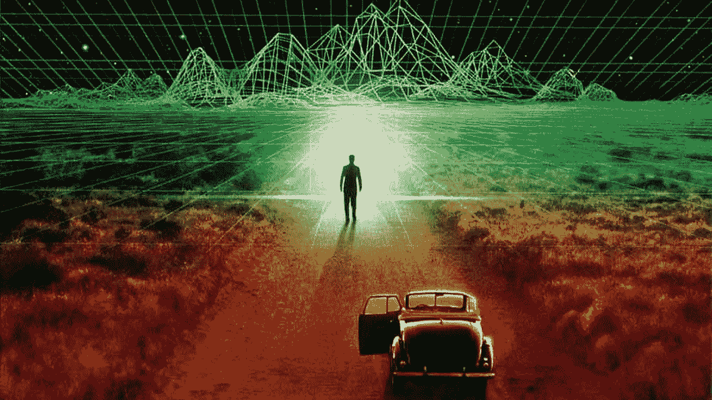

# 我们是生活在模拟中吗？

> 原文：<https://medium.datadriveninvestor.com/are-we-living-in-a-simulation-3006fe28b965?source=collection_archive---------19----------------------->

我们是生活在模拟中吗？我们生活在现实中吗？这是现在每个人都在思考的问题。

现在，我们能够创造人工智能。但随着我们每天的进步，我们离开发完全自主的人工智能更近了一步，这些人工智能有能力在没有人类干预的情况下为自己思考和行动。突然间，终结者电影中的场景成为了现实生活中的可能。

本质上，许多人认为我们即将创造出极其强大的超级计算机，它有能力开始生成模拟。如果这种情况发生，我们将能够真正地创造现实的模拟。非常类似于模拟人生。它会被有意识但不知道自己是模拟人的模拟人占据。

因为有了人工智能，有一天我们将有能力用不同的变化来模拟历史，看看事情是如何发展的。例如，未来的战争场景、政治公投等等。同样，如果普通公民能够创建模拟，那么你可以看到如果你约你的高中恋人出去，搬到另一个国家，或者其他任何事情会发生什么。突然间,“如果”( what if)的问题被消除了。

计算机的能力与日俱增。我们在技术上有能力进行模拟只是时间问题。

无论是谁创造了这些模拟，都可以假设他们可能创造了很多。这些模拟实验中的人最终可能会自己创造很多。因此，一次模拟最终可以创造出无限多的现实。

再一次，这些模拟的现实将被有意识的存在所占据，就好像它是真实的一样。鉴于只有一个基础现实，几乎可以肯定的是，我们目前生活在一个模拟现实中。

正因为如此，才有了更高存在的可能性:最初创造第一个模拟的人。这就意味着，要么原始人类没有因为灾难性事件而灭绝，要么我们实际上是被另一个物种模拟的:从而证明了外星生命的可能性。

我们很有可能被另一个现实中的物种模拟。但如果概率是真的，那就意味着有无穷多个马特·莉莉·怀特。对大多数人来说，这是一个令人担忧的想法。