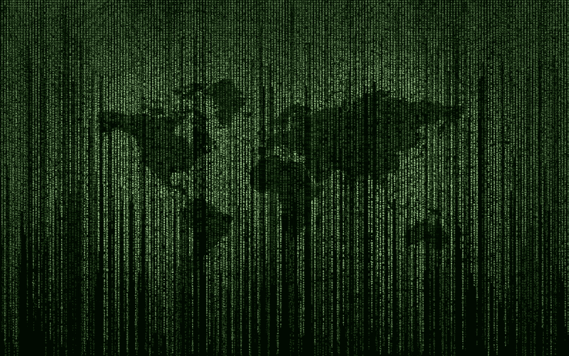

# 世界只是运行在 GPU 上的代码吗？？？

> 原文：<https://medium.datadriveninvestor.com/are-we-living-in-a-simulation-8d5dff4a55ed?source=collection_archive---------8----------------------->

模拟假说

要找到这个问题的答案几乎是不可能的，但还是有一些事情是我们知道的。让我们从这一切是如何开始的开始说起。

2003 年，牛津大学的瑞典哲学家尼克·博斯特罗姆提出了一个问题，他列出了 3 个想法，其中一个几乎肯定是正确的。以下是他的陈述:

*   没有哪个文明能够达到能够运行高质量模拟的阶段。
*   没有哪个文明会对模拟感兴趣。
*   我们生活在模拟中。

我们来分解一下。

本质上，他所说的是，在某个点上，先进文明将拥有计算能力来运行一个模拟，这个模拟对于那个模拟中的实体来说是无法区分的。所以，除非我们在一个模拟中，要么没有文明到达那个点，要么没有文明想要运行一个模拟。

基本上，我们处于模拟状态，除非没有人运行过模拟。

想想吧。如果哪怕只有一个人决定*嘿，我要模拟一些人*，并且他们有这样做的处理能力，他们将能够在一个人造宇宙中模拟比真实宇宙中多得多的人(除非这个人使用 Mac 来运行它)。

如果模拟宇宙中的人也运行模拟会怎么样？然后会有更多的模拟…我们生活在现实中的可能性会更小。如果那些被模拟的人继续运行模拟呢？

这就像现实生活中的盗梦空间…

因此，尼克·博斯特罗姆提出了一个很强的观点，关于我们如何能在模拟中，但没有人真正注意到，因为他不是一个价值数百亿美元的超级富豪首席执行官。

但你知道谁是身价数百亿的超级富豪 CEO 吗？

**埃隆·马斯克。**

在他说他认为我们最有可能在模拟中之后，他引发了很多关于这个话题的讨论。正如他解释的那样，

> “如果你假设任何改进的速度，那么游戏将与现实无法区分，或者文明将会终结。这两件事中的一件会发生。所以，我们最有可能是在一个模拟中，因为我们存在。”
> 
> -埃隆·马斯克

Elon Musk, CEO of SpaceX, Tesla, and the Boring Company with a net worth of over $20 billion; he was ranked 21st on the Forbes list of most influential people in the world. Pictured smoking weed.

他基本上与尼克·博斯特罗姆和其他一些聪明人如尼尔·德格拉斯·泰森的观点相同(除了文明不会对运行模拟感兴趣的想法)，除了因为他是一个超级富翁，每个人都变得疯狂。可怜的尼克:/

但是他所说的确实有价值，原因和博斯特罗姆的理论一样。如果任何先进的文明运行模拟，我们几乎肯定是在那些模拟之一。

所以它开始看起来像我们肯定是在模拟中；有些读到这里的人已经开始质疑生命的意义。如果我在一个模拟环境中，为什么我做的任何事情都很重要？

不要担心！有很多反对意见可以证明博斯特罗姆和埃隆是错的。

让我们来看一下可以让我们免于模拟假说的两点——要么没有文明达到他们运行模拟的阶段，要么没有文明对运行模拟感兴趣。

什么能解释为什么没有文明会达到运行模拟的高级阶段？也许这些文明被银河事件或其他一些世界末日事件摧毁，如大规模核战争或人工智能接管 T2。

好吧，假设你真的很怀疑，你认为这种可能性太低了。我们为什么不看看第二点——没有文明想要运行模拟。我们如何解释这一点？也许这些文明能够想到如果他们运行如此大的模拟可能会发生不好的事情，他们宁愿不为饼干冒险(这可能仍然适用于人工智能接管)。或者他们认为这是不道德的，因为人们应该知道他们是否是模拟的。或者他们只是有更好的事情要做(比如模拟很无聊)。

有没有办法证明我们是在用**科学**进行模拟？

我不知道该怎么做，但是研究人员正在努力。他们是这么说的。

想象一下，编写模拟整个宇宙的代码是多么复杂。好吧，如果你做任何类型的编程/编码，你知道任何时候你编码，都有错误。所以理论上，如果我们在一个模拟中，那么组成我们宇宙的代码中就有“错误”。证明我们不在模拟中的方法是**在我们的世界中找到一个 bug**。

一些非常聪明的人写了一篇论文，提出了一种方法来做到这一点。他们潜在的假设是，编码宇宙的最佳方式是只在玩家(我们中的一个)需要时加载信息(例如，如果现在没有人在看南极洲，那么它就不会被加载)。如果我们可以证明这是真的，那么我们知道我们的宇宙是一个模拟。这些研究人员使用一种很酷的量子物理学方法来试图证明这一点。

(如果你感兴趣，可以在本博客底部的参考资料中找到他们的论文)。

所以，是的，我们可能永远无法确定我们是否在模拟中。这并不意味着我们应该认为我们只是代码，生活的意义是 101010。无论哪种方式，我们都可以为伟大而奋斗——即使我们在一个模拟中，它仍然是一个非常酷的模拟。

额外资源

*   [尼克·博斯特罗姆的论文提出了模拟假说。](https://www.simulation-argument.com/simulation.html)
*   [关于埃隆·马斯克对模拟假说的思考的文章。](https://www.nbcnews.com/mach/science/what-simulation-hypothesis-why-some-think-life-simulated-reality-ncna913926)
*   [证明我们在模拟中的论文。](http://www.ijqf.org/wps/wp-content/uploads/2017/03/IJQF-3888.pdf)
*   [Vox 视频总结支持和反对模拟假说的论点。](https://www.youtube.com/watch?v=J0KHiiTtt4w)