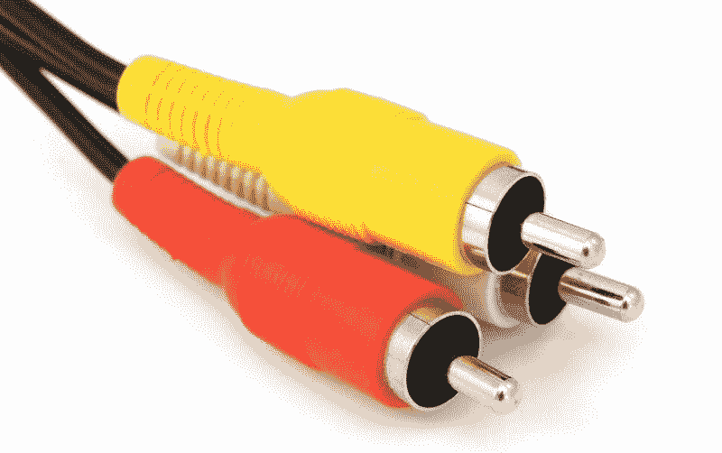
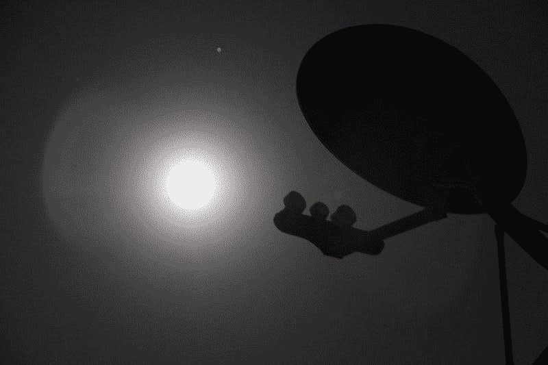
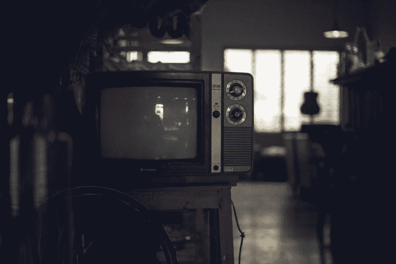
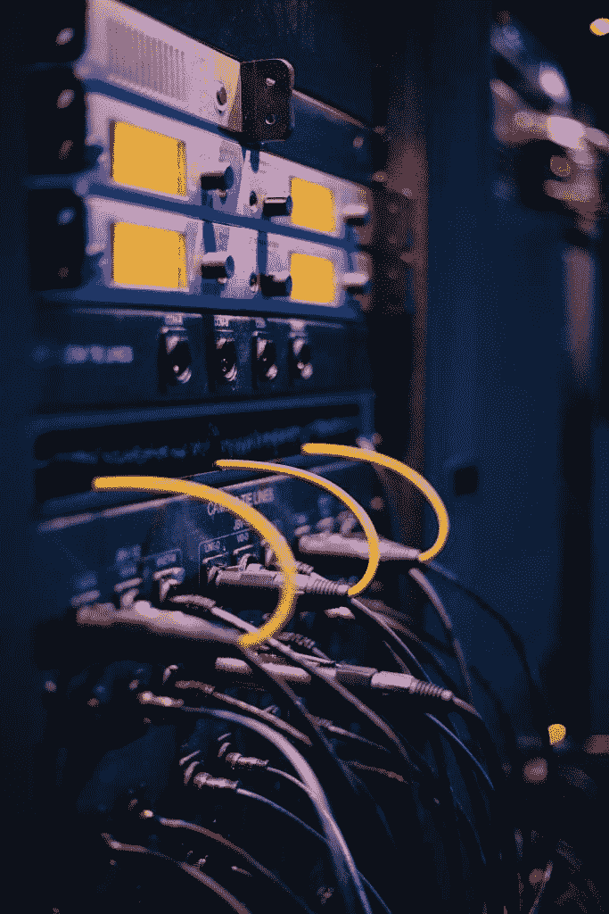
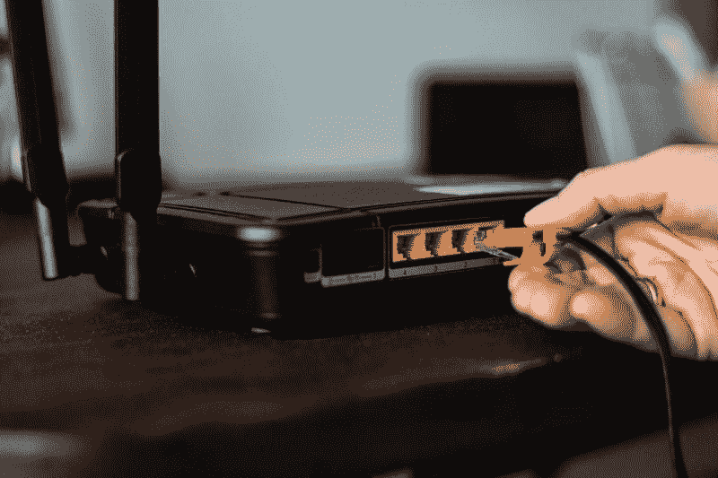
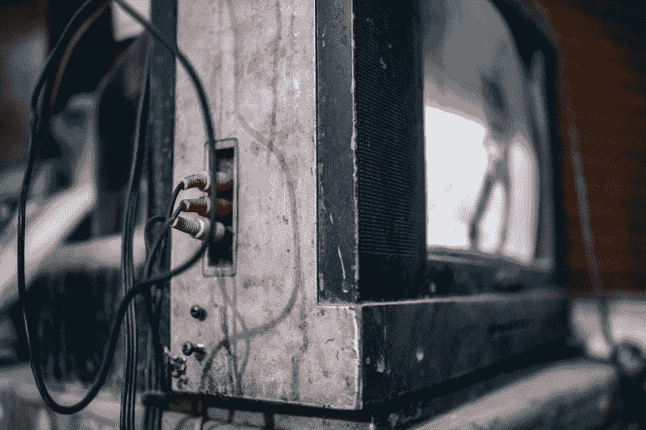
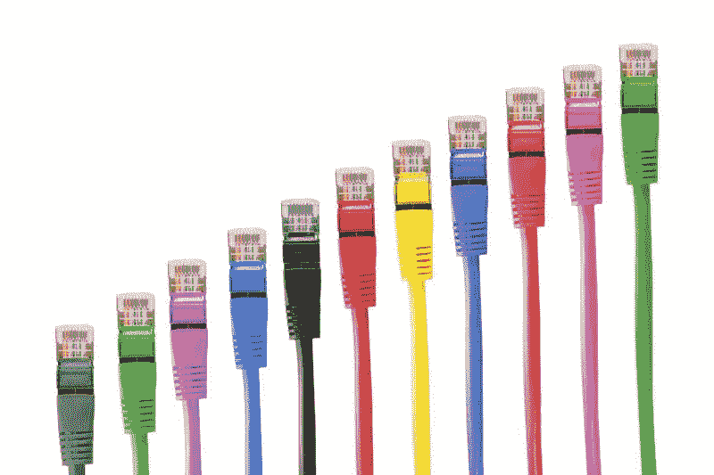
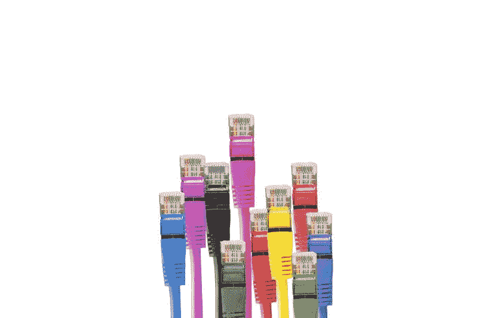
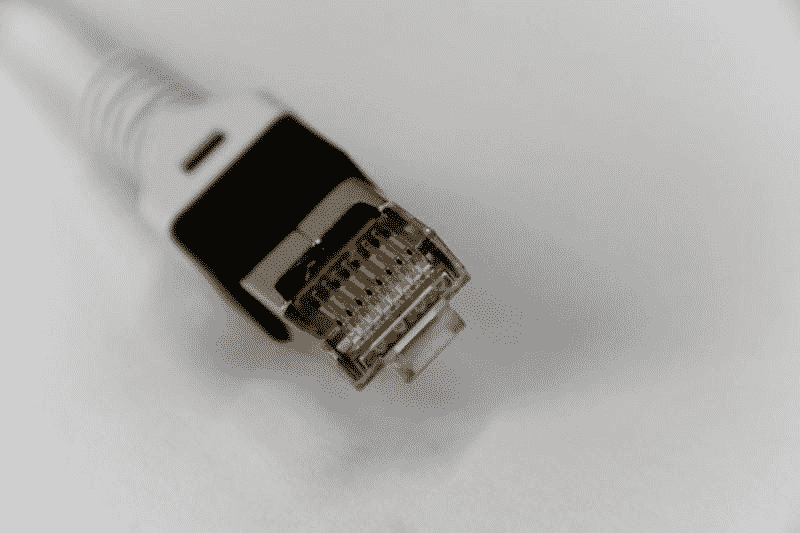
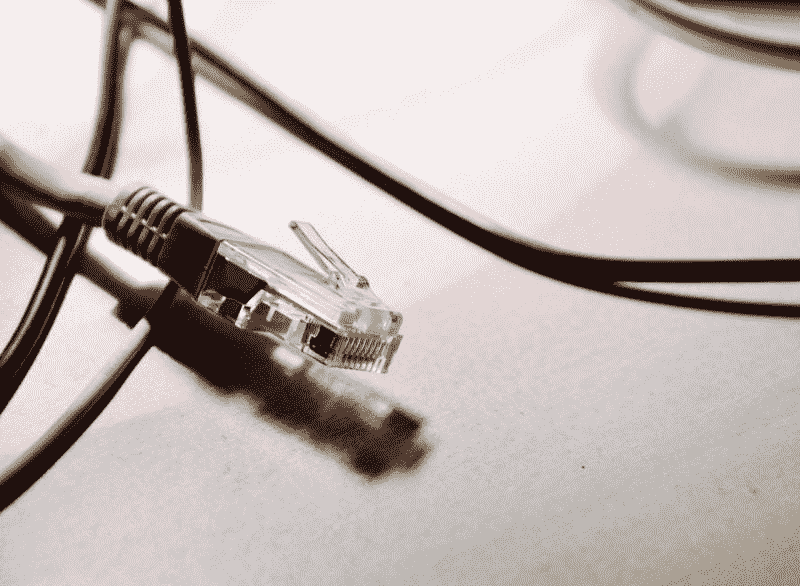

# WWE 和有线电视是可持续的吗？—市场疯人院

> 原文：<https://medium.datadriveninvestor.com/are-wwe-and-cable-tv-sustainable-market-mad-house-72ce3bcc59da?source=collection_archive---------8----------------------->

我问 WWE 和有线电视是可持续的吗，因为收视率和财务数字没有增加。

第一，**世界摔跤娱乐公司(NYSE: WWE)** 正在亏损。截至 2019 年 3 月 31 日，Stockrow 给 WWE 的运营亏损为-686 万美元，净亏损为-840 万美元。

 [## 苹果会成为新的网飞吗？-数据驱动型投资者

### 有可能。然而，该公司肯定会与大公司竞争。许多人不得不看到这一天的到来…

www.datadriveninvestor.com](https://www.datadriveninvestor.com/2019/02/15/will-apple-be-the-new-netflix/) 

此外，WWE 的毛利润为 4700 万美元，是同一天八个季度中的最低水平。很明显，WWE 的毛利比 2018 年 3 月 31 日报告的 6766 万美元的毛利低 2066 万美元。

此外，WWE 的收入增长在上个季度下降了-2.81%，收入降至 1.8245 亿美元。相比之下，WWE 的营收在 2018 年 3 月为 1.8722 亿美元，2018 年 12 月为 2.7251 亿美元。

# WWE 在烧钱

与此同时，WWE 正在以惊人的速度烧钱。促销活动报告了负的自由现金流-1008 万美元，融资现金流-1157 万美元，投资现金流-987 万美元。

唯一的正现金流是 675 万美元的运营现金流。所有这些使得 WWE 在 2019 年 3 月 31 日拥有 1.5276 亿美元的现金和等价物以及 1.8544 亿美元的短期投资。因此，WWE 在 3 月底拥有 3.3821 亿美元的现金和 4.396 亿美元的资产。

因此，我认为这些数字表明 WWE 正在花费它从商品销售、WWE 网络和门票销售中获得的现金来支付电视制作费用。特别是，WWE 在有问题的人才上花了一大笔钱。

例如，布洛克·莱斯纳并不是每周都免费出现在高飞的滑稽短剧中。殡仪员和戈德堡也没有去沙特阿拉伯朝圣。

# 有人在看 WWE 电视吗？

WWE 的两个有线电视节目的二级收视率；周一晚上**Raw*和 *Smackdown* ，再也无法证明花在他们身上的钱是合理的。*

*具体来说， *WWE Smackdown* 在 2019 年 6 月 4 日只吸引了令人垂涎的 18 至 49 岁人口的 0.6%， *TV by the Numbers* [计算](https://tvbythenumbers.zap2it.com/daily-ratings/tuesday-cable-ratings-june-4-2019/)。然而， *Smackdown* 是当晚收视率第三高的原创有线电视节目，有 201.6 万观众。*

**

*澄清一下，今晚两个福克斯新闻频道频道节目*汉尼蒂*和*塔克·卡尔森*胜过*smacknown*。详细来说， *Hannity* 获得了 294.7 万观众，在 18 至 49 岁人群中的份额为 0.2%。另外，塔克·卡尔森今晚吸引了 286 万观众，在 18 至 49 岁的人群中占 0.2%。*

*此外，我想今晚塔克·卡尔森和 T2·汉尼提的制作成本会比 WWE 低得多。解释一下，福克斯需要的只是节目的演播室，唯一的高薪就是主持人。塔克和*汉尼提的*嘉宾都将免费来宣传书籍或政治活动。然而，这两个访谈节目都吸引了很高的收视率，并在 18 至 49 岁的人群中占有相当大的份额。*

*相比之下，文森特·麦克曼必须支付所有摔跤手的工资，租用竞技场，并为每场演出设置新的布景(舞台)。我们还需要更多的摄像机和一大批技术人员来拍摄原始的打斗场面。*

# *WWE 和有线电视的真正问题*

*收视率揭示了 WWE 和有线电视的真正问题，而不是原始数据。问题是广告商最想要的观众不是看有线电视。*

*广告商和广播公司想要 18 到 49 岁的年龄组，因为这个年龄组包括最有可能消费的人群。例如，年轻人成家立业，买房买车。*

**

*不幸的是，收视率显示这些人不看有线电视。据人口普查记者估计，大约 39%的美国人口年龄在 19 岁至 49 岁之间。同时， *Worldometers* [估计](https://www.worldometers.info/world-population/us-population/)2019 年美国人口为 3.29093 亿。*

# *谁在看 WWE 电视？*

*因此，我估计美国 19 至 49 岁的人口为 1.2835 亿。然而，我估计在 2019 年 6 月 4 日，大约有 770，001 人目睹了*击倒*。说得详细一点， *TV by the Numbers* 估计 *Smackdown 的*19-49 收视率为 0.6%，我算出 1.2835 亿的 0.6%是 77 万 1。*

*因此, *Smackdown 的大部分观众可能是广告客户群体；不要；50 岁以上和 19 岁以下的人。我得出这个结论是因为 *TV By the Numbers* 估计 *Smackdown* 在 2019 年 6 月 4 日有 201.6 万观众。**

**

*然而，我的计算显示，其中只有 77 万人可能是 19 岁至 49 岁的人。注:我计算 201.6 万减去 77 万，001 等于 124.99 万。*

# *为什么广告商要为有线电视费心？*

*在这种情况下，我不得不怀疑为什么广告商还要为有线电视费心？相比之下，YouTube 上受欢迎的播客，如 Joe Rogan Experience 可以吸引类似数量的观众。*

*安东尼·蒙特乔伊估计罗根的最高收视率约为 197 万次。为了澄清，罗根在与极客偶像尼尔·德格拉斯·泰森的一次聊天中得到了这些观点。*

*因此，WWE 最大的竞争是独立摔跤手和像[科迪·罗德斯](https://marketmadhouse.com/independent-wrestling-is-not-dead-is-that-a-problem-for-wwe/)这样向 YouTube 发布比赛和视频的新贵。值得注意的是，科迪利用巧妙的视频和社交媒体炒作与新的全精英摔跤(AEW)达成了利润丰厚的交易。*

**

*此外，科迪可以通过一个噱头视频吸引和 WWE 一样多的社交媒体关注，比如他最近的[王位破坏者](https://www.wrestlinginc.com/news/2019/06/aew-releases-new-cody-rhodes-merchandise-with-triple-h-654928/)特技。于是，罗德斯；而不是 AEW 计划的 TNT 秀，是 WWE 最大的竞争。*

# *抱歉，文斯，摔跤手们现在掌控着你的表演*

*WWE 的所有者麦克马洪家族面临的最大问题是，YouTube 让摔跤手控制了这个过程。*

*为了解释这一点，Rhodes、Young Bucks 和 Hardy Boyz 证明了任何摔跤手都可以吸引大量粉丝，并通过巧妙的视频销售大量门票和商品。重要的是，任何摔跤手都可以在没有 WWE 帮助的情况下制作自己的视频，并放到 YouTube 上。*

**

*于是，像 AEW 这样的新晋升别无选择，只能雇佣科迪；如果它想要粉丝的话，他要多少就给多少。这扭转了传统摔跤行业的现状。*

# *WWE 和 AEW 无关吗？*

*从历史上来看，如果一个摔跤手想要观众的话，他/她不得不随发起人所愿。像史蒂夫·奥斯汀和胡克·霍根这样的大天才不得不追随文森特·麦克曼；或者 WCW 的剧本，如果他们想上电视赚大钱的话。*

*然而，今天，一个大人才可以剪切自己的视频并发布在 YouTube 上，在网上销售自己的商品，并控制自己的故事情节。因此，科迪和他的兄弟达斯汀·罗兹正在重塑自己，从愚蠢的增强天赋到前卫的硬核高跟鞋。*

**

*这让 AEW 陷入了困境，因为它最终会乞求 YouTube 上的顶尖摔跤手来看它的节目，以维持观众。因此，YouTube 明星允许任何新贵摔跤推广产生嗡嗡声和观众与现成的粉丝群和故事情节；还有才艺，粉丝关心的。*

*在这种情况下，WWE 和 AEW 在今天的摔跤世界中可能是无关紧要的。相反，我们可以看到一个类似于音乐的新现状。像碧昂斯和泰勒·斯威夫特这样的超级巨星主宰着现代乐坛，因为他们无论走到哪里都会带来自己庞大的听众。*

# *抱歉，文斯，战争结束了，科迪·罗兹赢了*

*类似地，我们可以看到一种新的摔跤超级明星，他在升职后带着她的或他的粉丝一起兜风。历史上，只有像胡克·霍根这样的超级巨星才能做到这一点，但 YouTube 让像科迪这样的小天才也能做到这一点。*

*去年，科迪和年轻的雄鹿队在不到 30 分钟的时间里，通过一点社交媒体宣传，卖出了超过 10，200 张摔跤表演的门票。罗兹在 30 分钟内打破了 WWE 对美国摔跤事业的束缚。 *All In* 继续吸引大约 55000 次付费观看购买，*摔跤公司*。[估计](https://www.wrestlinginc.com/news/2019/05/news-on-how-many-ppv-buys-aew-double-or-nothing-drew-654676/)。*

*这为 AEW 进入这一行业打开了大门；并吸引 98，000 次购买和超过 220，000 次互联网搜索，因为它的*双倍或零*付费观看，*福布斯*阿尔弗雷德·科努瓦[估计](https://marketmadhouse.com/are-wwe-and-cable-tv-sustainable/#1af4691475f3)。此外，Konuwa 估计双倍或零增长比 WWE 在银行的存款多 35%。*

**

*就这样，一个叫科迪·罗兹的人扰乱了摔跤事业。当外面有一打或更多的怪物时会发生什么？如果必须支付十几个明星[布洛克·莱斯纳级别的薪水，任何推广活动都负担得起吗？即使沙特阿拉伯在买单？](https://www.mmafighting.com/2018/9/17/17868528/brock-lesnar-returns-to-wwe-but-still-eyes-ufc-heavyweight-title)*

# *WWE 能活下来吗？*

*我的猜测是，由于其电视交易，WWE(纽约证券交易所代码:WWE) 将在可预见的未来生存下去。具体来说， *Paste 的* Garrett Martin [估计](https://www.pastemagazine.com/articles/2019/06/wwe-saudi-arabia.html)康卡斯特的美国和福克斯将在未来五年为 *Raw* 和 *Smackdown* 支付 WWE 20 亿美元。*

*不幸的是，大部分的钱可能会直接飞进摔跤手的银行账户；在目前的现状下，麦克马洪夫妇的收入越来越少。此外，WWE 可能不得不上演越来越疯狂、夸张和昂贵的噱头来吸引互联网对其产品的关注。*

**

*可悲的是，WWE 对新现状的反应是试图恢复它的“黄金时代”;或者说 90 年代末的态度时代。我认为这将失败，因为态度时代是一个不同时代的不同噱头。《态度》时代的淫秽闹剧之所以奏效，是因为互联网还处于起步阶段，而 WWE 的主要竞争对手是她写的《T2 谋杀案》的重播。*

# *为什么新态度时代会失败*

*此外，WWE 在 20 世纪 90 年代的批评者包括一些渴望曝光的社会保守派。今天，我预测新态度时代将很快招致以社交媒体为动力的“我也是”运动的愤怒。*

*我也已经打倒了像比尔·科斯比这样的偶像，让美国总统变成了贱民。所以我想知道 WWE 将如何对抗它。*

**

*今天的新态度时代很可能是陈腐的、有争议的、短暂的。我预测，文森特·麦克曼“前卫内容”的想法会让现代摔跤迷感到厌烦，同时吓跑广告客户。有人会打断他或她的*堡垒之夜*剧去看关于尸体和肛门手术的短剧吗？如果你不相信我，可以看看《摔跤吧》 ,看看态度时代的低谷。*

# *WWE 股票是垃圾*

*因此，我认为 WWE 股票是垃圾，每个人都应该远离。市场先生在 2019 年 6 月 13 日给出的 75.55 美元的股价没有任何理由。*

**

*此外，在今天的角力格局中，我看不出 WWE 能维持定于 2019 年 6 月 25 日的 12₵红利。Dividend.com 在 2019 年 6 月 13 日给 WWE 的支付率为 0.64%，48₵的年化支付率为 55.2%，WWE 股东也不太可能获得这一支付率。*

*归根结底，WWE 股票是投资者需要远离的垃圾。*

**原载于 2019 年 6 月 13 日*[*https://marketmadhouse.com*](https://marketmadhouse.com/are-wwe-and-cable-tv-sustainable/)*。**