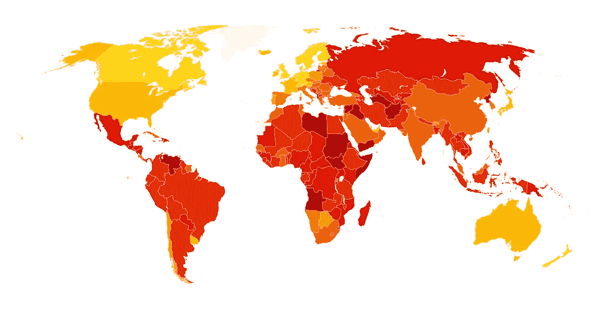

# 你是资本家还是社会主义者？我两者都是。

> 原文：<https://medium.datadriveninvestor.com/are-you-a-capitalist-or-a-socialist-i-am-both-f32378c5d998?source=collection_archive---------5----------------------->

资本主义和社会主义在一起工作时效果最好。没有好的政府，两者都不起作用。

Photo by [Ava Coploff](https://unsplash.com/@avaluria?utm_source=medium&utm_medium=referral) on [Unsplash](https://unsplash.com?utm_source=medium&utm_medium=referral)

# 什么是社会主义？什么是资本主义？

## 社会主义

韦氏词典将[社会主义](https://www.merriam-webster.com/dictionary/socialism)定义为“*任何一种主张集体或政府拥有和管理生产资料和商品分配的经济和政治理论。”这种类型的社会主义是个可怕的想法。这种类型的社会主义会因为没有奖励企业家精神而扼杀创新。很难在世界任何地方找到一个符合社会主义定义的经济体系。朝鲜可能仍然符合这个定义。剩下的前共产主义国家和现在的共产主义国家混合使用社会主义和资本主义。*

韦氏词典在第二个定义中将[社会民主](https://www.merriam-webster.com/dictionary/social%20democracy)定义为“*一个融合了资本主义和社会主义实践的民主福利国家。这是当今世界上占主导地位的社会主义。我是这种社会主义的坚定信徒，尽管我是一个资本家。*

 [## 为什么包容性财富指数比 GDP 更能衡量社会进步？|数据驱动…

### 你不需要成为一个经济奇才或金融大师就能知道 GDP 的定义。即使你从未拿过 ECON 奖…

www.datadriveninvestor.com](https://www.datadriveninvestor.com/2019/03/08/why-inclusive-wealth-index-is-a-better-measure-of-societal-progress-than-gdp/) 

## 资本主义

韦氏词典将资本主义定义为一种经济体系，其特征是资本货物的私人或公司所有权，由私人决定的投资，以及主要由自由市场竞争决定的价格、生产和商品分配。“资本主义有利于创新。资本主义已被证明是历史上最伟大的经济体系，因为资本主义为任何有好主意的人提供了一条致富之路。

韦氏词典将自由放任主义定义为‘*,一种反对政府对经济事务的干预超过维持和平和财产权所必需的最低限度的学说。*“自由放任的资本主义扼杀竞争，因为企业获得了垄断和买方垄断的权力。这些垄断和买方垄断力量分别导致高价格和低工资。自由放任的资本主义导致收入差距、过度污染以及无力应对气候变化等挑战。许多共和党人都提倡这种形式的资本主义。所有美国人都应该大力抵制这种可怕的经济制度。

# 许多国家经济的真正问题

右翼政客将委内瑞拉作为社会主义失败的例子。这是一个公平的评估，还是委内瑞拉有其他问题？有没有人注意到，这些右翼政客从未把海地作为资本主义成功的例子？按照这些右翼政客的逻辑，我们应该迅速远离资本主义，否则我们可能会变得像海地一样！委内瑞拉和海地的共同点不在于它们的经济体系。海地和委内瑞拉的问题在于政府内部的腐败程度。根据 2018 年清廉指数，委内瑞拉的腐败程度在 180 个国家中排名第 168 位。根据同一指数，海地在 180 个国家中排名第 161 位。参见透明国际数据在[的这个链接。](https://www.transparency.org/cpi2018)

社会主义行得通的国家和行不通的国家的关键区别是什么？任何形式的社会主义要想成功，管理者必须有能力，不能腐败。在社会主义制度下，管理者是政府雇员，最终是政府本身。无能和腐败的政府导致社会主义(公共部门)计划的失败。在透明国际评选的最廉洁国家中，丹麦在 180 个国家中排名第二。丹麦是民主社会主义非常成功的国家的一个例子。委内瑞拉在这份名单上排在第 168 位。查看下面的地图，了解世界上最廉洁和最腐败国家的更多信息。下图提供了世界各国清廉指数排名的更多信息。

Corruption Perception Map from Transparency International. An interactive version is available at this [link](https://www.transparency.org/cpi2018).

像社会主义一样，自由企业资本主义与腐败的政府不太合拍。腐败的政府会给一些企业行贿政府官员的优惠待遇。为了让自由企业资本主义发挥作用，最成功的企业必须是那些由消费者根据其商品和服务的质量/价格选择的企业。如果腐败的政府官员选择了最成功的企业，消费者将得到次等商品和次等服务以及高价。

# 美国人应该问的关于我们经济体系的问题

在美国我们有哪种形式的经济体系？我们有一个混合的资本主义/社会主义制度。美国脱离纯粹的资本主义可以追溯到 19 世纪末。这是政府开始通过反垄断法和劳动法干预私营企业体系的时候。有人可能会说，美国的社会主义可以追溯到 1639 年，当时第一所由纳税人出资的免费公立学校在马萨诸塞州的多切斯特成立。

在 21 世纪，政府控制了我们医疗保健行业的一部分(VA 医疗系统，医疗保险，医疗补助)，一些地区发电(田纳西河流域管理局)，公立学校和一些养老金(社会保障)。

政府拥有公共公园。也有私人拥有的公园。政府拥有大多数高速公路和道路，但私营部门也拥有一些道路。哪些行业更适合永久归政府所有？哪些行业更适合政府短期接管？政府应该补贴哪些行业？这些是我们应该问的问题。

政府对某些自然/合法垄断的所有权加强了自由企业制度。高速公路和公路是自然垄断的例子。高速公路和公路通常是政府所有的。政府拥有高速公路和道路，因为让私人拥有的道路并排竞争是没有效率的。公路和高速公路的政府所有权增强了卡车运输公司之间的竞争。你是否愿意支付额外的运输费用，将私人公司向这些卡车运输公司收取的过路费包括在内？

自然/合法垄断的另一个例子是一个州或地区的输电线路。这些电力线通常归私人公司所有。由于为相互竞争的公司提供多套输电线效率低下，州和地方政府授予特定公司供电的合法权利。这曾经是必要的，但现在我们有技术在相同的线路上运行来自多个电力公司的电力。政府对输电线的所有权将支持多家电力公司之间的竞争。政府拥有输电线路会更好吗？请参见[的*allconnect.com*网站此链接](https://www.allconnect.com/electricity)查看可供消费者选择电力公司的州列表。

互联网传输线路是否应该归政府所有？政府对互联网传输线路的所有权也可以用来加强多个互联网服务提供商之间的竞争，因为传输可以在相同的线路上进行。

政府控制整个医疗保险系统会更好吗？单一的国家医疗体系将带来巨大的议价能力。这种议价能力将使我们的处方价格与其他国家的一致。

理性的问题是，我们是要在这种混合中提高社会主义的水平，还是要降低社会主义的水平？相比之下，丹麦等所谓“社会主义”国家的公民似乎比美国人对我们的制度更满意。保罗·克鲁格曼写了以下关于丹麦的文章。

> 没错，丹麦根本不符合社会主义的经典定义，即生产资料归政府所有。**取而代之的是社会民主主义:一种市场经济，资本主义的弊端通过政府行为得以缓解，包括非常强大的社会安全网。**

见[丹麦不烂的东西](https://www.nytimes.com/2018/08/16/opinion/denmark-socialism-fox.html)摘自*纽约时报*。这是描述大多数美国社会主义倡导者使用“社会主义”一词时真正含义的最佳文章之一。然而，共和党制造恐惧的宣传机器试图用委内瑞拉或前苏联的术语来描绘所有的“社会主义”。

我想说，美国确实需要大大提高我们经济中的社会主义水平。我们需要一个社会化的全民医疗体系。我们需要负担得起的(如果不是免费的)高等教育。我们需要一个更强大的社会安全网，而不是我们目前拥有的残酷制度。这些都是经济最优化的问题，最好通过仔细的分析来确定。这些不是政治煽动的问题，因为它们是由右翼分子设计的。

# 结论

美国人需要问，在我们的经济中，我们可以用社会主义来改善资本主义。美国人也需要问一问我们现在的政府是否有能力处理更多的社会主义。自特朗普当选以来，他一直试图“抽干沼泽”，代之以“有毒废物堆”。我们政府内部的腐败以前所未有的速度增长。从 2017 年到 2018 年，在透明国际的排名中，美国从第 16 个最不腐败的国家下降到第 22 个最不腐败的国家。

美国的民主社会主义者不仅要关注经济问题，还要关注如何改善我们的政府程序，以减少或消除腐败。除非我们改进政府，否则许多进步政策根本不会奏效。腐败的政府不适合社会主义。腐败的政府在资本主义上没有长期的成功。从长远来看，独裁主义总是会导致腐败。我们必须促进麦迪逊式的民主，以扭转独裁主义的趋势。我们必须改进我们的“制衡”所有美国人都必须积极捍卫我们的民主。美国人应该支持一个奖励创新同时减少资本主义弊端的经济体系。