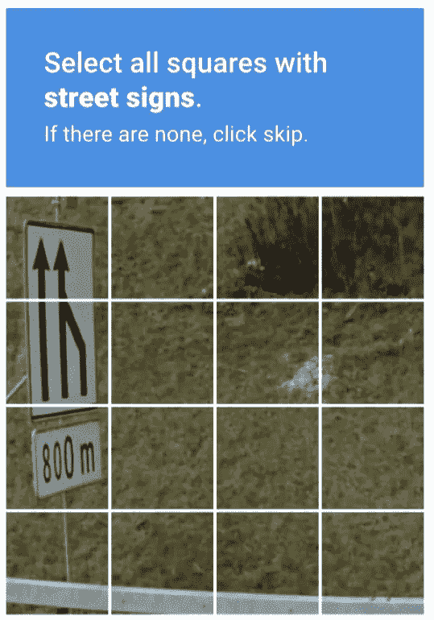

# 你是机器人吗？证明一下。

> 原文：<https://medium.datadriveninvestor.com/are-you-a-robot-prove-it-2e26bc28c5d5?source=collection_archive---------16----------------------->

验证码是一种形式验证技术，以避免机器人用假账户填充你的数据库。如果没有它们，典型的僵尸网络攻击可以关闭您的服务。

验证码已经进化了，我们已经从识别和输入杂乱无章、字迹模糊的字母发展到识别物体。你们中有多少人被谷歌要求识别物体，直到什么都没有了？这些物品经常在街上被发现。具体来说，它们分布在树木、路灯、店面、斑马线之间。明白我的意思了吗？

我为谷歌鼓掌。很巧妙。

> 每次你识别物体来完成谷歌的验证码，你都在做猴子的工作来训练他们的自动驾驶车辆的自动驾驶算法。

作为人类，我们在“视觉游戏”中领先于机器，因为我们有能力说“哦，是的，那是一个店面”。就“硬件”而言，我们每只眼睛捕捉的角度略有不同。这有助于我们识别深度，也有助于对比，这意味着我们可以判断物体是在近处还是远处。第一次微分在这里完成。我们的眼睛实际上是不可思议的，也许是动物界中最不引人注目的，但仍然令人惊叹。

就软件而言，从很小的时候起，我们就开始体验世界的相似性，识别日常物品非常容易，我们自然而然地做到了这一点。一旦细节到位，我们就开始使用其他感官。对特定物体经验较少的人会使用触觉等其他感官。如果我能感觉到十字螺钉，我会更容易识别十字螺钉。那是因为它们很小，而且涉及深度。如果有人把它举到我眼前问我，我会摇头，从不同的角度看。我会更乐意去感受它。

对于一台机器来说，要复杂得多。硬件方面，镜头必须有一个小光圈，所以一切都很清晰。这意味着它们必须有相对较慢的快门速度，否则没有足够的光线进入传感器。时间太长，他们捕捉的图像将会模糊。即使在 24fps 的情况下，在夜间，传感器也必须提高 ISO 感光度，以折衷微弱的光线，降低图像质量。我只能想象距离典型广角传感器 100 米的店面图像的模糊性。

说你是谷歌，你要处理这种歧义。想象一下，当你的汽车的人工智能错误地将 10 米外的人归类为 100 米外的店面时，会有多麻烦。所以谷歌会让你验证它的假设。如果很多人验证他们的数据，他们的测试和培训会进行得更好，更快，更不用说:免费劳动力。这并不违法，因为它不被归类为工作，你当然不会因此而得到报酬。你有选择吗？你真的绕不过这些，你得利用你的人性优势来解谜。或者你可以争辩说你有*自由意志*与自由意志相对，比如你可以选择不进入网站。适得其反，因为你一开始就想这么做。从生物学上讲，你仍然是人类，你的进化优势是，作为人类的智慧让你解决上述难题。然而，你被奴役在这条单行道上，在到达你想要的地方和回到起点之间。从哲学上讲，在这种情况下，你是机器人吗？证明一下。