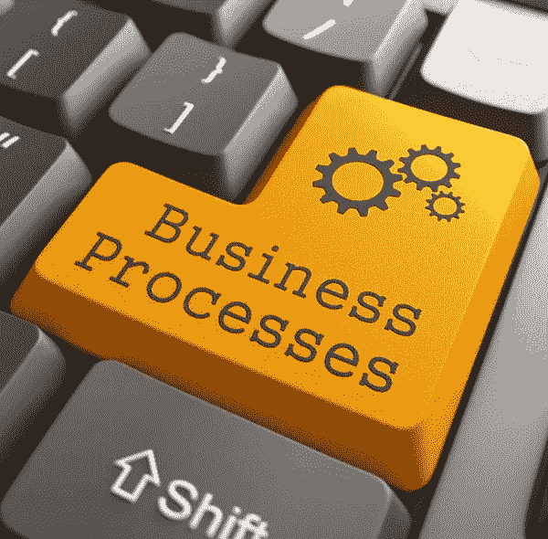
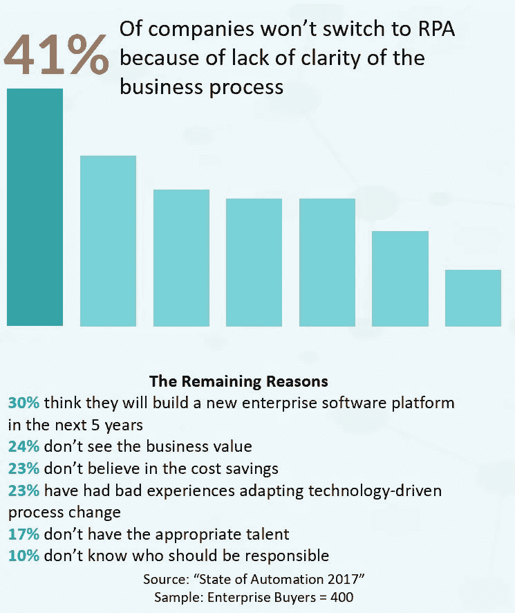

# 你是在实施 RPA 之前问这些问题的吗？你应该…

> 原文：<https://medium.datadriveninvestor.com/are-you-asking-these-questions-before-implementing-rpa-you-should-be-abe60c148efc?source=collection_archive---------8----------------------->

预计到 2025 年，企业将因 RPA 而获得 5 万亿至 7 万亿美元的潜在节约。这是因为当与正确的流程配合使用时，它具有节省大量时间和成本的能力。然而，预计企业将继续错过 50%的自动化机会。为什么企业对实施 RPA 如此犹豫不决？

 [## 挑战你对人工智能和社会的看法的 4 本书——数据驱动的投资者

### 深度学习、像人类一样思考的机器人、人工智能、神经网络——这些技术引发了…

go.datadriveninvestor.com](http://go.datadriveninvestor.com/4AI1) 

尽管有这么多好处，但乍看之下，公司为什么会错过 RPA 的机会并不合理。下图显示了公司不采用 RPA 的七大原因。不采用 RPA 的主要原因是不了解公司最基本的流程。

# 最重要的考虑因素是什么？

智能自动化有能力转变业务模式，并加速大大小小组织的变革。最重要的考虑是策略。您可以使用智能自动化来节省成本。但是如果你把智能自动化作为一个更广泛的战略工具，你会从中获得更多。

为了确保选择正确的流程来实现自动化，下面的清单有助于确定流程是否适合 RPA。

**RPA 清单**

*   该流程遵循基于规则的决策，而不是基于判断的决策
*   这个过程是重复的，容易出现人为错误
*   这个过程遵循一套清晰的指令
*   如果有输入数据，它将被数字化，或者可以使用 OCR 等方法

**需要考虑的其他流程**

*   该过程具有高容量和低复杂性
*   这个过程包括数据操作
*   该流程有很高的出错率，或者在出错时有很大的影响
*   该流程全天候运行

在您的业务运营中实施机器人流程自动化之前，您是否考虑过新实施的机器人劳动力的全部影响。通过回答这些问题，您将更接近于充分利用 RPA 并看到巨大的投资回报。如果这些问题中的一些被忽视了，它会给你和你的企业带来灾难。

*   是否为 RPA 项目定义了组织范围的、业务驱动的愿景？
*   系统集成是否在组织范围内进行了沟通？
*   流程是否是 RPA 的最佳候选？
*   投资回报率(ROI)是多少？
*   组织何时会实现正投资回报？
*   所选的工艺是否有适当的文件记录并充分优化？
*   自动化流程与愿景和期望的价值一致吗？
*   是否定义了关键绩效指标(KPI)来衡量成功？
*   谁将接受管理新 RPA 系统的培训？
*   谁将有权访问新的 RPA 系统？
*   RPA 是否与公司的底层体系结构和基础架构兼容？
*   RPA 系统能否与任何其他新兴技术很好地集成？
*   是否会创建一个知识管理知识库？
*   是否考虑了安全和安全漏洞？
*   如果机器人出现故障，是否有后备计划？这怎么保证？
*   多久对机器人进行一次评估，以确保它们符合当前的业务需求？有更简单的方法吗？

获得正确的 RPA 非常困难—根据行业专家的说法:由于规划不准确，目前有 50%的自动化机会被错过。手动流程评估仍然是 RPA 前流程发现的常用方法，但有一种更好的方法。提示:流程智能

**过程智能和机器人过程自动化一起可以…**

1.  在准备阶段确定适合 RPA 实施的流程
2.  监控、构建和控制高效、自动化的端到端业务流程提供了一种管理和控制众多后端系统的简单方法
3.  减少操作中的错误和低效，并确保积极的结果
4.  提供 RPA 性能的监控和分析，促进 RPA 在实施后阶段的持续改进

免费电子书*机器人流程自动化:了解“工作的未来”并转变您的业务*—[https://connect.timelinepi.com/rpa-e-book](https://t.co/eP8El6EcJn)作者 [@timelinepi](https://twitter.com/timelinepi) 这本电子书帮助浏览有助于在全公司范围内成功实施 [#RPA](https://twitter.com/hashtag/RPA?src=hash) 的最佳实践。

我的收件箱随时欢迎围绕这些话题的讨论。如果您有任何问题，请随时联系我们。

**关于作者**

Ryan Raiker 是一位有着中小型企业工作经验的资深商业顾问。Ryan 在州政府和地方政府从事项目管理工作。他学习商业分析，后来在宾夕法尼亚州切斯特的威得恩大学获得工商管理硕士学位。目前，Ryan 正专注于 TimelinePI 的品牌管理和产品开发。

与我联系:

领英:[https://www.linkedin.com/in/ryan-raiker/](https://www.linkedin.com/in/ryan-raiker/)

推特:[https://twitter.com/ryraiker](https://twitter.com/ryraiker)