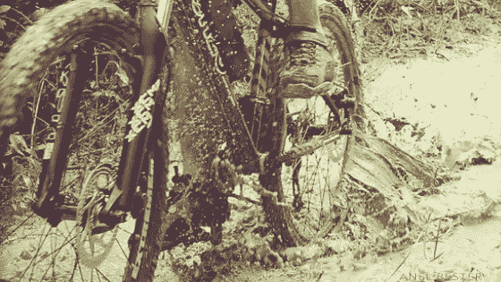

# 你问自己最好的问题了吗？

> 原文：<https://medium.datadriveninvestor.com/are-you-asking-yourself-the-best-questions-95004fac40f0?source=collection_archive---------40----------------------->

我喜欢吃我认为吃不完的东西。

我喜欢早上醒来，决定是时候前进了，然后对宇宙决定的一切说是。

当我按下回车键时，我喜欢闭上眼睛否认自己的疯狂。

它让我集中注意力。

它让我保持敏锐。

它保持肾上腺素的分泌，足以确保我每天早上 5 点前就能双脚着地。

周六的早些时候，我在饼干怪兽上，而邻居们正在按贪睡键。

一场倾盆大雨之后，我知道天气会变得泥泞不堪。

好吧，好吧，也许我嘴里有一点点唾液，因为我想变得干燥。

走近单行道，我发现自己兴奋地期待着暴风雨后的景观变化。

我没等多久。

仅仅 20 米，我来了个急刹车，因为一棵倒下的树完全切断了路线。

没有别的办法了。

高度使它不可能过去。

这意味着我必须穿过扭曲的树枝，跪着爬行，必须以疯狂的角度捡起中药才能把她带到另一边。

进入，声音…

嗯嗯，

如果这是路线的起点，

这可能会是一次棘手的旅程。

它会打乱我的平均速度。

Grrrrr，令人沮丧。

再往下可能就不行了，然后我就不得不转身从头再做一遍。

我今天真的不需要训练泥地跑步。

我真的不需要在山地车的技术闹剧上花功夫。

我可以去 stop-banks，打出一些音程。'

没错，她就是个小贱人，还能像行家一样找借口！

话说回来，

“如果今天是比赛日，我会怎么做？”

该死的。

刮膝盖，敲手肘，亲泥巴。

***这就是你问自己问题的力量。***

这是我多年前学到的策略。

当我回顾我的自行车比赛胜利时，很明显，登上领奖台的比赛是条件最差的比赛。

通常暴风雨肆虐，大多数参赛者选择呆在床上。

从那些开始的人，很少有人坚持到最后。

不断地与逆风作战，感觉就像穿越山顶，耗尽人的灵魂。

雨滴变成了刀片，制造出一种感觉，你的皮肤被从骨头上切下，谈论下一个层次的精神操。

难怪大多数人最终会为了避难而牺牲一个可能的胜利。

为什么我到达了终点线？

*因为比赛前的几个月、几周和几天，*

*天气屎的时候，*

我会问自己

*“如果今天是比赛日，我会怎么做？”*

我明白，对我来说，在任何条件下比赛，我必须愿意在任何条件下训练。

我必须做好到达目标的准备，不管大自然和生活给了我什么。

有时压力会导致睡眠不足或根本不睡。

我会训练。

有时候，一个生病的孩子整夜不睡会让我感觉像一块漂白的洗碗布。

我会训练。

有时，重新安排的会议意味着不得不素颜出席，梳着马尾。

我会训练。

因此，与其问自己“我怎样才能让这变得更简单？”或者“什么时候做这件事更方便？”或者“其他人都在做什么？”

*我他妈的出现了。*

在我知道情况会怎样之前，我做了我承诺要做的任何事情。

直到今天，我仍然尊重这些价值观。

当我不能再骑的时候，我在泥泞中行走。

当我走不动的时候，我会爬树。

疼的时候我就恬不知耻的哭，一直往前走。

当暴风雨袭击我时，我大声尖叫，并继续寻找我想去的地方。

大多数人会认为这是过分的。

我更清楚。

**因为我在场上学到的东西，**

我融入生活。

为什么当屎打在粉丝身上的时候，当经济走下坡路的时候，当我的网站倒下的时候，当支付系统瘫痪的时候，当我得不到公众的掌声的时候，我不放弃？

简单。

我在路上训练韧性、目标、激情和承诺，并把它们带到办公室。

我知道我要去哪里，不管情况如何，我每天都会出现。

知道无论有多艰难，我都会变得更坚强。

我知道尽管障碍会令人沮丧，但我最终会找到解决办法。

知道我会继续崩溃到我的膝盖，我的灵魂会继续上升。

*当我问“简单选项”问题时，这些都不会发生。*

当我问“呼呼呼”的问题时。

当我环顾四周，与他人进行比较时，我为自己开脱，因为坦率地说，大多数人都很懒惰，意志薄弱。

相反，我选择保持头脑清醒，从内心汲取灵感。

**今天我邀请你开始关注你的问题。**

不仅仅是那些你大声说出来的，你知道的，那些你已经思考过的，用声音思考过的，它们会让你听起来超级聪明或者坏蛋。

我说的是你在决定每一个行动之前无意识地问自己的问题:

你放进嘴里的东西；

你在行动清单上写了什么；

你穿在身上的东西；

你选择相信什么；

你选择和谁交谈。

所有这些看似无关紧要的行为之前都有一个问题。

当你的问题听起来微不足道时，

换句话说，那些揭露你实际上是一只懒惰的树懒的故事，

明白你的结果会反映这一点。

另一方面，如果你的问题是性能驱动的，

亲爱的，

你知道你晚上睡觉时会像小猫一样咕噜咕噜叫，

***疲惫但满足。***

你可能会有一些额外的擦伤和瘀伤，

但你不是被棉絮包裹着的。

如果你对成功很认真

**关注心灵细节，**

**简单来说就是**

**没有商量的余地。**

只有死亡不可避免。

茁壮成长是勇敢无畏的人提出问题的选择，这些问题会带来最佳表现。

带着爱和感激，

阿内尔