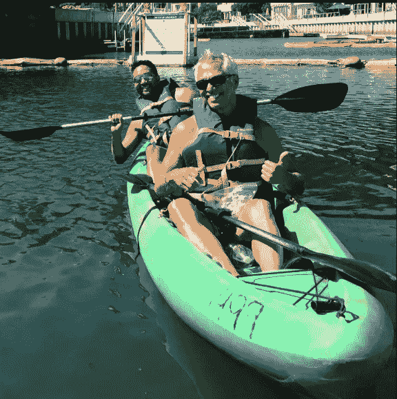

# 你的人生是在漂泊吗？

> 原文：<https://medium.datadriveninvestor.com/are-you-drifting-through-your-life-687bbdbfee44?source=collection_archive---------15----------------------->

偶尔，当天气温暖晴朗时，我和理查德会开车去加利福尼亚长滩那不勒斯沿岸的运河。

我们租了一艘双人皮艇，这样我们就可以在水中一边看着附近运河边的漂亮房子和游艇。(我想象这是意大利威尼斯的样子，但是 a-la-洛杉矶。)

我们开始划皮划艇，充满了能量和意图。

我们互相喊着，“划！中风！，“我们调整桨的时间，这样我们就能有效地朝着我们想要去的方向前进。

然而，在某些时候，我们的手臂会疲劳，我们会便便。

这时我们发现我们的皮艇在慢慢漂流。

当我们不在水里划桨的时候，我们就像是坐以待毙的鸭子，随波逐流，随波逐流。

有时，我们会直接撞上一艘停泊的船或码头，或者碰到其他初学者，他们正试图弄清楚如何驾驶这些水上交通工具。

其他时候，我们只是坐在水中间，根本不动，只是漫无目的地漂流。

 [## 摔倒不是失败。-数据驱动型投资者

### 你只有在放弃的时候才会失败。每个英雄都会倒下，我们活着就是为了失败者出现的时刻；上升到…

www.datadriveninvestor.com](https://www.datadriveninvestor.com/2019/01/17/falling-isnt-failing/) 

皮划艇运动可以作为一种隐喻来说明你如何对待自己的生活。

在生活的某个方面，你有没有发现自己感觉在漂泊？

**漂泊表现为感觉你的生活没有目标，你只是在走过场。**

你醒来，去上班，回家，睡觉，循环又开始了。

你等着看会发生什么，希望并祈祷一些令人兴奋的事情发生。

其他时候，你可能会举起双手，简单地说，“事情就是这样。我能怎么办？”

**我告诉你，我不相信有人会故意想浑浑噩噩地度过一生。**

但出于某种原因，有些人某天醒来，会想，“我是怎么到这里来的？我曾经的梦想去哪了？我的人生目标都去哪了？”

意识到这一点会让人感到非常沮丧，甚至心碎。

那么，当你发现自己在生活中随波逐流时，你会怎么做呢？

嗯，这是我和理查德在我们的皮艇旅程中所做的。

在放松肌肉并在水上漂流后，我们知道我们必须做点什么，否则我们将在这一天的剩余时间里一直坐在那里。

我们在皮划艇上转向对方，问道:“你现在想做什么？”

这似乎是一个简单的问题。

**“你想要什么？**”

但是这个简单的问题是很多人不会问自己的。

如果你在职业生涯中随波逐流，你喜欢做什么样的工作？

如果你的财务状况不稳定，你想把钱花在哪里？

如果你在你的关系中随波逐流，你想要什么样的关系，你想和谁有这样的关系？

如果你的健康状况不稳定，你想做出什么改变？

如果你总的来说在你的生活中随波逐流，感觉你没有到达你想去的地方，那么谁是你心中的那个人呢？

在很多情况下，很多人没有问我列出的这些问题，而是接受了他们无能为力的想法。

所以他们甚至不知道他们可以问这个问题。他们认为没什么可做的。

但是你可以做一些事情，那就是问你自己一个简单的问题。

“你想要什么？”

**当你花时间问自己想要什么时，在生活中的任何情况下，前进的道路开始变得更加清晰。**

你感觉到你灵魂中的火花，你意识到可能有一个你被召唤去的目的地。

然后，你需要做的就是迈出第一步。

或者，在我们的皮划艇郊游中，第一排。

如果你想知道理查德和我在水中漂流后决定做什么，我们得到了在附近的购物中心喝点热巧克力的灵感。

这意味着我们必须再划 20 分钟才能到达购物中心。(幸运的是，他们有一个码头，我们可以在那里停放皮划艇。)

买了热巧克力后，我们坐在码头上，双脚悬空，就在我们的皮艇旁边。我们一边晒着太阳，一边品尝甜点。喝完饮料后，我们又划了 30 分钟回到我们租的皮划艇。

总之，我们度过了美好而难忘的一天。

现在，你呢？

**你能做些什么来确保自己不会在生活中无意识地漂流？**

如果你不想的话，你不需要在这一点上想出什么重大的改变。

你可以从小处着手，问自己一个简单的问题:

今天，你想做些什么来给你的一天带来一点甜蜜和快乐？

当你问自己想要什么，并采取行动朝那个目标前进时，你会发现你不再漂泊。

你会发现自己实际上是自己生活的驾驶员。

**丰盛的祝福和合十礼。**

我很想听听你对今天帖子的看法。请在下面留下评论。当你在做的时候，请随意给一些“掌声”!

*如果你有兴趣收到这些每周一期的励志文章，请点击* [*这里*](http://www.abundantgood.com/free-newsletter.html) *随意报名。*

*最初发表于*[*【www.abundantgood.com】*](https://www.abundantgood.com/blog/are-you-drifting-through-your-life)*。*