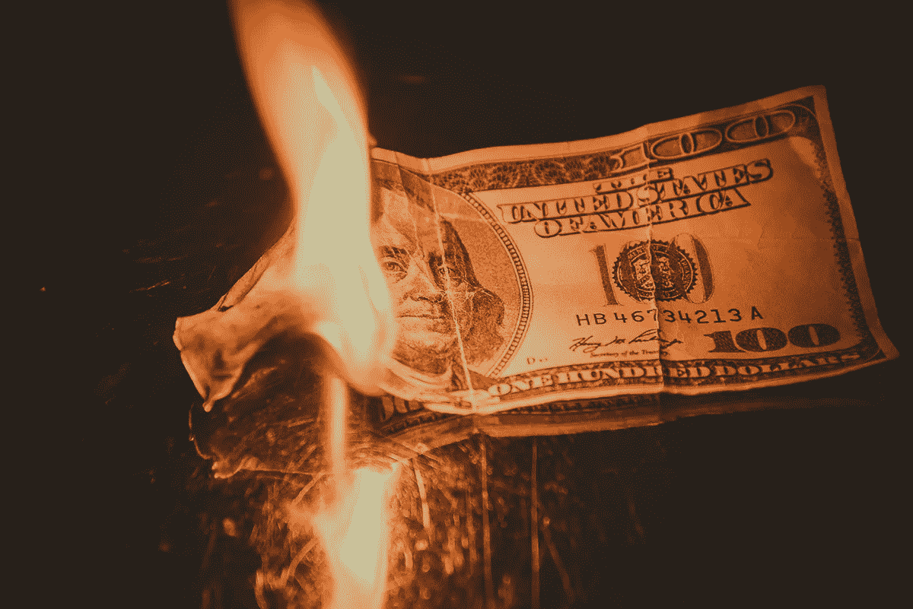
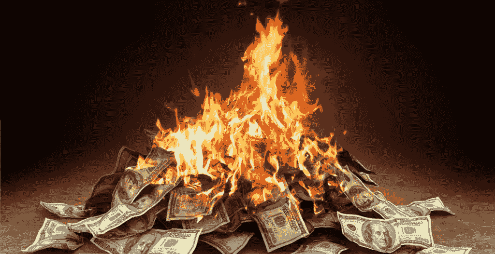

# 你经济独立，提前退休了吗？

> 原文：<https://medium.datadriveninvestor.com/are-you-fire-material-50c9bae6ae89?source=collection_archive---------13----------------------->

Photo by [Thomas Ashlock](https://unsplash.com/@thomas_ashlock?utm_source=medium&utm_medium=referral) on [Unsplash](https://unsplash.com?utm_source=medium&utm_medium=referral)

我看到了一篇关于“财务独立，提前退休”的文章，它引起了我的兴趣。在[这篇文章中，](https://www.theguardian.com/lifeandstyle/2019/jul/24/millionaire-retired-30s-kristy-shen-bryce-leung-fire?CMP=Share_AndroidApp_Copy_to_clipboard)一对夫妇设法停止了工作，因为到了 30 岁，他们已经设法存了 100 万英镑(以美元表示)。现在他们提前退休，过着最好的生活，周游世界，写博客和书，总的来说，过得很愉快。

鉴于我自己也计划很快退休(当然是在博士毕业后)，我想让自己熟悉这种生活方式及其可能性是个好主意。

 [## 什么是目标日期基金&你应该考虑退休吗？数据驱动的投资者

### 退休规划是个人财务管理的一个重要方面，我们很多人都方便地…

www.datadriveninvestor.com](https://www.datadriveninvestor.com/2018/11/09/what-is-a-target-date-fund-should-you-consider-it-for-retirement/) 

## 财务独立

什么造就了财务独立？读了几篇文章后，我现在找到了一系列答案。一个消息来源称，FI 没有一个固定点，但是一旦你攒够了 15 倍于你年薪的钱，你就可以宣称自己独立了。鉴于我拿的是博士工资，门槛定得很低…

你如何存下那么多钱？投资你一半的收入。不开玩笑。你持续投资多年，然后靠分红过活。荷兰人[宾克](https://www.binck.nl/kennis/begrippenlijst/financial-independence-retire-early)很友好地给了我们一个这样的例子(我不得不把它翻译成英语，几乎没有):

*“假设你的年薪是 35000€(税后)。其中，你把 50% (€ 17.500)存起来。20 年后，你的工资会翻 15 倍(€52.5 万英镑)。”*我必须检查一下这个计算，因为依我的愚见，20 乘以 17，500 等于 350，000，但他们是基于过去一个世纪假设市场回报率为 7%。他们警告说过去的结果不会在未来继续下去等等等等。"*想象一下，另外 1%用于税收，另外 2%用于通货膨胀，那么你只剩下 4%的€ 525，000，也就是€ 21，000。"如此突然，现在你退休了，靠分红生活，你的年度支出津贴甚至增加了。*

你觉得这很疯狂吗？去阅读 [Investopedia](https://www.investopedia.com/terms/f/financial-independence-retire-early-fire.asp) 。存 50%(并投资)看起来微不足道，因为他们建议你需要存 70%，并且需要存 30 倍于你年薪的钱，接近 100 万美元(我猜也是美元)。但是经过大量的自我反省，我发现了终极法则:“4%安全提款”法则。这表明你以 75%的比率储蓄，因为不到 10 年的工作就可以积累 25 倍的年平均生活费用。4%指的是你退休时可以动用的储蓄。叹气。

Investopedia 继续以类似的方式写道:“火的爱好者从他们的储蓄中提取小额资金，通常每年大约 3%到 4%。根据储蓄的规模和想要的生活方式，这需要极其勤奋地监控支出，并持续维护和重新分配他们的投资。当然，当股市下跌和/或利率环境较低时，救火计划可能会功亏一篑。”好极了。

不要认为我是一个吝啬鬼，或者只是想破坏乐趣的人，但我目前只能存下一半的收入，因为我不用付房租。一般人在这里应该做什么？我的意思是，我明白你不会住大。要做到这一点并积累储蓄，你根本不可能过得很奢侈。这不仅仅是在存钱的时候。是在你整个退休期间。在文章中，他们解释说，他们中至少有一个来自贫困的背景，因此知道如何应对贫困。但不是每个人都这样。不是每个人都想。

## 提前退休

如果你在 30 岁退休，平均预期年龄超过 80 岁，你还有很长的路要走。但是如果你再读一遍这篇文章，你会意识到这对夫妇从一开始就没有真正停止过工作。当然，他们告别了自己不喜欢的忙乱工作，转而从事写作工作(这很酷)。但它仍然工作正常，对吗？

对我来说，退休根本不是工作。尤其是我可能需要做的工作(不是说我会退休很久，恐怕我这一代人要到 75 岁才会退休)。但我不认为这是真正的主要问题。我担心的是这次提前退休会产生前所未有的反效果。你的安全网就是钱。不是工作经验，只是钱。其中一个比另一个稳定得多…

这就是困扰我的地方。万一事与愿违呢？我们只看投资部分。在[第一篇](https://www.theguardian.com/lifeandstyle/2019/jul/24/millionaire-retired-30s-kristy-shen-bryce-leung-fire?CMP=Share_AndroidApp_Copy_to_clipboard)中，他们的投资被描述为无风险。那是什么投资？！被捆住的钱就是被捆住的钱。到了那个阶段，它就不再是你的钱了，这些钱可以开始做有趣的事情。你不想让它做的事，比如消失。我们过去认为投资债券是安全的(或无风险的)，还需要我多说吗？我查阅的关于这个话题的所有资料都提到了这一点:投资仍然会带来风险，而且并不一定会获利(尽管必须提到的是，从实际价值来看，把钱存入储蓄账户肯定会赔钱，因为通货膨胀大于账户利息)。储蓄和投资的钱很有可能不会束缚你，那怎么办？在做出像这样彻底改变生活的决定之前，你需要一个 b 计划。或者，像这对夫妇那样，一个压力较小的收入来源，比如写演出，自由职业咨询等。一些你喜欢做的事情。这也被称为“[咖啡师火灾](https://www.investopedia.com/terms/f/financial-independence-retire-early-fire.asp)”。

我觉得这种形式的火是我这一代最有可能发生的。为什么？因为我这一代人似乎没有这种朝九晚五(或者说是朝八晚八)的生活，为自己工作的人和自由职业者正变得越来越受欢迎。收入足以支付当前的开支，但除此之外就没什么了。没有真正的储蓄或投资的“剩余”，参与火灾似乎是一个遥不可及的概念。

## 结论和更多问题

当我继续阅读关于[大火](https://www.marketwatch.com/story/heres-why-you-shouldnt-retire-super-early-even-if-you-can-2018-08-30)的文章时，我只是觉得没有人喜欢他们的工作。如果你比较年轻，这是可以理解的。好果子不会挂得太低。所以，我觉得奇怪的是，人们往往在达到顶峰之前就放弃了。在你处于食物链的顶端之前退休(也是你收入的最大化)。火灾参与者似乎在到达那个阶段之前就放弃了。但这难道不是你一开始就开始并坚持一份工作的很大一部分原因吗？

我明白，解雇是对疯狂的工作文化的一记猛踢，在这种文化中，如果你一周工作不到 60 个小时，没有人的工作是安全的，除了工作之外，你还缺乏身份和生活，你无休止地、盲目地参与到我们有史以来最有害的消费文化中。我支持你。去你的当前工作环境。但是我怀疑火是所有方法的最终目的。

在 FIRE 方法中有一些巨大的陷阱，这些陷阱在整篇文章和其他资料中变得非常明显。你需要从一份稳定的收入开始，这份收入足够存钱。如果它不够高，要么提高它，要么降低你的开支。如果你不能这样做，你就不能参加射击。我甚至没有提到持续依赖 3-4%的预算所带来的精神压力。这会让我发疯的…

因此，我觉得火可能不适合我。至少现在不是。考虑到我可能会在英国工作，他们认为付给你 24000 英镑的薪水和收取同样多的租金是正常的(去你的，目前的住房环境)。

总的来说，火对我来说只是另一种时尚。储蓄没有错，投资也没有错(尽管要明智地做)，减少消费也没有错。但是火也不例外:如果你很富有，它会有所帮助。

*本文原载于*[*【moneyonthemind.org】*](https://www.moneyonthemind.org/post/financially-independent-retiring-early)