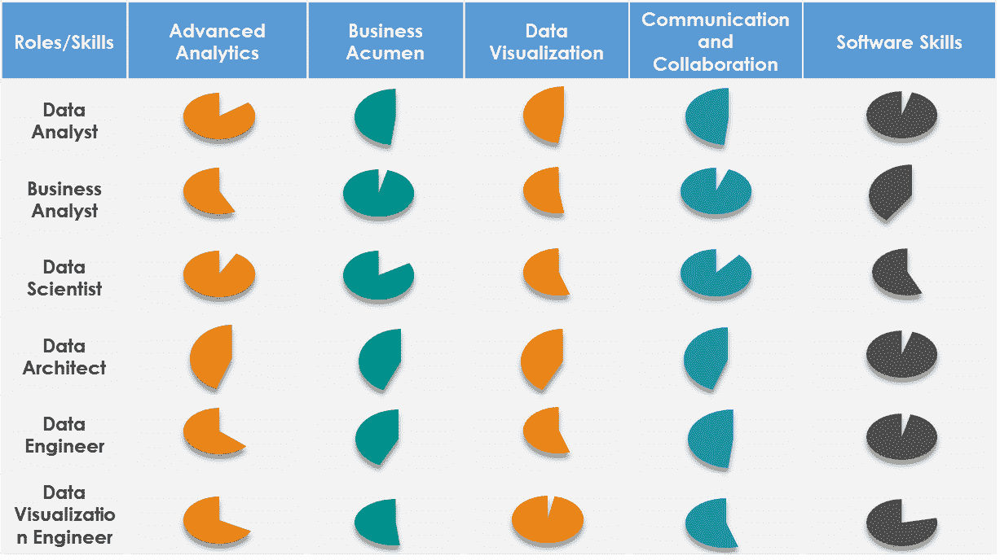

# 你正在寻找数据科学方面的职业吗？让我们探索它对你有什么好处

> 原文：<https://medium.datadriveninvestor.com/are-you-looking-for-a-career-in-data-science-lets-explore-what-it-holds-for-you-82e364df7b12?source=collection_archive---------3----------------------->

在过去的十年中，大多数组织越来越依赖数据来记录业务交易、管理生产线和制定发展战略。意识到数据的重要性后，组织不断投入时间和金钱来构建技术基础设施和分析能力，以最大限度地利用未使用的数据。

组织认为，仅仅雇用几名数据科学专家来应对竞争环境中的这一趋势是不够的。分析不再是一项 IT 职能，它需要来自业务和职能部门的多个利益相关方的参与，以实现企业级的敏捷数字化转型。

作为实现组织目标的重要一步，CXO 一直强调需要一个专门的数据分析办公室。专门的数据和分析办公室是在一个空间内协调筒仓分析功能的平台。那么，一个典型的数据和分析(DAO)办公室是什么样子的，什么样的角色构成了这样的安排？除了首席数据和分析官，以下是组成团队的几个角色

**数据分析师**

数据分析师负责收集数据，分析和解释。他确保收集的数据是相关的和详尽的。

**商业分析师**

业务分析师填补了领域专业知识方面的知识空白。他实现了 CDAO 的功能，但只是在操作层面。他负责将业务预期转化为数据分析。

**数据科学家**

数据科学家是使用机器学习和数据挖掘技术解决业务任务的人。他负责数据准备和清理以及进一步的模型训练和评估。

**数据架构师**

该角色对于处理大量数据至关重要。该角色对于数据仓库、de២ne 数据库架构、集中数据以及确保不同来源的完整性至关重要。

**数据工程师**

数据工程师实现、测试和维护数据架构师设计的基础设施组件。实际上，工程师的角色和建筑师的角色可以结合在一个人身上。技能组合非常接近。

**数据可视化工程师**

基本上，这个角色只对专门的数据科学模型是必要的。他需要有创造力和良好的可视化技能

我相信你一定对每个角色的不同之处有所了解。我看到人们为“数据科学家”这个头衔而疯狂，因为从职业和金钱的角度来看，这个头衔能带来增长。不一定所有人都需要成为数据科学家，但我们每个人都必须知道自己的优势，并选择一个真正适合你在分析领域的角色。

有些人擅长编码，但在沟通方面很吃力，无法翻译客户的业务需求。另一方面，有些人擅长理解业务需求和问题陈述，在技术和业务之间架起了桥梁，但是他们可能不知道模型背后的代码。简而言之，很难找到一个具备上述所有技能的人。

我们需要理解，组织也理解这个问题，他们已经为这个问题定义了如上所述的角色，以满足不同的所需技能。我在下图中总结了这些角色和所需的技能，这样你就可以更好地了解哪个角色真正适合你

有很多 MOOC 课程可以让你获得全面的知识和技能，从而进入你真正期待的角色。你可能也想知道我学习数据科学的方法。请浏览下面链接中的文章

[https://medium . com/@ arunelangovan 8/my-approach-to-learning-data-science-ca 36 c 6 ef 0d 77](https://medium.com/@arunelangovan8/my-approach-to-learning-data-science-ca36c6ef0d77)

万事如意！！！