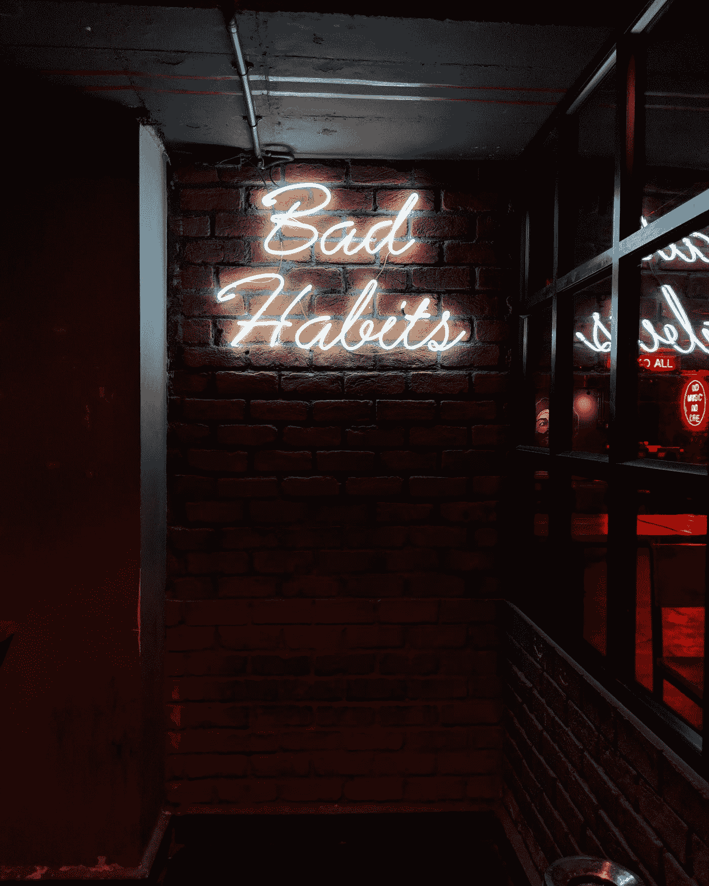

# 你正在失去你的伟大吗？

> 原文：<https://medium.datadriveninvestor.com/are-you-losing-your-greatness-5163de3d282?source=collection_archive---------4----------------------->

## 因为我有——带着坏习惯、自满和对我应该使用什么系统缺乏认识

Photo by [Manan Chhabra](https://unsplash.com/@manancfc23?utm_source=medium&utm_medium=referral) on [Unsplash](https://unsplash.com?utm_source=medium&utm_medium=referral)

你正在失去你的伟大吗？是我最近开始问自己的问题。我想大多数人认为伟大是赢得的。大多数人说，“是的，你必须接受伟大，你必须赢得它。你必须站起来，为伟大而战斗和牺牲。”

我认为人们可能是矫情的——美国人的确如此。

*老兄，只要每天走楼梯去上班，你就会减掉 10 磅，布罗汗。*

伟大往往是失去而不是赢得。这就像每天选择走楼梯一样简单(也很小)。伟大始于小细节，然后在重大时刻胜出。伟大在于提前 20 分钟起床去锻炼或写作，或者专注于优化你的一天以获得成功。

> 我们大多数人都失去了成就伟业的机会。

失去伟大是我在高中、大学、 [NBA 和 FIBA 职业比赛](https://medium.com/@Trevor_Huffman/my-best-nba-sport-stories-getting-cut-from-the-7-seconds-or-less-phoenix-suns-4824c311af4d)的 20 年经历中的一个话题。现在，作为一名职业主教练(之前没有任何经验)，我学到了很多关于“什么”实际上对自己有效，以及什么能让别人表现得更好。

想要变得伟大还不够，你必须有一个让你对最小的细节负责的系统。烧掉让你远离伟大的东西。造什么不造。

## 下面是“[牢不可破的你](https://medium.com/the-ascent/3-rules-of-an-unbreakable-you-dbafd9005624)”的三条规则:

1.  设计一个系统，要求持续的、小的日常努力来克服充满激情的、不一致的大努力
2.  使用一面个人和社会责任的镜子，这样你就能看到是什么创造了伟大，以及你是如何失去它的
3.  用我的+10 效果系统追踪你的小习惯和小目标

## 最终，作为一名球员，我总是试图把自己推出舒适区，但作为一名教练呢？

是的，在我的第一个赛季，作为团队的领导者，执行起来有点困难。细节太多了。我做错了很多小事。但是伟大的意志并不总是看得见的。它是更小的增长块。微习惯。日复一日的边际收益。不断学习，鞭策自己去学习。

 [## 成功人生的 25 种自我提升方式|数据驱动的投资者

### “我活得越久，学到的就越多。学的越多，体会的越多，知道的越少。”―米切尔·莱格兰德时间到…

www.datadriveninvestor.com](https://www.datadriveninvestor.com/2019/03/12/25-self-improvement-ways-for-a-successful-life/) 

现在我读的书有詹姆斯·克利尔的《原子习惯》。或者大卫·高金斯的《T2 你伤害不了我》。我试着听取那些在各自领域持续取得成功的导师和教练的建议。我聆听并阅读了托尼·罗宾斯、詹姆斯·克里尔、卡罗尔·德韦克和克里斯·盖奇讨论他们的生活、关系以及走向伟大(和快乐)的过程。

# “你不必为了开始而变得伟大，但如果你不开始，你就永远不会伟大。”

Photo by [Alex Radelich](https://unsplash.com/@alexradelich?utm_source=medium&utm_medium=referral) on [Unsplash](https://unsplash.com?utm_source=medium&utm_medium=referral)

我敢肯定，如果你看了这个[激励视频](https://www.fearlessmotivation.com/2019/10/14/quit-everything-that-takes-you-further-away-from-the-life-you-want/)，你会觉得更有动力变得伟大。更有激情。激动。准备工作。

但是猜猜当想成为伟人的感觉离开你时会发生什么？

你会失去动力。你失去了激情。你会忘记自己的习惯。你的努力。当每天都需要坚持、负责和努力工作的时候，这种激情会离你而去。

> 即使作为一名 12 年的职业篮球运动员，那种“被激励”的感觉不断地离开我——如果让“感觉”主宰我的篮球生涯，我将永远不会发现伟大。

即使你试着每天工作、训练或练习 10 分钟，激情和动力的感觉也不会长期支持你；如果你试图在上学前醒来，当你需要流汗、努力工作并让自己对伟大负责时，就不会。

> 伟大不在于日复一日地拥有激情的“感觉”——而在于当你不想走这条路的时候，选择最大的阻力。

要肯定自己，要建立自信，就要肯定自己的习惯。要想摆脱成绩不佳，你必须走阻力最大的那条路。阻力最大的道路不仅仅是为了你的职业、工作、人际关系、手艺，也不是为了在某件事情上保持最佳状态…

> 选择阻力最大的道路是为了改善你的人类精神——变得更有弹性，更贴近你的愿景，做任何事都更有毅力。

Photo by [Randalyn Hill](https://unsplash.com/@randalynhill?utm_source=medium&utm_medium=referral) on [Unsplash](https://unsplash.com?utm_source=medium&utm_medium=referral)

# 为什么“伟大”需要“阻力最大的道路？”

> 因为自满是我们的天性。与自我斗争是人类的本性，然而自我是机能障碍、成就低下和自我衰退的根源。如果我们放弃战斗，我们就失去了伟大。

这可能是婚姻失败的原因。这可能是为什么大多数世界冠军队不能连续赢三次。这可能是柯达和莱曼兄弟以及金州勇士队失去竞争优势的原因。这也是为什么年度教师很少再是“年度教师”的原因。人类的身体、精神和头脑注定要被测试和挑战，慢慢地、一点一点地、日复一日地——然而自我想要的恰恰相反。

人类可以进化和适应，但随着这个数字时代的干扰、信息和技术的进步，我们退化了。

我们磨磨蹭蹭。

我们让坏习惯取代了好习惯，我们成长的时间消失了。

我们的工作是不断利用我们意识和时间的分分秒秒来改善我们人类的精神和状态——不管昨天的成功与否。

## 成长的定义是什么？

> 身体、智力或精神发展的过程；数量、价值或重要性增加的过程。

创建你自己的人的成长计划就像推动你自己走上最努力的道路一样容易——这是日复一日边际收益最小的地方。

## 我最近在使用一个新的人类成长实验，我称之为+10 情感。我开始这样做是因为我努力保持责任感。

无论你想成长、进步或关注生活中的什么，你都必须每天至少花 10 分钟去做。10 分钟是最少的(一旦开始，我通常会在 30 分钟左右结束)，实际上我总是会做得更多(就像现在，我想写 10 分钟，但我已经写了半小时)。

这是 [+10 效应的特殊调料——通过让自己](http://www.trevorhuffman.com/huffman-basketball-habit-tracker/)行动起来并开始工作，你正在走一条阻力最大的道路。这个世界上的大多数人都不能每天花 10 分钟在他们的生活、手艺、激情、婚姻、家庭和工作上。

Photo by [bruce mars](https://unsplash.com/@brucemars?utm_source=medium&utm_medium=referral) on [Unsplash](https://unsplash.com?utm_source=medium&utm_medium=referral)

> **你不必一开始就变得伟大，但你必须开始变得伟大。**

你身材走样了吗？数学不好？你是在走身体阻力最小的路，但是想要更好的结果吗？

是的，范姆，在这一点上我同意你——我也是质量的[矮胖球。大多数医生、雇主和医疗保健专业人士从来不会告诉你，每天 10-30 分钟的体育锻炼比任何抗抑郁药或焦虑药都强。](https://www.mayoclinic.org/diseases-conditions/depression/in-depth/depression-and-exercise/art-20046495)

## 把每天跑步或锻炼 10 分钟列入你的+10 效果计划，看看 30 天后你感觉如何。

想成为一名伟大的作家，却不能每天写作最少 10 分钟？

长大吧，斯莫斯(我在自言自语)。

**每天 10 分钟不能和亲人联系？**

现在就离婚吧，因为大多数成功的婚姻和关系都有 5:1 的积极和消极互动。

不能每天冥想或者做 10 分钟瑜伽？

我想你明白了。关键是创造一个+10 的系统，让你负责任，日复一日为你创造边际增长。

# 我们如何停止失去伟大？使用大卫·戈金斯的责任镜像系统

Photo by [Ian Stauffer](https://unsplash.com/@ianstauffer?utm_source=medium&utm_medium=referral) on [Unsplash](https://unsplash.com?utm_source=medium&utm_medium=referral)

“Goggins 用责任之镜来确保他走在正确的方向上。如果在某一天，有什么事情感觉不对劲，高金斯会把它写在便利贴上，然后解决它。

我们可以在日常生活中运用责任感，成为我们想成为的人。如果有什么感觉不好的地方，写下来，尽快修复。

戈金斯会问自己，“我今天的进攻怎么样？我昨天怎么发作了？”——[无畏的动力](https://www.fearlessmotivation.com/)

正如戈金斯所说，

> **“我试图做很多事情来适应。但是当你照镜子的时候，那是你唯一不能撒谎的人。”—大卫·高金斯**

# 我的问责制？我用干擦记号笔在浴室的镜子上写字，而不是用便利贴。

我做了一个网格，把我的+10 个目标放在一列，并在顶部画出(1，2，3，4，5，6，7)天。然后我为每一个+10 的目标和相应的日子画一个网格。如果我做了+10，我就画一个 x。如果只做了 5 分钟，我就画一条线。如果我没有得到+10，我就把它留为空白。

这是我保持自我负责的方式。试试看，让我知道你的想法！

# 创建一个个人问责系统，将日常边际收益纳入其中，这是阻力最大的途径，你将获得长期增长，改善你的人类精神，变得[牢不可破](http://www.trevorhuffman.com/tell-the-truth-and-be-a-better-leader/)，并且[在你做的任何事情上更加坚韧不拔。](http://www.trevorhuffman.com/my-only-golden-rule-of-success/)

> PS。所有分支机构的佣金都归入特雷弗·霍夫曼的低收入家庭篮球奖学金基金。