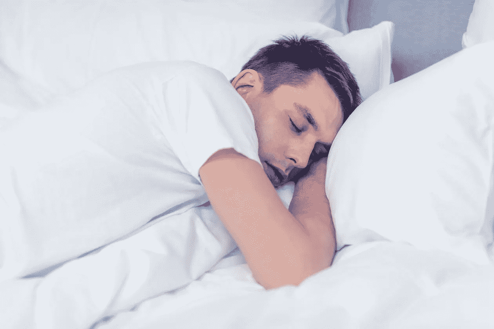

# 你躺下了吗？为什么一切都从睡眠开始…

> 原文：<https://medium.datadriveninvestor.com/are-you-lying-down-why-it-all-starts-with-sleep-51be156ee8d9?source=collection_archive---------4----------------------->

一个晚上少于五个小时的睡眠或者两个晚上少于七个小时的睡眠。这些有什么共同点？它们都会导致睡眠不足。睡眠不足反过来会使任何原因导致死亡的可能性加倍。无论是死于车祸、癌症还是心脏病发作，睡眠不足都会使这种可能性增加一倍。从另一个不太极端的角度来看，睡眠不足会导致情绪不稳定和认知障碍，开车昏昏欲睡和酒后驾车一样危险。好吧，所以我们都需要更多的睡眠，但即使想到它也会让我们更不容易入睡——我们该如何解决这个问题呢？

 [## 为“黄金时间”平衡工作和生活——数据驱动的投资者

### 30 年来，Sabrina Cadini 作为一名活动和婚礼设计师和策划人表现出色并获奖。她逼自己…

www.datadriveninvestor.com](https://www.datadriveninvestor.com/2019/02/13/balance-work-and-life-for-a-golden-hour/) 

我们都知道人类需要大约八小时的高质量睡眠，但是为什么呢？睡眠是我们精神和身体恢复和重新充满活力的时候。它让我们处理白天发生的事情，处理事件和感受，放下记忆。我们可以清空白天装满的压力桶。它让我们的身体进入修复模式。每一种活着的动物都需要睡眠，从大象的 4 小时睡眠到蝙蝠的 20 小时睡眠。

当我们睡眠不好的时候，我们会带着满满的压力桶开始第二天。这意味着它填满，然后在一天中开始溢出。我们知道这种感觉——它是一种烦躁和焦虑，是一种优柔寡断，不在最佳状态的感觉。然后，我们试图带着更激动的心情睡觉，睡得更差，对睡得更差感到压力，压力-睡眠剥夺的恶性循环开始了。

肯定有一些技巧可以帮助睡眠，其中一些列在文章的下面，但首先，让我们看看睡眠不好的根本原因。在之前，我已经写过关于压力的文章。当感知到的对我们的要求大于我们感知到的满足这些要求的资源时，压力就会产生。从进化的角度来看，当有人突然向我们扑来时，我们会有这种感觉，直到我们决定战斗，逃离冻结。在现代，它是我们在工作、家庭或生活中不知所措时的感受。

大自然希望真正的压力持续大约一秒钟，超过几秒钟的都是慢性压力。让我们在某种程度上同意我们都处于慢性压力状态；这反过来又让高质量的睡眠变得更加困难。我们正在有效地入侵自然系统。

快速停顿以区分压力和紧张。当有人说，“我在压力下工作得更好”时，他们真正的意思是，“我在压力下工作得更好”。压力是当我们有很多要求，但我们觉得我们有资源来满足这些要求。在没有任何压力的情况下，当资源超过需求时，我们可能会感到无所事事，或者漫无目的。

压力等式包含三个关键词:感知、需求、资源。在紧张的时候，当然感觉是真实的。我们看不到出路。“坚持到底”是我们通常的做法。但是有多真实呢？我们的思想会捉弄我们。因此，我们如何退后一步，审视真实的故事是什么。你能找到客观看待正在发生的事情的方法吗？你可能会发现我创建的 AGA 练习对这个很有用。如果你断定压力是真实的，而不是过度活跃的想象虚构出来的，那么你有两个选择:减少需求或增加资源。减少需求通常包括说不、推迟或把事情分解成更小的任务。增加资源可能意味着外部资源，如帮助或授权，或者通过锻炼、良好饮食或休息来增加你的内部资源。具有讽刺意味的是，我们也知道对你的内部资源最好的促进是睡眠。制定计划是开始减压的好方法。

一旦你开始放松你自己制造的压力，那么有一些专家们一致同意的睡眠技巧；

1.放松——从你想睡觉的两到三个小时开始，减少情绪和精神刺激的数量

2.常规——在入睡前建立一个有规律的模式和时间

3.没有口服——酒精、尼古丁、咖啡因和食物都会让你更难入睡和保持睡眠。在可能的情况下，睡前三小时坚持喝水或草药茶。尽量避免酒精和尼古丁。睡觉前六到七个小时需要停止摄入咖啡因

4.黑暗的房间入睡，明亮的房间醒来。这有助于身体识别何时睡觉。如果可以的话，在入睡前拉开窗帘，前提是房间是黑暗的。如果不是最好让窗帘拉上

5.让自己暴露在自然的阳光下。人造光打乱了我们的周期。尽可能多花时间在户外。

6.洗个热水澡。这增加了放松，当你从浴室出来时，温度下降会引起睡意

7.保持你的房间在 18 度左右。房间太热会导致睡眠不好

8.屏幕，与普遍的看法相反，损害睡眠的不是屏幕发出的光，而是精神刺激。电脑比平板电脑更糟糕，平板电脑比电视更糟糕，这仅仅是因为它们创造的参与度。在你放松的两到三个小时里查看邮件会严重影响你的睡眠。不要把屏风放在卧室里，诱惑太大了。为娱乐而读书是可以的，但不是为工作而读书。

9.定期锻炼是有帮助的，但不是在放松期

10.在你的床边放一个笔记本——这样就可以记下你的想法或担忧，第二天再处理。

如果你真的睡不着，或者醒来后无法再睡，那就设定一个时间，比如 20 分钟，然后如果你还醒着的话，起来做些放松的事情。

以上大部分内容基于我参加的牛津大学神经科学教授杰夫·伯德的精彩讲座。有一次，一位相当绝望的观众问道:“那我晚上能做什么？”对于 30%的夜猫子来说，这是一个特别的问题，他们的自然节奏被一个以早晨为基础的社会破坏了。

如果你有一个需要起床的固定时间，那就真的没有办法倒过来睡八个小时，然后再睡两到三个小时。这意味着，如果你的闹钟在早上 7 点响起，那么下午 6 点后就没有咖啡了，从晚上 8 点开始减少精神或情绪刺激。记住，社交是一种精神刺激，所以如果你和别人在一起，选择早点吃晚饭。

我知道上面是一个很长的令人生畏的清单，有些地方相当可怕。我的目的不是增加你的压力，从而导致睡眠不足！我能请你接受睡眠的重要性，努力降低你的压力水平，然后尽可能多地采用上面的 10 个步骤吗？这不是一朝一夕的事，可能需要几个月才能睡个好觉，但这段旅程是值得的。