# 对密码周期的观察:你准备好迎接周期性拐点了吗？第一部分

> 原文：<https://medium.datadriveninvestor.com/are-you-ready-for-the-periodic-inflection-point-part-1-data-driven-investor-2f09d03c5f86?source=collection_archive---------6----------------------->

## 我们更多地讨论周期，以及它与钟摆和正反馈/负反馈的关系。然后，我们介绍霍华德·马克斯的钟摆理论和索罗斯的反身性理论，以更好地把握经济周期的本质。最后，我们讨论了全球化和去全球化不可避免的历史循环。

*由创新研究机构 X-Order 的研究员陈巍撰写，该机构试图结合分布式计算、计算博弈论、人工智能和密码学等跨学科领域来发现未来的扩展订单。它的创始人是托尼·陶，他也是 NGC 风险投资公司的合伙人。*

> 随着时间的推移，我们很容易习惯目前的情况，并使用当前的逻辑来预测未来——雷伊·达里奥，布里奇沃特联合公司

 [## 为什么包容性财富指数比 GDP 更能衡量社会进步？|数据驱动…

### 你不需要成为一个经济奇才或金融大师就能知道 GDP 的定义。即使你从未拿过 ECON 奖…

www.datadriveninvestor.com](https://www.datadriveninvestor.com/2019/03/08/why-inclusive-wealth-index-is-a-better-measure-of-societal-progress-than-gdp/) 

随着美联储宣布降息，美股暴跌，黄金资产迅速成为资产配置的新宠。所有这些似乎都证实了雷伊·达里奥创造的新范式转换周期已经正式开始。

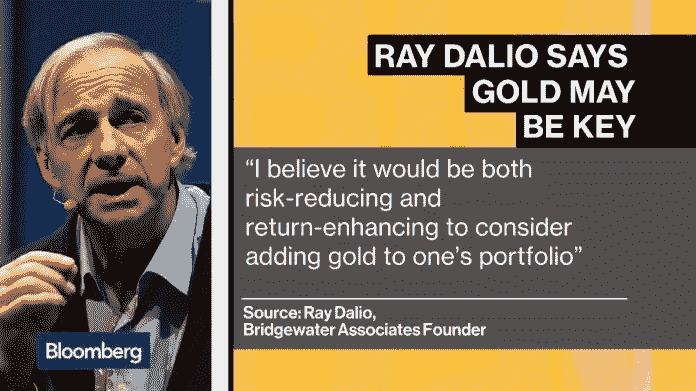

Gold May be Key, Bloomberg

在 Tony Tao 的上一篇文章，*“对周期的观察|进入新周期后的* [*Token*](https://www.datadriveninvestor.com/glossary/token/) *经济还有未来吗”*中，我们看到全球经济已经进入了周期中的对冲阶段。避险情绪上升改变了整体投资格局，也影响了数字货币领域。

**在解释世界如何进入风险厌恶周期之前，我们需要思考以下问题:**

1.  是什么造成了这种循环？周期的特征是什么？
2.  我们目前处于周期的哪个阶段？我们该如何应对？
3.  [比特币](https://www.datadriveninvestor.com/glossary/bitcoin/)在这个周期中扮演什么角色？

# 周期:钟摆和正反馈/负反馈

为了进一步理解周期，我们先来说说金融市场。金融市场就像是世界的一面镜子，在其中我们不断经历不同规模的周期。

金融市场总是处于两种反馈的过程中——**正反馈和负反馈。**正反馈推动市场扩张，负反馈抑制市场发展。这两股力量在一场永恒的戏中，使得市场的状态周期性振荡，我们在贪婪和恐惧的循环中。

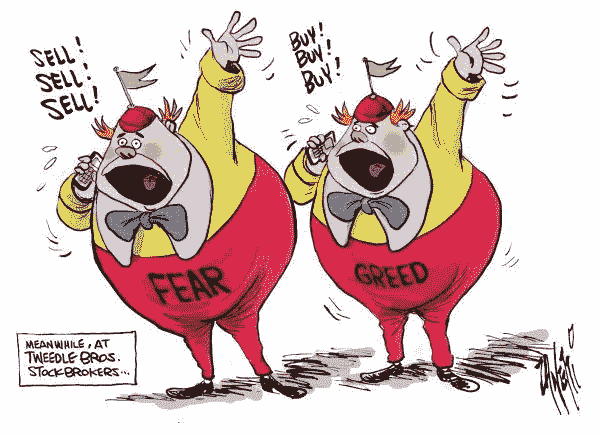

Greed and Fear, Cagle

历史上很多人更侧重于对周期的描述，无论是凯恩斯主义关于繁荣和衰退的经济周期理论，还是更技术性的艾略特波浪理论和道氏理论。当然，描述可以向我们展示历史，但找到周期的**因果会带给我们它的本质。这将使我们能够自信地做出预测，并根据周期采取适当的行动。**

因此，**霍华德·马克的钟摆理论**和**索罗斯的反身性理论**在这里弥足珍贵。

## 霍华德·马克斯的钟摆

> *钟摆是描述周期的一种非常生动的方式。*

橡树资本管理公司(Oak Tree Capital Management)创始人霍华德·马克斯(Howard Marks)在其著作*《掌握市场周期》*中首次系统描述了周期中正反馈力量与负反馈力量的**互动过程。**

Mastering the Market Cycle, Money and Markets

与直接使用术语“循环”相比，这样的描述强调了两个重要特征:

1.  **过度上涨和过度下跌互为因果**:过度上涨导致过度下跌，反之亦然；

把钟摆效应和负反馈过程联系起来，我们会发现，在摆动的最高点，物体保持相对静止，具有最高的势能。在霍华德看来，这是周期达到极端并开始向相反方向移动的时候。

2.**价格不会停留在中轴不动。**价格在过度上涨后恢复到中轴，立即进入过度下跌过程，反之亦然。

从正反馈的角度来看，当达到一种“恰到好处”(钟摆的中间点)的状态时，动量最大，因为人们意识到了这种状态的好处。因此，这种状态将继续被推向另一个极端。*“恰到好处”就是风险不暴露。*

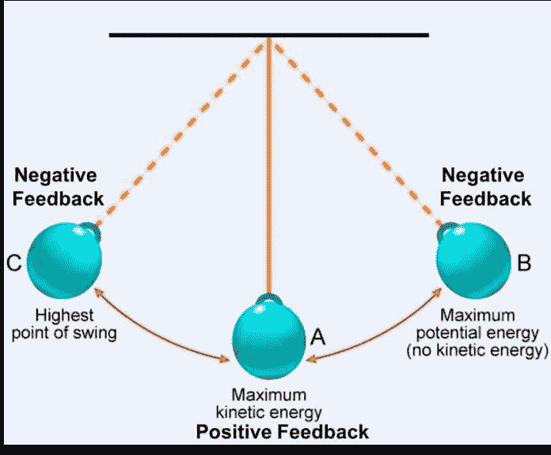

这样的正反馈过程最好用反身性来解释。

## 索罗的反身性:正反馈过程

根据索罗斯的观点，参与者感知情境(“认知功能”)的变化会导致参与者行动(“参与功能”)的变化。同时，参与者行动的变化(“参与功能”)会导致参与者感知情境的变化(“认知功能”)。

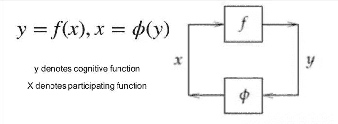

上图表明**由于结果的积极变化，我们的认知将进一步强化。此外，我们的行为会通过认知的积极强化而进一步强化自身。**

现在让我们来分析钟摆周期。当我们看不到任何弊端的时候(也就是处于价值中心的时候)，我们的认知没有接收到任何“过度的行为会有问题”的信号。因此，我们会倾向于强化我们当前的想法。这将导致的行为当然是继续前进。

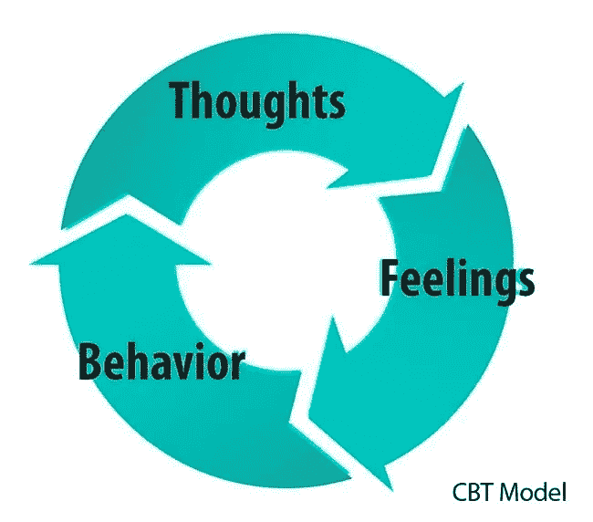

Reinforcement, Simply Psychology

将这样的行为延伸到群体层面，就会产生**参与** [**偏向**](https://www.datadriveninvestor.com/glossary/bias/) ，不可避免地将群体引向另一个极端。

只有当我们的**内在认知被更客观的规律**(即外界因素对我们认知的影响)终止，我们的新认识才能脱离正反馈的过程，进入负反馈时期。

> *这样，人会不会直到所有的希望都没有了才放弃？*

其实还有一个办法，比如以史为鉴。**历史让我们感受到自己是多么的渺小，让我们暂时走出应对现实的困境，让我们能够真实的看待自己的处境。**

# 伟大的历史循环:全球化和去全球化

将金融市场钟摆的正反馈定律扩展到全球视角，将会在我们面前展开一个基于全球经济的大周期。

## 全球化的全盛时期已经结束

区块链产业的快速发展离不开全球合作。全球化带来了许多好处，如跨国企业的兴起、大量的机会、多样化、开放和交流等。

然而，全球化带来的不仅仅是好处。当人们享受它带来的便利时，诸如保护主义和经济不平等的弊端也不断暴露出来。

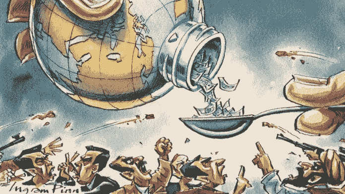

Benefits & Drawbacks of Globalisation, The Daily Star

甚至在美中贸易战之前，各国就已经悄悄引发了贸易战。从 2008 年 11 月到 2016 年 10 月，二十国集团成员实施了 5560 项贸易保护主义措施。从 2011 年到 2016 年，以贸易额衡量的全球商品和服务贸易**增速**持续低于世界经济增速**。**

在全球化背景下，社会资源分配不公、国家间发展不平衡的问题越来越突出。全球化的问题正在逐渐积累。今年的美中贸易战进一步加剧了**贸易保护主义和人们对全球化趋势的反思。**

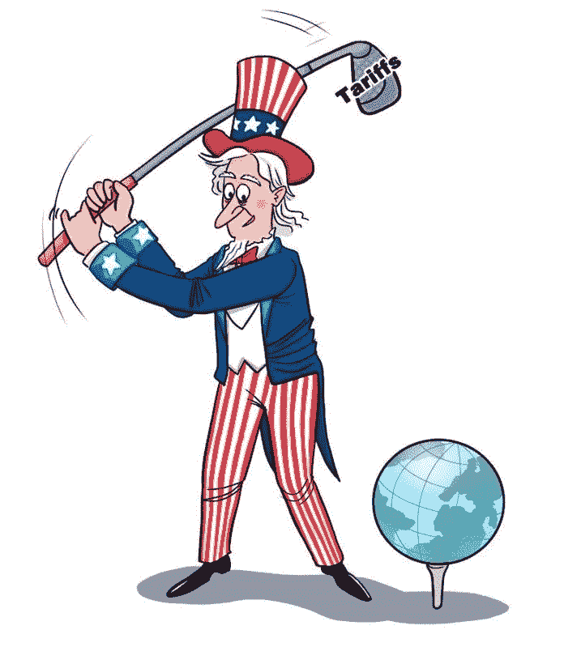

Trade Protectionism, China Daily

> 托马斯·皮凯蒂在他的著作《*21 世纪的资本》*中回应了全球化的问题，强调代表富人的资本回报率长期以来显著高于全球经济增长率。随着互联网的快速发展和全球化带来的繁荣，财富差距并没有像库兹涅茨曲线预期的那样不断缩小。相反，它已经开始远离库兹涅茨曲线(或倒 U 型曲线)。经济不平等面临着进一步和更快扩大的风险。

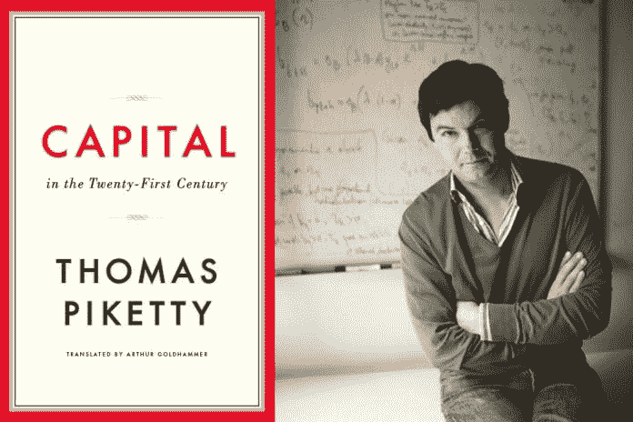

Capital in the Twenty-First Century, JSTOR Daily

这种财富分配的不平衡**不仅仅发生在特定的国家。根据 2018 年世界不平等报告*显示，大多数国家的收入差距**呈现出不断扩大的趋势，尤其是美国和印度。更详细的数据显示，1980 年至 2016 年间，全球最富有的 1%人群的收入增长迅速，远快于中等收入群体。*****

****世界正在进入去全球化状态，这似乎是不可避免的。****

**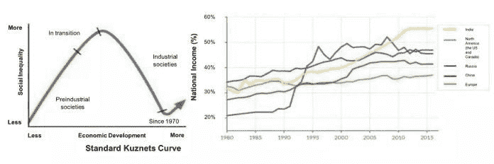**

# **去全球化已经开始**

**人们可能会认为，全球化作为多年发展的产物和世界趋势本身是一个不可逆转的进程。然而，研究全球化的学者普遍承认这样一个事实:全球化是可逆的。**

> ***全球化和去全球化是一个漫长的历史大周期。***

**最后一个周期始于 1850 年。第一次工业革命已经完成，第二次已经悄然发生。20 世纪 70 年代建立的金本位保证了国际支付体系的稳定。这导致了 19 世纪后全球贸易的增长快于世界收入的增长。库兹涅茨估计，到第一次世界大战前夕，世界出口价值占全球收入的 16%—17 %,即使按照今天的标准，这也已经相当高了。**

**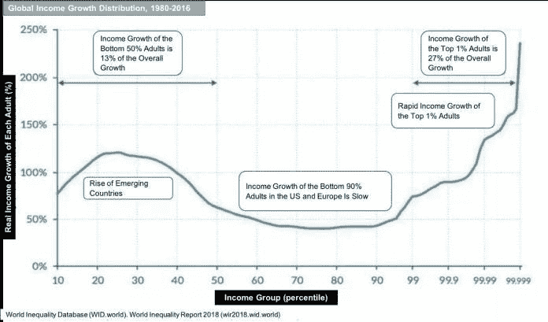**

**随着一战的爆发，世界贸易体系受到强烈冲击，全球化停止倒退。更有甚者，1929 年的大萧条使得保护主义成为世界的主流。**

**从 1929 年到 1937 年，世界贸易年增长率下降了 0.4%，相当于世界经济增长率 0.8%的一半。这样的去全球化循环一直持续到第二次世界大战结束，直到那时，全球贸易体系的重组才逐渐恢复。**

> **通过这 200 年的历史，我们可以看到全球化和去全球化就像钟摆一样，从一端摆向另一端，然后又摆回来。**

**从 1850 年到 1914 年，它从去全球化走向全球化，然后从 1914 年到 1950 年又回到去全球化。随后，世界经济再次进入全球化时期。**

**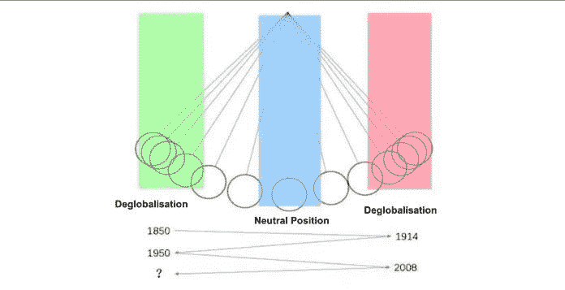**

**每个周期持续一个世纪。如果 2008 年的次贷危机象征着去全球化的开始，**那么这个周期才刚刚开始，钟摆还在加速。****

***原载于 2019 年 10 月 6 日*[*https://www.datadriveninvestor.com*](https://www.datadriveninvestor.com/2019/10/06/are-you-ready-for-the-periodic-inflection-point-part-1/)*。***

# **下一步是什么？**

**在第二部分，我们讨论了全球周期中的不可逆因素及其驱动因素。然后我们讨论风险规避周期和对冲，以及比特币如何成为对冲资产的阿尔法。**

**在 [Linkedin](http://linkedin.com/company/xorderglobal) 上与我们联系！**

*****由*** *(通过我们的微信账号)****:****Transladom***

*****编辑:*** *谭***