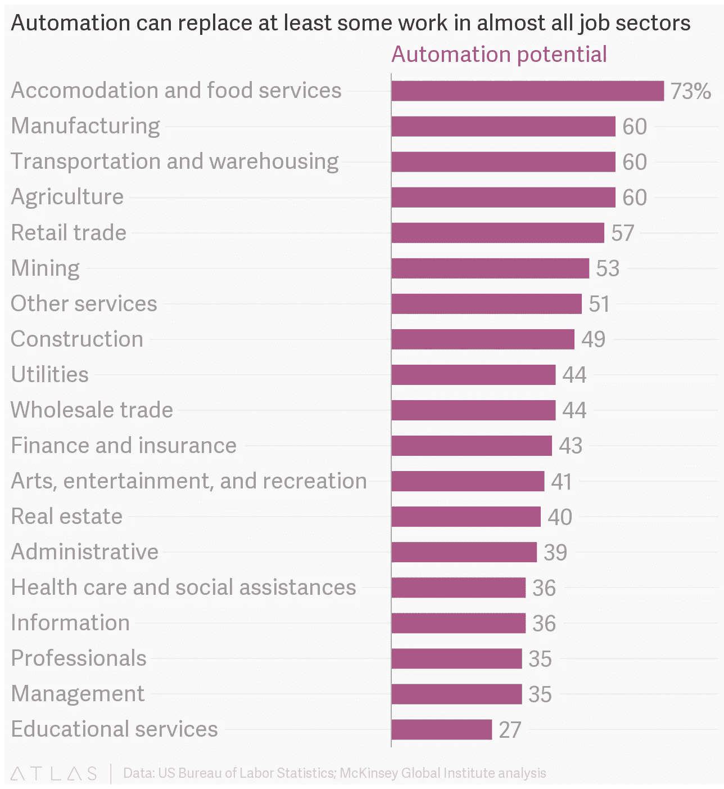

# 你准备好革命了吗？

> 原文：<https://medium.datadriveninvestor.com/are-you-ready-for-the-revolution-68dbc2b31635?source=collection_archive---------24----------------------->

Photo by [Franck V.](https://unsplash.com/@franckinjapan?utm_source=medium&utm_medium=referral) on [Unsplash](https://unsplash.com?utm_source=medium&utm_medium=referral)

大约 10 个月前，马云在世界经济论坛上表示:

> “教育现在是一个巨大的挑战，如果我们 30 年后不改变我们的教学方式，我们将陷入大麻烦。我们的教学方式，我们教给孩子的东西是 200 年前的东西，是以知识为基础的。我们无法教会孩子与机器竞争——他们更聪明。我们必须停止教授知识，我们必须教授一些独特的东西，这样机器就永远无法赶上我们。”

杰克是对的吗？机器的崛起会给我们的职场带来巨大的问题吗？技术失业会上升到我们的教育系统变得多余吗？

麦肯锡全球研究所(McKinsey Global Institute)使用美国劳工统计局(US Bureau of Labor Statistics)分析的一幅有趣图像显示了所有就业领域的自动化潜力。

这是否意味着这些领域的就业机会将会减少？这很难预测。如果行业内的工作完全自动化，那么就业就会减少，如果只是部分自动化，那么它可能会增加就业——自动化可能会导致价格下降和需求增加——导致失业增加。然而，价格下跌并不总是增加需求。还有一个事实是，现代技术发展如此之快，以至于我们不能以同样的方式从历史中学习——尽管勒德分子当时可能是错的，但他们现在可能不会错。

问题不在于机器人会在一场针对人类的天网人工智能战争中加速我们世界的末日。问题是，可供选择的工作类型变化非常快，而我们人类还没有为未来做好准备。

在自动化潜力大的行业中从事低技能工作的老年人面临的风险最大。他们的年龄和教育水平使他们无法轻易地从一个地区转移到另一个地区。在一个你的所作所为很能说明你是谁的世界里，那些因自动化而失去工作的人的羞辱和痛苦显然令人不安。

政府倾向于忽视那些在技术变革中以这种方式遭受损失的人们的需求。他们的社会、教育和财政问题被掩盖了——可能导致一些由民粹主义群众运动引起的政治动荡，这些运动将这些问题推到了前台。

减轻对这些人口的损害的方法是通过教育和再培训，不幸的是，在这方面没有足够的开支，许多人无法利用。

随着机器的兴起，显然，如果许多正在经历当前教育体系的人继续学习与他们将进入的工作场所无关的知识，他们的未来将受到威胁。那么如果知识出来了呢？什么在里面？

Jack 接着说，我们应该教授的软技能包括:

> “价值观、信念、独立思考、团队合作和关心他人——这些是知识无法教会你的。我们应该教我们的孩子体育、音乐、绘画、艺术——以确保人类与众不同。我们教的东西都应该和机器不一样。如果机器能做得更好，我们就得考虑一下。”

这与我在以前的文章中发表的观点略有不同，但它确实值得研究。与机器人相比，人类的优势在哪里？如果我们只是想成为服从命令的劳动力，那么机器总是会超出我们的能力——它们不需要休息和食物，可以专注更长时间，犯更少的错误。

自动化将永远以这些领域为目标，利润驱动着公司，并要求它们不断创新和前进，以与对手竞争。大型全球巨头使得这种推动力比过去更加迅猛。

20 世纪 40 年代末在通用电气工作的库尔特·冯内古特见证了计算机芯片给自动化带来的早期变化。他在 1952 年写了他的第一本书《钢琴演奏者》,在书中他意识到工业革命总是会发生的。

> "首先是肌肉工作，然后是日常工作，然后可能是真正的脑力劳动."

如果马云是对的，那么我们正处于工业革命的最后阶段，脑力劳动开始由机器完成。无人驾驶汽车、送货无人机和自动化仓库现在已经存在，并且可能很快就会出现在你附近的城市。所有以前需要使用人脑并且只有人脑才能很好完成的角色。

不管未来如何，也不管杰克是否正确，很明显，我们确实需要一场教育革命，这样的革命已经有 200 年没有出现过了。一场教育革命，帮助人们提高在机器世界中工作所需的基本人类素质。机器还无法学会移情、创造力和独立思考——也许这就是我们应该关注的地方——培养人类能够为了全人类的利益而掌握机器，而不是试图与它们竞争。