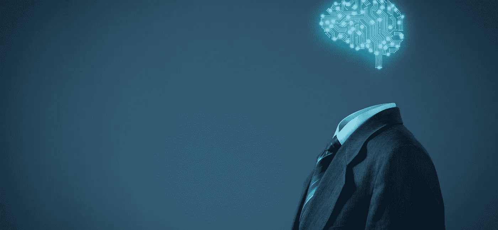

# 你准备好明天的工作空间了吗？

> 原文：<https://medium.datadriveninvestor.com/are-you-ready-for-tomorrows-workspace-f8facc3f0cab?source=collection_archive---------13----------------------->

## 未来，让您的员工走在人工智能的前面

CREDIT: Getty Images

“嘿谷歌，我想改变我的手肘。维也纳看着镜子说:“给我推荐镇上最好的人体设计师。”。“不行！”随着一声大叫，打断了奥古斯特，她的姐姐说“现在这很重要吗！我感到无聊。谷歌，给我们带来最好的虚拟栖息地设计师，用动物设计虚拟森林，这样我就可以玩得开心了”。维也纳和奥古斯特之间的战斗开始了。这些孩子的母亲艾玛没有耐心听下去，她看着他们说:“我再也受不了了。我要打电话给个人内容制作人，让你回忆一下

*   “啊啊啊！!"尖叫的乔从睡梦中醒来，需要一些时间恢复正常，并决定不再阅读微软与未来实验室合作的“乔布斯的未来”报告。

人体设计师？是的，他可以改变，改变和修改我们的身体部分。虚拟栖息地设计师？是的，他可以设计我们周围的虚拟环境来生活。个人内容创作者？是的，他可以将我们的记忆闪现或策划成值得观看的东西…这个清单还可以继续引用下去

> “今天 65%的学生将从事尚不存在的工作”

## 哎哟！不会有无算法区。

不仅对乔，而且对这里的每一个普通人，我们都不能摆脱算法。他们将出现在任何地方，从我们喝酒的街边咖啡店，到我们睡觉时盖的被子，几乎无处不在。在物联网、人工智能、机器学习、云计算等等的支持下，算法会变得无处不在。很快，我们将从世界上失去“离线”这个词，因为我们将不再有机会离线。欢迎，算法先生！

## 未来工作的可能性是不可预测的！

很明显，算法将是我们的未来。对未来工作的预测更加复杂和具有挑战性。当算法消除了人工工作时，劳动力应该提高自己的技能来维护运行算法的机器人吗？当销售可以很容易地被算法执行时，销售主管会用他们的学位和经验做什么？听起来很奇怪，对吧？老实说，我们不能确切地说出人类未来会做什么，但我们可以保证算法的工作方式。那是给你的人类智慧！

## 但是，有一项技能可以阻止你被人工智能取代:

我们都知道莱昂纳多·达芬奇——那个让我们凝视他所有作品的人，包括《蒙娜丽莎》,史蒂夫·乔布斯——他通过不同的思维方式建立了世界上最伟大的科技公司之一，还有比尔·盖茨，他是二十年来世界上最富有的人。这些历史上最伟大的天才有一个共同点。

他们放弃了大学和典型的自学途径，成为各自领域的大师。他们是自学成才的。

> “自学——自我学习”是学习新技能和应对未来未知的关键。现代生活最大的礼物是，我们现在获得的信息比人类历史上任何时候都要丰富。个人和组织应该将此作为一种习惯/文化反复灌输，以不断适应新趋势，并与工作保持关联。

## 自学的小贴士:

**爱上费曼手法:**

**使用简单的术语；教别人”——费曼是这么说的。有了这个，一个人就能彻底理解概念，更好地保留所学的信息。**

**遵循这些简单的步骤来学习新的东西:**

1.  **选择一个你想学的题目，开始研究它**
2.  **写下你所知道的关于这个话题的一切，并加上你对这个话题新学到的任何东西。**
3.  **讲授题目。**
4.  **确保你用简单的术语解释你的主题。**
5.  **教的时候卡住了就回去看书。一开始被打击是难免的。重新浏览网页，尝试加强那些薄弱的地方。**
6.  **一定要简化你的语言，用类比联系事实。**

**你可以从每个工作日抽出 1 小时= 1*5 =每周 5 小时，并遵循上述活动来促进自学。你知道它有多有效吗？比尔·盖茨每年花 1 小时读 50 本书。**

## **成功的关键不是持续学习，而是学习迁移:**

**多年来，我们都遇到过“持续学习是帮助适应变化并在工作场所大放异彩的关键”。事实是，帮助成功的不是持续的学习，而是“学习迁移”。**

**学习迁移是将技能分解成子技能，并将我们在特定环境中所学的知识应用到实际问题中。它是把我们发现的东西应用到现实世界中。也可以把我们学到的东西应用到不同的行业。**

> ***“将知识视为一棵语义树是很重要的——在进入树叶/细节之前，确保你理解了基本原则，即主干和大树枝，否则就没有什么可以依靠的了。”***

**埃隆马斯克在他的 Reddit AMA 会议上说。**

**他的哥哥金巴尔·马斯克(Kimbal Musk)说，从童年开始，马斯克每天都会阅读两本不同学科的书籍。他对知识的渴求让他接触了各种学科，如物理、工程、产品设计、商业、技术和能源，他将从一个领域学到的知识交叉应用到其他领域。尽管如此，你仍然认为“学习转移”不会在人工智能领域保持领先，这就是埃隆·马斯克，他在 45 岁左右建立了四家数十亿美元的公司——在四个不同的领域(软件、能源、交通和航空航天)**

## **万事通，无所不能是一个神话:**

**有一个隐含的假设，如果一个人在多个领域学习，他只能获得表面水平的专业知识。但是严酷的事实是，跨多个领域的学习提供了信息优势，而许多人只专注于学习一个领域。比方说，如果你在科技行业，而其他人都在学习与科技相关的东西，你也了解生物学，那么你就有能力提出别人无法提出的想法和解决方案。**

> **“在苹果的 DNA 中，光有技术是不够的——只有技术与自由艺术、人文学科相结合，才能给我们带来让我们心动的结果。”史蒂夫·乔布斯这样描述他的公司文化。**

**是的，通过将我们从一个领域学到的不熟悉的东西结合到我们擅长的领域，可能会走向卓越。尽管如此，你还是有疑问，看看这个有趣的研究吧。**

****杀公司保持领先 AI:****

**向后思考是一种策略；驱使你的大脑逆向思考。不要问怎么做一件事，而要问怎么不做。如果否定的部分变成真的呢？**

**这种策略被称为“杀死公司”或“失败前死亡”。在这个策略中，你可以快进几个月，像他们现在设定的目标已经失败一样思考。现在，你应该分析一下犯了什么错误？怎么失败的？这将确定挑战和失败点，以便您可以防止它们发生。**

> **“向后思考是一个有效的工具，因为它会突出那些乍看起来不明显的错误。伟大的思想家、领袖、偶像和创新者为了实现他们的目标，会前思后想。”**

## **结果:**

**由于世界不断围绕技术和进步的轴心旋转，未来的工作空间将因人工智能、区块链和自动化而面临巨大变化。通过吸取上述策略的精华，如下所列，你可以在行业中生存下来，并与那些技术竞争。**

**自学——练习自学。**

**学习迁移——将学到的东西应用到现实世界的问题中**

**组合技能——混合两种或多种技能的基础，为不同的问题创建解决方案。**

**回顾过去——用一种会让我的工作失败的方式来思考，消除导致失败的因素。**

**只管跳进去，遵循这些策略，开始乱搞，犯错误。当你一个月后甚至几年后回头看时，你会发现你已经走了多远，你会很高兴你的朋友和同事会因为你在某项技能上表现出色而欣赏你！你还在等什么？**