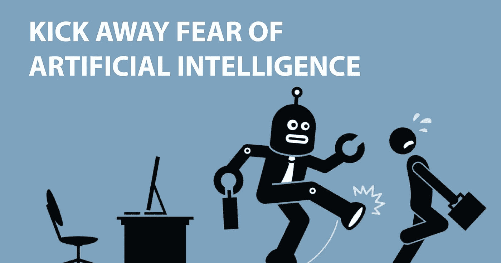

# 你害怕 AI 吗？不要这样。

> 原文：<https://medium.datadriveninvestor.com/are-you-scared-of-a-i-dont-be-e572f12241c?source=collection_archive---------29----------------------->

Are you scared of A.I , Don’t Be

随着人工智能领域发生如此多的事情，我们都开始质疑我们的技能在未来时代的相关性。别担心，我们是来帮助你的。

我们为你精心挑选了这些 TED 演讲，让你感到舒服。

[**不要害怕智能机器，和它们一起工作|加里·卡斯帕罗夫| TED 2017**](https://www.ted.com/talks/garry_kasparov_don_t_fear_intelligent_machines_work_with_them/transcript?referrer=playlist-talks_on_artificial_intelligen)

在 Gary Kasporov(世界上最好的国际象棋选手)的这个鼓舞人心的演讲中，他带你回忆 1996 年他和深蓝之间的那场著名比赛，在那场比赛中，他在成为世界国际象棋冠军 10 年后输给了深蓝。他谈到了一句著名的俄罗斯谚语——“如果你不能打败他们，就加入他们”。必须看。

[**如何获得授权，而不是被压制，作者 AI | Max Tegmark | TED 2018**](https://www.ted.com/talks/max_tegmark_how_to_get_empowered_not_overpowered_by_ai/transcript)

麻省理工学院的物理学家和人工智能研究员马克斯·泰格马克从历史中吸取了关于技术如何帮助世界从石器时代进步到文明、现代化以及现在的未来生活的相似之处。他的观点是，我们需要为人工智能设定正确的方向，这样它才能让我们获得力量，而不是被压制。

[**什么艾又不是| Sebstian Thrun | TED 201**](https://www.ted.com/talks/sebastian_thrun_and_chris_anderson_the_new_generation_of_computers_is_programming_itself)7

教育家和企业家巴斯蒂安·特龙在与克里斯·安德森的对话中谈论了人工智能将如何释放资源以进行更多的创新和创造。sebastian 的这个自信的演讲会让你相信你应该拥抱世界的进步和人类的进步。